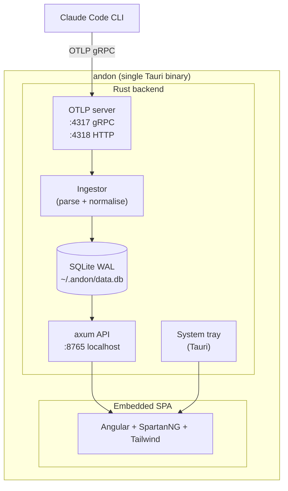

# Andon — Implementation Handoff

## Project: `andon`

> *Andon* (アンドン) — the lean-manufacturing signal board that surfaces what's happening on the factory floor. This is the andon board for Claude Code usage.

A local, single-binary desktop application that receives OpenTelemetry data directly from Claude Code, persists it to embedded SQLite, and presents a reporting dashboard. Built with Rust + Tauri.

---

## Goal

Give a single developer a zero-install reporting tool to track Claude Code costs, model usage, accept rates, and change history. Engineer launches one executable, sees a system tray icon, opens a dashboard whenever they want to inspect their usage.

## Non-Goals (v1)

- Multi-user / multi-machine aggregation
- Cloud sync
- Authentication / authorization
- Exporting to external observability platforms
- Mobile clients
- Real-time streaming dashboards (polling every few seconds is fine)

---

## Architecture



**Single process. Single binary. No external collector. No Docker.**

---

## Tech Stack — Locked Decisions

| Layer            | Choice                                  | Why                                                                     |
|------------------|-----------------------------------------|-------------------------------------------------------------------------|
| Shell            | Tauri 2.x                               | Native window + tray, small binary, Rust-first                          |
| Async runtime    | tokio                                   | Required by tonic and axum                                              |
| OTLP gRPC server | tonic + `opentelemetry-proto`           | Official protobuf bindings, no custom decoding                          |
| OTLP HTTP server | axum                                    | Same router used for the SPA + API; HTTP/protobuf POST endpoint         |
| Internal API     | axum                                    | JSON REST, served on `127.0.0.1:8765`                                   |
| Persistence      | rusqlite (`bundled` feature) + WAL mode | Zero external deps, statically linked SQLite                            |
| Frontend         | Angular standalone + SpartanNG + Tailwind | Matches existing stack; consistent with Workbench/Siora                |
| Charts           | ng2-charts (Chart.js wrapper)           | Lightweight, sufficient for line/bar/stacked-bar                        |
| Embedding        | Tauri's built-in asset pipeline         | Frontend builds to `dist/`, Tauri bundles it                            |

**Do not substitute crates without flagging it in the summary.**

---

## Functional Requirements

### Ingestion

- Listen on `127.0.0.1:4317` (gRPC) and `127.0.0.1:4318` (HTTP/protobuf).
- Accept OTLP `ExportMetricsServiceRequest` and `ExportLogsServiceRequest`.
- Always return `Ok` to the client — never propagate ingestion errors to Claude Code.
- Persist every metric and log event into SQLite.
- Bind only to `127.0.0.1`. No external network exposure.

### Metrics to capture

Claude Code emits standard metric names. Persist all of these:

| Metric (OTel name)                         | Stored as              |
|--------------------------------------------|------------------------|
| `claude_code.session.count`                | `sessions` row         |
| `claude_code.lines_of_code.count`          | `file_changes`         |
| `claude_code.pull_request.count`           | `git_activity`         |
| `claude_code.commit.count`                 | `git_activity`         |
| `claude_code.cost.usage`                   | `cost_entries`         |
| `claude_code.token.usage`                  | `token_usage`          |
| `claude_code.code_edit_tool.decision`      | `tool_decisions`       |
| `claude_code.active_time.total`            | `active_time`          |

For unknown metrics, store the raw name + attributes in a `metrics_raw` table so nothing is lost.

### Resource attributes to extract

From the OTLP `Resource`, capture and denormalise these into every row:
- `session.id`
- `user.account_uuid` (if present)
- `organization.id` (if present)
- `service.name`
- `service.version`
- `host.arch`
- `os.type`
- `terminal.type`

### Dashboard (Angular SPA)

Routes:
- `/` — Overview
- `/sessions` — Session list + detail
- `/files` — File-change heatmap
- `/settings` — Config + database location + uninstall instructions

**Overview page must show:**
1. Top strip: today's cost, today's sessions, today's accept rate (three big numbers)
2. Cost over time: stacked bar by model, daily for last 30 days
3. Token usage: line chart split by input/output/cache, daily for last 30 days
4. Accept rate by language: horizontal bar, sorted descending
5. Active time today: total + breakdown of user vs CLI processing time

**Session detail page:**
- All token/cost/decision events for that session
- Files touched with lines added/removed
- Timeline of tool decisions

**File heatmap:**
- Treemap of files modified, sized by edit count, coloured by accept rate

### System tray

- Icon in tray on launch
- Menu: "Open Dashboard", "Pause Ingestion", "Quit"
- Window starts hidden by default; opening from tray shows it
- Closing window hides to tray, does not quit
- Quit fully shuts down OTLP listeners and the API server

---

## SQLite Schema

Apply in a single migration on first run. Use WAL mode (`PRAGMA journal_mode=WAL`).

```sql
CREATE TABLE sessions (
    session_id        TEXT PRIMARY KEY,
    started_at        INTEGER NOT NULL,    -- unix ms
    ended_at          INTEGER,
    user_account_uuid TEXT,
    organization_id   TEXT,
    service_version   TEXT,
    host_arch         TEXT,
    os_type           TEXT,
    terminal_type     TEXT
);

CREATE TABLE token_usage (
    id              INTEGER PRIMARY KEY,
    session_id      TEXT NOT NULL,
    timestamp       INTEGER NOT NULL,
    model           TEXT NOT NULL,
    token_type      TEXT NOT NULL,  -- input | output | cacheRead | cacheCreation
    count           INTEGER NOT NULL
);

CREATE TABLE cost_entries (
    id              INTEGER PRIMARY KEY,
    session_id      TEXT NOT NULL,
    timestamp       INTEGER NOT NULL,
    model           TEXT NOT NULL,
    cost_usd        REAL NOT NULL
);

CREATE TABLE tool_decisions (
    id              INTEGER PRIMARY KEY,
    session_id      TEXT NOT NULL,
    timestamp       INTEGER NOT NULL,
    tool_name       TEXT NOT NULL,
    decision        TEXT NOT NULL,
    language        TEXT,
    file_path       TEXT
);

CREATE TABLE file_changes (
    id              INTEGER PRIMARY KEY,
    session_id      TEXT NOT NULL,
    timestamp       INTEGER NOT NULL,
    file_path       TEXT,
    lines_added     INTEGER NOT NULL DEFAULT 0,
    lines_removed   INTEGER NOT NULL DEFAULT 0
);

CREATE TABLE git_activity (
    id              INTEGER PRIMARY KEY,
    session_id      TEXT NOT NULL,
    timestamp       INTEGER NOT NULL,
    activity        TEXT NOT NULL,  -- commit | pull_request
    count           INTEGER NOT NULL DEFAULT 1
);

CREATE TABLE active_time (
    id              INTEGER PRIMARY KEY,
    session_id      TEXT NOT NULL,
    timestamp       INTEGER NOT NULL,
    seconds         REAL NOT NULL,
    kind            TEXT NOT NULL   -- user | cli
);

CREATE TABLE metrics_raw (
    id              INTEGER PRIMARY KEY,
    session_id      TEXT,
    timestamp       INTEGER NOT NULL,
    metric_name     TEXT NOT NULL,
    attributes_json TEXT NOT NULL,
    value_json      TEXT NOT NULL
);

CREATE INDEX idx_token_session   ON token_usage(session_id, timestamp);
CREATE INDEX idx_cost_session    ON cost_entries(session_id, timestamp);
CREATE INDEX idx_decisions_session ON tool_decisions(session_id, timestamp);
CREATE INDEX idx_files_session   ON file_changes(session_id, timestamp);
```

---

## Project Layout

```
andon/
├── Cargo.toml
├── src-tauri/
│   ├── tauri.conf.json
│   ├── Cargo.toml
│   ├── build.rs
│   └── src/
│       ├── main.rs              # Tauri setup, tray, window lifecycle
│       ├── otlp/
│       │   ├── mod.rs
│       │   ├── grpc_server.rs   # tonic MetricsService + LogsService impl
│       │   ├── http_server.rs   # axum :4318 POST handlers
│       │   └── ingestor.rs      # Translate OTLP → SQLite rows
│       ├── api/
│       │   ├── mod.rs
│       │   ├── routes.rs        # /api/sessions, /api/overview, etc.
│       │   └── dto.rs           # Response shapes
│       ├── db/
│       │   ├── mod.rs
│       │   ├── migrations.rs
│       │   └── queries.rs
│       └── config.rs
├── web/                          # Angular SPA
│   ├── angular.json
│   ├── package.json
│   ├── src/
│   │   ├── app/
│   │   │   ├── app.config.ts
│   │   │   ├── app.routes.ts
│   │   │   ├── core/
│   │   │   │   ├── api.service.ts
│   │   │   │   └── models/
│   │   │   ├── features/
│   │   │   │   ├── overview/
│   │   │   │   ├── sessions/
│   │   │   │   ├── files/
│   │   │   │   └── settings/
│   │   │   └── shared/
│   │   └── styles.css
│   └── tailwind.config.js
└── README.md
```

---

## Key Dependencies

`src-tauri/Cargo.toml`:

```toml
[package]
name = "andon"
version = "0.1.0"
edition = "2021"

[build-dependencies]
tauri-build = { version = "2", features = [] }

[dependencies]
tauri = { version = "2", features = ["tray-icon"] }
tauri-plugin-shell = "2"

tokio = { version = "1", features = ["full"] }
tonic = "0.12"
prost = "0.13"
opentelemetry-proto = { version = "0.27", features = ["gen-tonic", "metrics", "logs", "trace"] }

axum = "0.7"
tower-http = { version = "0.6", features = ["cors", "fs"] }

rusqlite = { version = "0.32", features = ["bundled"] }
r2d2 = "0.8"
r2d2_sqlite = "0.25"

serde = { version = "1", features = ["derive"] }
serde_json = "1"

anyhow = "1"
thiserror = "2"
tracing = "0.1"
tracing-subscriber = { version = "0.3", features = ["env-filter"] }

dirs = "5"
```

---

## Implementation Order

Build in this order. Verify each layer before moving on.

### 1. Skeleton + DB

- `cargo init` the Tauri app via `cargo tauri init`
- Wire up SQLite at `~/.andon/data.db` (use `dirs::home_dir()`)
- Apply migrations on startup
- Add a `health` axum endpoint, confirm SPA can hit it

**Done when:** Launching the app creates the DB file and `GET /api/health` returns `200`.

### 2. OTLP gRPC ingestion

- Implement `MetricsService` and `LogsService` from `opentelemetry-proto`
- Decode `ResourceMetrics` → extract resource attributes → for each metric, dispatch to a handler per metric name
- For known metrics, write to typed tables. For unknown, write to `metrics_raw`.
- Always return `ExportMetricsServiceResponse::default()` even on internal errors. Log errors via `tracing`.

**Done when:** Pointing Claude Code at `localhost:4317` and running a session results in rows appearing in `sessions`, `token_usage`, `cost_entries`.

### 3. OTLP HTTP ingestion

- Add `POST /v1/metrics` and `POST /v1/logs` on the axum router bound to `127.0.0.1:4318`
- Decode `Content-Type: application/x-protobuf` using the same `opentelemetry-proto` types
- Share the same ingestor logic as gRPC

**Done when:** Setting `OTEL_EXPORTER_OTLP_PROTOCOL=http/protobuf` also produces rows.

### 4. API + DTOs

Implement these endpoints. Keep response shapes flat and chart-ready.

| Method | Path                              | Purpose                                    |
|--------|-----------------------------------|--------------------------------------------|
| GET    | `/api/overview/today`             | Today's cost, sessions, accept rate        |
| GET    | `/api/overview/cost-by-day`       | Last N days, grouped by model              |
| GET    | `/api/overview/tokens-by-day`     | Last N days, grouped by token_type         |
| GET    | `/api/overview/accept-by-language`| Aggregate accept rate per language         |
| GET    | `/api/overview/active-time/today` | Sum of active_time today, split by kind    |
| GET    | `/api/sessions?from=&to=&limit=`  | Session list                               |
| GET    | `/api/sessions/:id`               | Session detail                             |
| GET    | `/api/files/heatmap?days=30`      | File path + edit count + accept rate       |

All endpoints return `application/json`. Accept rate = `accepts / (accepts + rejects + aborts)`. Round to 4 decimal places.

### 5. Angular SPA

- `ng new web --standalone --routing --style=css`
- Install SpartanNG, Tailwind, ng2-charts
- Build the four routes (`overview`, `sessions`, `files`, `settings`)
- Single `ApiService` wraps fetch calls
- Use signals for state, no NgRx
- Grid-based layout, not flexbox (parent layout pattern)
- Charts via ng2-charts (Chart.js wrapper)

**Done when:** `npm run build` produces a `dist/` that Tauri can serve.

### 6. Tauri integration

- Configure `tauri.conf.json` to:
  - Point `frontendDist` at `../web/dist/web/browser`
  - Hide window on close (not exit)
  - Set window size 1400x900
  - Disable web inspector in release builds
- Tray icon with menu: Open Dashboard / Pause Ingestion / Quit
- "Pause Ingestion" toggles a flag the ingestor checks before writing

**Done when:** `cargo tauri dev` opens a window showing the dashboard, tray icon appears, closing the window hides it.

### 7. Polish

- Empty states for every chart ("No data yet — start using Claude Code")
- Settings page shows DB location, total rows per table, "Open data folder" button
- Log file at `~/.andon/log.txt`, rotated daily
- README with the `settings.json` snippet engineers need

---

## Coding Standards

### Rust

- Use `Result<T, anyhow::Error>` at the app boundary, `thiserror` for domain errors.
- Wrap the SQLite pool in `Arc<r2d2::Pool>`. Never hold a connection across `.await`.
- All DB writes go through a single `Ingestor` struct that owns the pool.
- `tracing::instrument` on every public async fn in the ingestor and API layers.
- No `unwrap()` or `expect()` outside of `main.rs` setup code.
- Use `serde` for any JSON payloads. Never hand-write JSON strings.

### Angular

- Standalone components only. No NgModules.
- Signal-based services. `signal()`, `computed()`, `effect()`.
- ngx-formly for any form input (settings page filters etc.).
- Tailwind utility classes preferred. Custom CSS only for SpartanNG overrides.
- Master-detail navigation: use the parent layout + `position: absolute; inset: 0` overlay pattern. Do not destroy summary components when navigating to detail.

### Diagrams

- All diagrams in markdown must be Mermaid. **Never use ASCII art.**

---

## OTel Resource Attribute Reference

Claude Code sets these resource attributes on every export. Use them when ingesting:

| Attribute              | Notes                                  |
|------------------------|----------------------------------------|
| `service.name`         | Always `claude-code`                   |
| `service.version`      | Claude Code version                    |
| `session.id`           | UUID, stable per CLI session           |
| `user.account_uuid`    | Anthropic account UUID                 |
| `organization.id`      | Anthropic org ID (Team/Enterprise)     |
| `host.arch`            | e.g. `arm64`, `amd64`                  |
| `os.type`              | `darwin`, `linux`, `windows`           |
| `terminal.type`        | e.g. `tmux`, `iTerm.app`               |

If `session.id` is missing on a metric, store it but flag it — this should not happen but the ingestor must not crash.

---

## Privacy & Safety Rules

1. Bind OTLP listeners and the API server to `127.0.0.1` only. Never `0.0.0.0`.
2. Do not log raw user prompts even if `OTEL_LOG_USER_PROMPTS=1` is set upstream.
3. SQLite database file permissions: user-only read/write (0600 on Unix).
4. Never make outbound network calls. This is a fully local tool.
5. No telemetry of telemetry. The app must not phone home.

---

## Acceptance Criteria

- [ ] Single executable launches on Windows, macOS, Linux
- [ ] OTLP gRPC + HTTP both accept Claude Code telemetry without errors
- [ ] Database is created at first launch with all tables and indexes
- [ ] Overview page renders all five visualisations with real data after one Claude Code session
- [ ] Session detail page renders correctly for any session ID
- [ ] System tray icon appears and the menu works
- [ ] Closing window hides to tray; tray "Quit" cleanly shuts down listeners
- [ ] No `unwrap()` in non-test, non-`main.rs` code
- [ ] No outbound network calls
- [ ] README explains setup in under 10 steps

---

## Out of Scope — Do NOT Add

- Authentication, user management
- HTTPS / TLS (it's localhost only)
- Multi-database / database selection UI
- Custom OTLP exporters (e.g. forwarding to another collector)
- Dashboards beyond the four routes specified
- Custom metric definitions / user-defined queries
- Export to CSV / Excel (defer to a future version)
- Update checker / auto-updater

If you think any of these is essential, stop and ask.

---

## Verification Steps

After implementation, verify in this order:

1. `cargo build --release` succeeds on the target platform
2. Launch the binary, confirm tray icon appears
3. Add the OTel env vars to `~/.claude/settings.json`:
   ```json
   {
     "env": {
       "CLAUDE_CODE_ENABLE_TELEMETRY": "1",
       "OTEL_METRICS_EXPORTER": "otlp",
       "OTEL_LOGS_EXPORTER": "otlp",
       "OTEL_EXPORTER_OTLP_PROTOCOL": "grpc",
       "OTEL_EXPORTER_OTLP_ENDPOINT": "http://localhost:4317"
     }
   }
   ```
4. Run any Claude Code session
5. Open the dashboard from the tray
6. Confirm today's overview populates within 10 seconds of metric export
7. Open the session detail page for the just-completed session
8. Verify no errors in `~/.andon/log.txt`

---

## Notes for the Implementing Session

- Use `tauri-plugin-shell` only if absolutely necessary for the "Open data folder" button. Otherwise stay vanilla.
- The `opentelemetry-proto` crate version must match the protobuf schema Claude Code emits. If decoding fails, check the crate version against the latest stable release first.
- WAL mode requires the DB file to be on a local filesystem. Document this in the README.
- If `r2d2_sqlite` causes friction, fall back to a single `tokio::sync::Mutex<Connection>` — performance is not the bottleneck for a single-user tool.
- For the SPA build, configure Angular's `outputPath` to `dist/web/browser` (Angular 17+ default). Tauri's `frontendDist` must match.
- Plan all cross-cutting changes (e.g. adding a new metric → migration + ingestor + DTO + Angular type + chart) as a single coherent change. Do not partial-commit.

**Approve this plan before writing any production code.**
