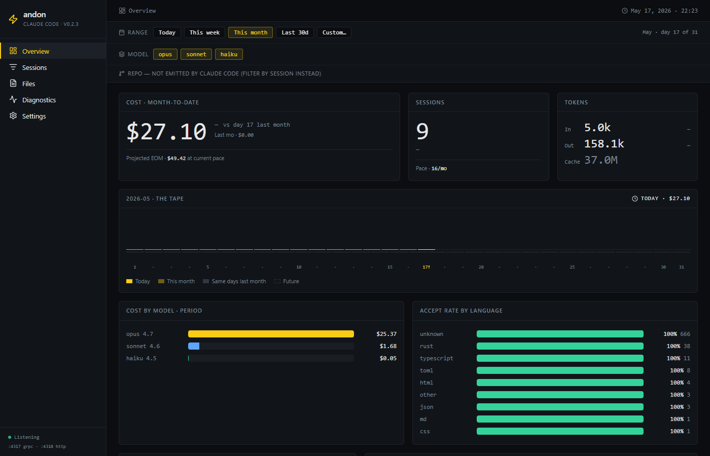
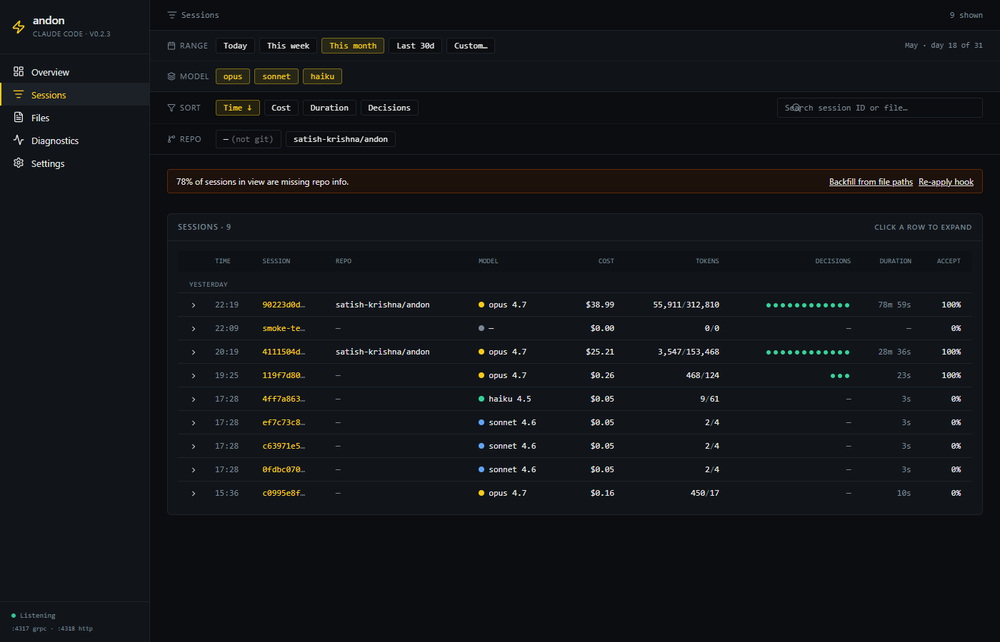
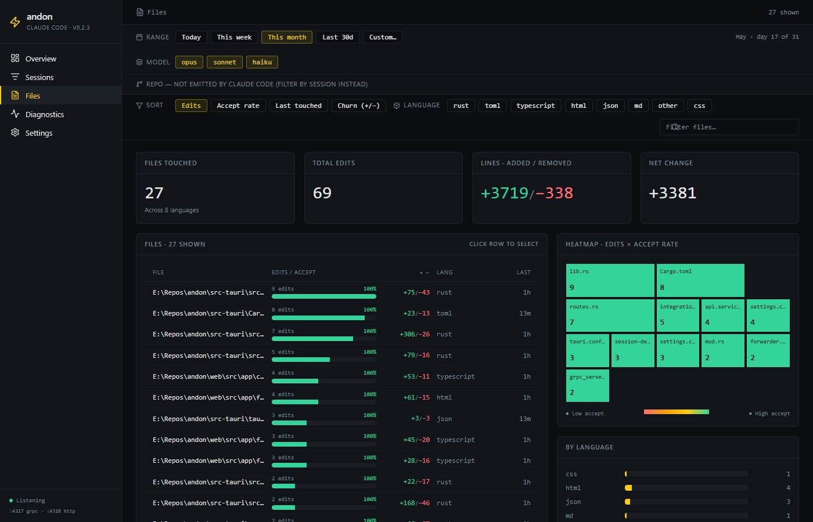
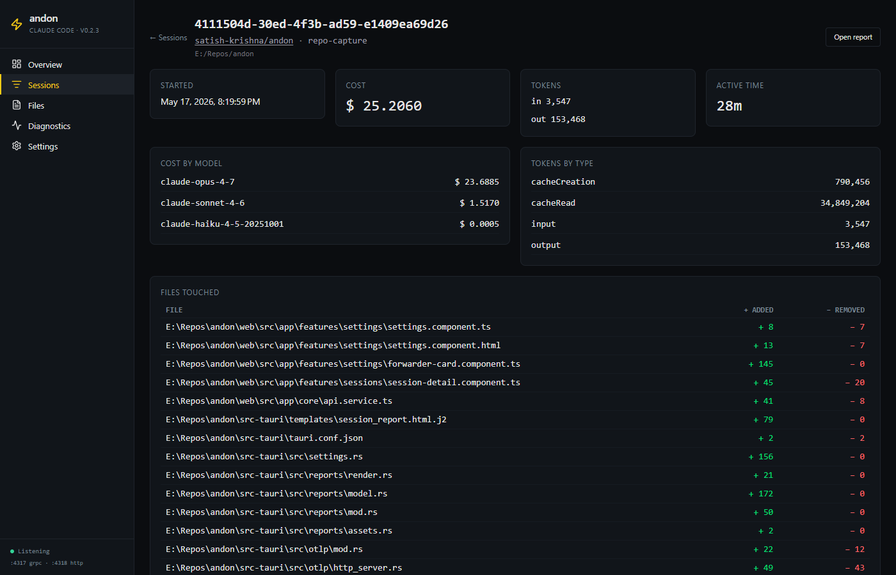
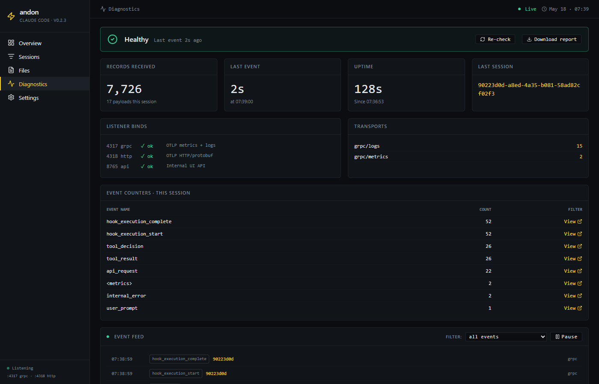

# andon

*Andon* (アンドン) — the lean-manufacturing signal board that surfaces what's happening on the factory floor. This is the andon board for Claude Code usage.

A local, single-binary desktop app that ingests Claude Code OpenTelemetry data, stores it in embedded SQLite, and renders a reporting dashboard. Everything runs on `127.0.0.1`. No cloud, no auth, no outbound network.

Works with **any Claude Code subscription** (Pro, Max, Team, Enterprise, API key) — telemetry is emitted client-side regardless of plan.



## What it does

Claude Code already emits a rich stream of OpenTelemetry metrics and logs — cost, token usage, tool decisions, file edits, session lifecycle. Most engineers never see it because there's nowhere for it to go. Andon is the place for it to go.

- A bundled OTLP receiver (gRPC `:4317` + HTTP/protobuf `:4318`) accepts the telemetry directly from the Claude Code CLI.
- An embedded SQLite database persists every metric and log event, denormalised by session.
- An Angular dashboard, served by a localhost API on `:8765`, renders the data as charts, tables, and a file heatmap.
- A system tray icon keeps the process alive in the background; the window opens on demand.

No collector, no Docker, no daemon to install. One executable.

## At a glance

| | |
|---|---|
|  |  |
| **Sessions** — every Claude Code session with cost, duration, tokens, accept rate. | **Files** — what got touched, how often, accepted vs rejected, by language. |
|  |  |
| **Session detail** — per-session timeline of tool decisions, files, and token spend. | **Diagnostics** — live OTLP event feed, listener health, event-type counters. |

More detail and per-page screenshots: [`docs/features.md`](docs/features.md). Architecture, ports, and data model: [`docs/architecture.md`](docs/architecture.md).

## Compared to ccusage and JSONL-based tools

`ccusage` and tools like `claude-code-templates` read `~/.claude/projects/<slug>/*.jsonl` — the conversation transcripts Claude Code writes to disk — and derive token counts and inferred costs from them. They're great for "what did I spend yesterday" answers with zero setup, work retroactively on data already on disk, and can grep your prompts.

Andon ingests a different stream: the OpenTelemetry feed Claude Code emits when `CLAUDE_CODE_ENABLE_TELEMETRY=1`. That stream carries the numeric and metadata signal (token counts split by type, the `claude_code.cost.usage` value Claude Code itself computes, tool decisions, file paths, lifecycle events) — and no conversation text at all.

| | Andon | ccusage / JSONL harvesters |
|---|---|---|
| Data source | OTLP (gRPC `:4317` + HTTP `:4318`) from the CLI | `~/.claude/projects/**/*.jsonl` transcripts |
| Cost source | `claude_code.cost.usage` metric, emitted by Claude Code | Inferred: token counts × a bundled pricing table |
| Captures prompts / responses | Never — see *Privacy* below | Yes, on disk; the tool chooses whether to surface them |
| Persistence | Embedded SQLite, WAL mode | None — recomputes from JSONL on each invocation |
| Real-time | Live ingest plus a diagnostic event feed | Snapshot at invocation |
| Retroactive | Yes — Settings → "Ingest JSONL history" walks `~/.claude/projects/` | Yes — every session you've ever run |
| Form factor | Tray app plus web dashboard | Terminal CLI |
| Setup | One exe, auto-patches `~/.claude/settings.json` | `npx ccusage@latest` |
| Cross-platform | Windows-first today | Anywhere Node runs |
| Outbound network | None (forwarder opt-in) | None |

The tools are complementary more than competing. A reasonable workflow:

- Run `npx ccusage@latest` once for the retroactive month-to-date number on a machine that has never been instrumented.
- Run Andon from then on for the persistent dashboard, behavioural views (accept-rate by language, file heatmap, repo attribution), the live OTLP diagnostic feed, and optional forwarding to your own collector.

## Requirements

- Windows 10/11 (x64). No admin rights required.
- That's it. SQLite, the OTLP receivers, and the web UI are all bundled in a single executable.

## Install

1. Download the latest `andon.exe` from the [releases page](https://github.com/satish-krishna/andon/releases).
2. Double-click to launch. A tray icon appears (yellow disc).
3. Left-click the tray icon → window opens.

## Wire up Claude Code

**Automatic** — on first launch, andon patches `%USERPROFILE%\.claude\settings.json` for you:

- If no `env` block exists, andon adds one with the required OTel variables.
- If your existing settings already point at andon, nothing changes.
- If you already export to a *different* OTLP endpoint (e.g., your own collector), andon refuses to overwrite and the Settings page shows a "conflict — manual review needed" notice.
- Before any write, andon copies your existing settings to `settings.json.andon-backup`.

Then restart any open Claude Code sessions. Within ~10 seconds of finishing a session you'll see today's numbers populate on the Overview page.

### Manual setup (if you'd prefer)

```json
{
  "env": {
    "CLAUDE_CODE_ENABLE_TELEMETRY": "1",
    "OTEL_METRICS_EXPORTER": "otlp",
    "OTEL_LOGS_EXPORTER": "otlp",
    "OTEL_EXPORTER_OTLP_PROTOCOL": "grpc",
    "OTEL_EXPORTER_OTLP_ENDPOINT": "http://localhost:4317"
  }
}
```

The **Settings → Danger zone** panel exposes "Unpatch" and "Restore from andon-backup" buttons if you want to roll back.

## Data location

All data lives in `%USERPROFILE%\.andon\`:

| File           | Purpose                              |
|----------------|--------------------------------------|
| `data.db`      | SQLite database (WAL mode)           |
| `log.txt`      | Rotating daily log                   |

Open from the **Settings → Data** panel via the "Open folder" button.

## Ports

| Port  | Bind        | Purpose                       |
|-------|-------------|-------------------------------|
| 4317  | 127.0.0.1   | OTLP gRPC ingest              |
| 4318  | 127.0.0.1   | OTLP HTTP/protobuf ingest     |
| 8765  | 127.0.0.1   | Internal API + SPA backend    |

All bind to loopback only. If any port is already in use (e.g., another OTLP collector), andon will fail to start with a clear error.

## Pause ingestion

Tray menu → **Pause Ingestion** drops incoming metrics on the floor without closing the listeners. Tray menu → **Resume Ingestion** re-enables. Also toggleable from the Settings page.

## Optional: forward to another collector

Andon can re-emit everything it receives to a second OTLP HTTP/protobuf endpoint (your own collector, Honeycomb, Grafana Cloud, etc.). Off by default. Configure under **Settings → OTel Forwarder**.

## Build from source

See [`docs/building.md`](docs/building.md) for the full setup. Quick version:

```powershell
# One-time setup: Rust + Visual Studio Build Tools 2022 + tauri-cli
cd web && npm install && npm run build && cd ..
cargo tauri dev          # development
cargo tauri build        # release binary in src-tauri/target/release/bundle/
```

## Privacy

- All ports bind to `127.0.0.1`. Nothing is exposed to the network.
- No outbound calls. Andon never phones home.
- Raw user prompts are never persisted even if `OTEL_LOG_USER_PROMPTS=1` upstream.
- SQLite DB is user-only read/write.
- Andon installs a Claude Code `SessionStart` hook (in addition to the existing `PostToolUse` and `SessionEnd` hooks) that POSTs the session id and working directory to `http://127.0.0.1:8765/api/session/context`. Git metadata (toplevel, remote, branch) is computed by Andon locally — git is invoked from the cwd you launched Claude Code from. Nothing leaves the machine.

## License

MIT.
