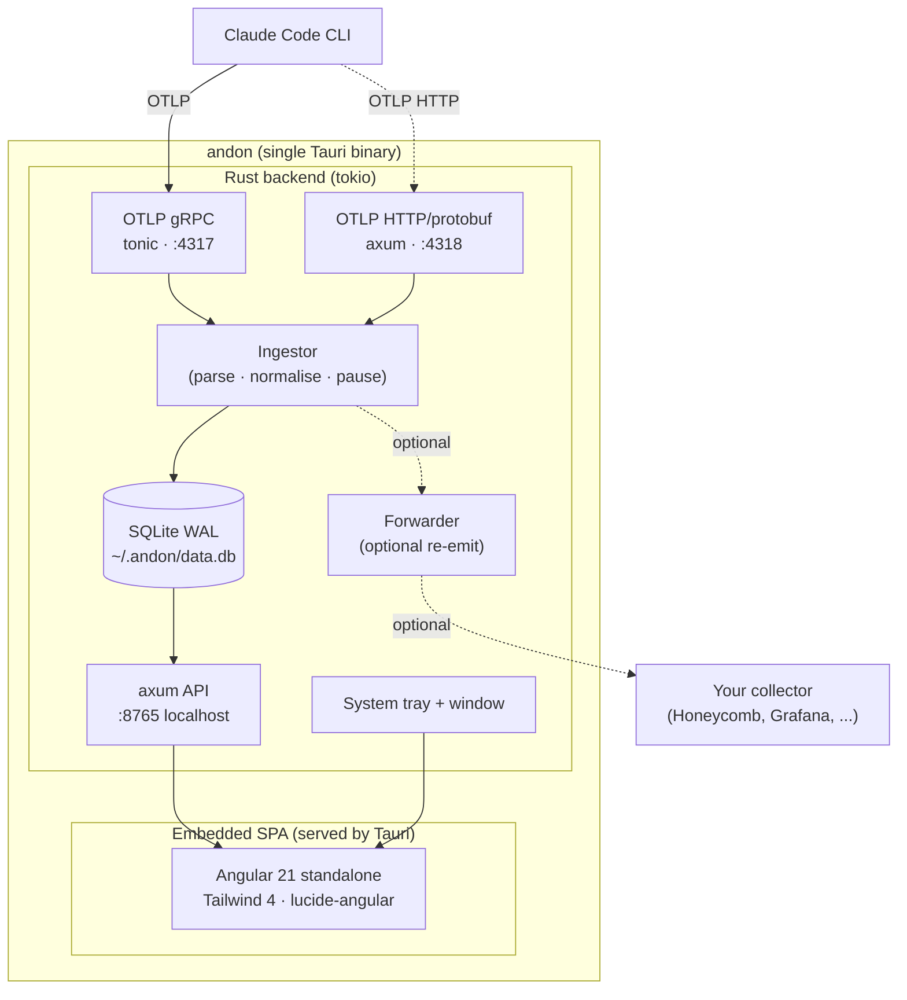

# Architecture

Andon is a single Tauri 2.x binary. Inside it, a Rust backend runs three concurrent servers and an embedded Angular SPA. There is no external collector, no Docker, no daemon to install.

## Process model

- **Single OS process.** Tauri owns the window and tray; the Rust backend runs on a tokio runtime in the same process.
- **Three TCP listeners**, all bound to `127.0.0.1`:
  - `:4317` — tonic gRPC `MetricsService` + `LogsService` from `opentelemetry-proto`.
  - `:4318` — axum routes `POST /v1/metrics` and `POST /v1/logs` accepting `application/x-protobuf` with the same decoders.
  - `:8765` — axum JSON API consumed by the SPA. CORS allow-any so a browser pointed at a built `dist/` also works for development.
- **Window is optional.** Closing it hides to tray; quitting from the tray shuts the runtime down cleanly.

## Ingestion path

1. Claude Code emits an OTLP `ExportMetricsServiceRequest` or `ExportLogsServiceRequest`.
2. The receiver decodes the protobuf and hands a flat batch to the `Ingestor`.
3. The ingestor extracts the resource attributes (`session.id`, `user.account_uuid`, `organization.id`, `service.version`, `host.arch`, `os.type`, `terminal.type`) and denormalises them onto every row it writes.
4. Known metrics get typed rows in their dedicated table. Unknown metric names are preserved verbatim in `metrics_raw` so nothing is lost.
5. Receivers always return `Ok` to the client — ingestion failures are logged but never surfaced to Claude Code.
6. If the forwarder is enabled, the same batch is re-emitted over HTTP/protobuf to the configured downstream endpoint.

## Tech stack — locked decisions

| Layer            | Choice                                  | Why                                                                     |
|------------------|-----------------------------------------|-------------------------------------------------------------------------|
| Shell            | Tauri 2.x                               | Native window + tray, small binary, Rust-first                          |
| Async runtime    | tokio                                   | Required by tonic and axum                                              |
| OTLP gRPC server | tonic + `opentelemetry-proto`           | Official protobuf bindings, no custom decoding                          |
| OTLP HTTP server | axum                                    | Same router used for the SPA + API; HTTP/protobuf POST endpoint         |
| Internal API     | axum                                    | JSON REST, served on `127.0.0.1:8765`                                   |
| Persistence      | rusqlite (`bundled`) + WAL mode         | Zero external deps, statically linked SQLite                            |
| Frontend         | Angular 21 standalone + Tailwind 4      | Signals-only state, no NgModules, no NgRx                               |
| Charts           | Hand-rolled SVG + CSS (no Chart.js dep) | Lightweight, themable, deterministic snapshots                          |
| Embedding        | Tauri's built-in asset pipeline         | Frontend builds to `web/dist/web/browser`, Tauri bundles it             |

## SQLite schema

WAL mode, applied as a single migration on first run. Indexes on `(session_id, timestamp)` for every event table.

| Table             | Purpose                                                                |
|-------------------|------------------------------------------------------------------------|
| `sessions`        | One row per Claude Code session. Lifecycle + denormalised resource attrs. |
| `token_usage`     | Per-event token counts split by `model` and `token_type` (input/output/cacheRead/cacheCreation). |
| `cost_entries`    | Per-event USD cost split by `model`.                                   |
| `tool_decisions`  | Accept / reject / abort per tool call. Carries `language` + `file_path`. |
| `file_changes`    | Lines added / removed per file per session.                            |
| `git_activity`    | Commits + pull requests emitted by Claude Code.                        |
| `active_time`     | Wall-clock active time, split `user` vs `cli`.                         |
| `metrics_raw`     | Catch-all: any metric name the ingestor doesn't recognise lands here with full attrs as JSON. |

## OTel resource attributes captured

| Attribute              | Notes                                  |
|------------------------|----------------------------------------|
| `service.name`         | Always `claude-code`                   |
| `service.version`      | Claude Code version                    |
| `session.id`           | UUID, stable per CLI session           |
| `user.account_uuid`    | Anthropic account UUID                 |
| `organization.id`      | Anthropic org ID (Team/Enterprise)     |
| `host.arch`            | e.g. `arm64`, `amd64`                  |
| `os.type`              | `darwin`, `linux`, `windows`           |
| `terminal.type`        | e.g. `tmux`, `iTerm.app`               |

## Privacy & safety rules

1. All listeners bind to `127.0.0.1` only. Never `0.0.0.0`.
2. Raw user prompts are not logged even if `OTEL_LOG_USER_PROMPTS=1` is set upstream.
3. SQLite DB file is user-only read/write.
4. No outbound network calls except the optional, opt-in OTel forwarder.
5. No telemetry of telemetry — andon does not phone home.
