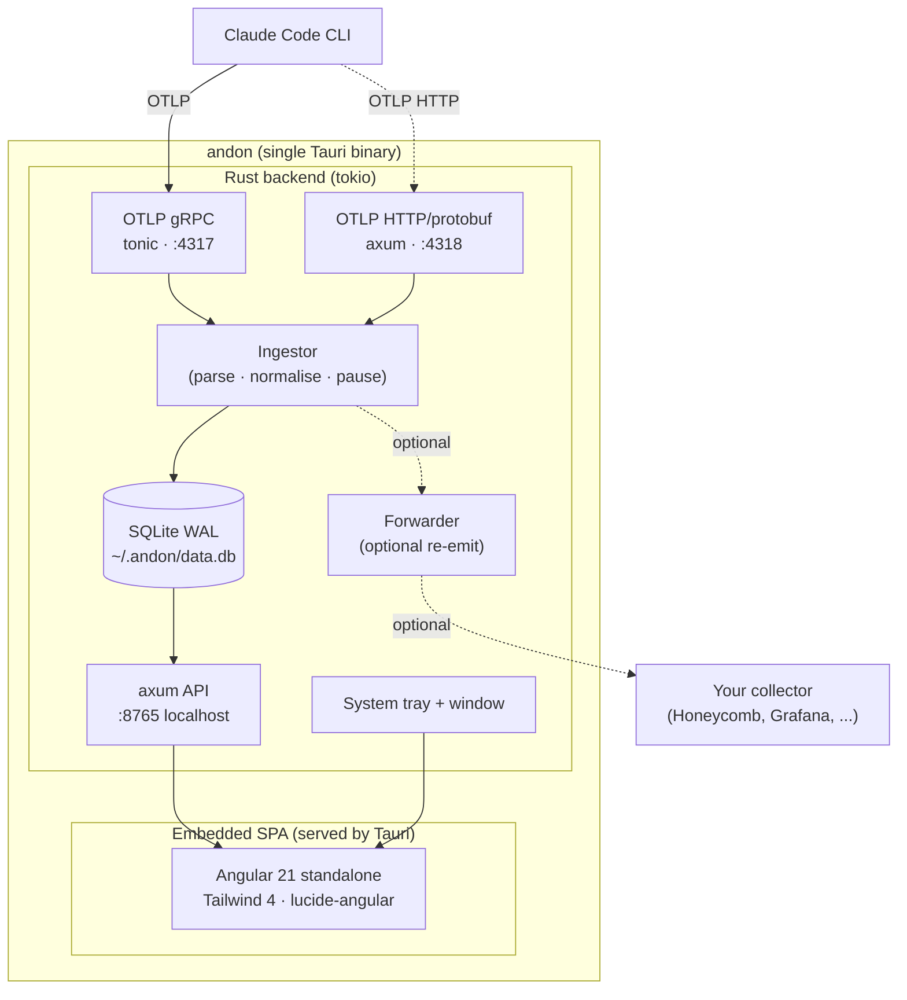
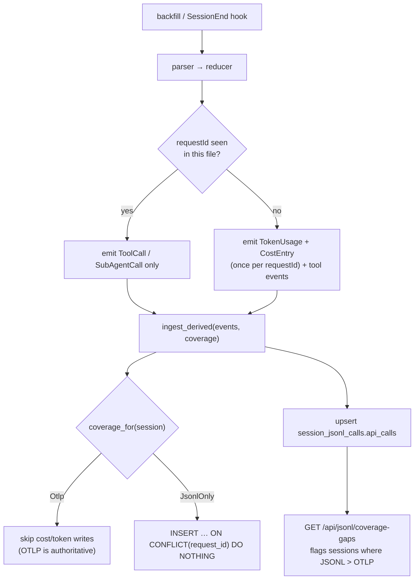

# Architecture

Andon is a single Tauri 2.x binary. Inside it, a Rust backend runs three concurrent servers and an embedded Angular SPA. There is no external collector, no Docker, no daemon to install.

## Process model

- **Single OS process.** Tauri owns the window and tray; the Rust backend runs on a tokio runtime in the same process.
- **Three TCP listeners**, all bound to `127.0.0.1`:
  - `:4317` — tonic gRPC `MetricsService` + `LogsService` from `opentelemetry-proto`.
  - `:4318` — axum routes `POST /v1/metrics` and `POST /v1/logs` accepting `application/x-protobuf` with the same decoders.
  - `:8765` — axum JSON API consumed by the SPA. CORS allow-any so a browser pointed at a built `dist/` also works for development.
- **Window is optional.** Closing it hides to tray; quitting from the tray shuts the runtime down cleanly.
- **Budget monitor.** A background task wakes every 30 minutes (and once at startup), projects month-end cost from `cost_entries`, compares it to the user's monthly budget, repaints the tray icon, and fires desktop notifications. Notification de-dup state is persisted to `budget-alerts.json` in the data directory; the budget amount itself lives in `settings.json` under the `budget` key.
- **Coach re-evaluator.** On `SessionEnd`, the coach re-evaluator runs in a spawned tokio task (never inline) and writes findings to `coach_findings`. The JSONL backfill also runs the evaluator and Skill Finder at batch completion.

## Ingestion path

1. Claude Code emits an OTLP `ExportMetricsServiceRequest` or `ExportLogsServiceRequest`.
2. The receiver decodes the protobuf and hands a flat batch to the `Ingestor`.
3. The ingestor extracts the resource attributes (`session.id`, `user.account_uuid`, `organization.id`, `service.version`, `host.arch`, `os.type`, `terminal.type`) and denormalises them onto every row it writes.
4. Known metrics get typed rows in their dedicated table. Unknown metric names are preserved verbatim in `metrics_raw` so nothing is lost.
5. Receivers always return `Ok` to the client — ingestion failures are logged but never surfaced to Claude Code.
6. If the forwarder is enabled, the same batch is re-emitted over HTTP/protobuf to the configured downstream endpoint.

## JSONL transcript ingestion

In addition to the live OTLP stream, Andon can read Claude Code's on-disk JSONL transcripts from `~/.claude/projects/<slug>/*.jsonl`. This covers sessions that ran before Andon was installed, or sessions where OTel was stripped mid-flight by an enterprise policy.

### Routing: binary OTLP-wins

A session is either OTLP-covered or JSONL-only. The reconciler (`reconciler.rs`) checks for any OTLP-written `token_usage` row (identified by `request_id IS NULL`) to classify the session:

- **OTLP-covered** — JSONL ingestion contributes no `token_usage` or `cost_entries` rows. OTLP is the authoritative source for cost and tokens; writing JSONL rows on top would double-count.
- **JSONL-only** — JSONL is the sole writer of `token_usage` and `cost_entries` rows for that session.

There is no merging or blending of the two sources. This makes the classification explicit and the row provenance unambiguous. The `request_id IS NULL` predicate in `coverage_for` is deliberate: JSONL's own rows carry a non-NULL `request_id`, so they never make a JSONL-only session appear OTLP-covered on a subsequent re-ingest.

### Per-`requestId` usage collapse

Claude Code writes one JSONL `assistant` record per content block of an API response. Every record belonging to the same API call shares the same `requestId` and carries an identical `usage` object. Naively emitting a `TokenUsage` and `CostEntry` per record would overcount by 1.6×–3×.

The reducer (`reducer.rs`) collapses usage to one event per `requestId`: it tracks a `seen_requests: HashSet<String>` and emits cost and token events only the first time a `requestId` is encountered. Subsequent records from the same request still have their `tool_use` content blocks processed (each becomes a `ToolCall` event). Records without a `requestId` — synthetic or api-error rows — carry no priceable usage and are skipped.

### Structural uniqueness backstop

Every `token_usage` and `cost_entries` row written by the JSONL path carries the `requestId` in the `request_id` column. Partial unique indexes enforce that no two JSONL rows share the same `(request_id, token_type)` (for `token_usage`) or `request_id` (for `cost_entries`). The `INSERT … ON CONFLICT(request_id) WHERE request_id IS NOT NULL DO NOTHING` clause makes repeated backfill runs idempotent without any time-based heuristics.

### Partial-OTLP detection

Binary routing means a session that lost OTel mid-flight reports only its pre-loss turns in the OTLP stream. Rather than silently under-report, every JSONL ingest upserts the count of distinct `requestId`s seen in the transcript into `session_jsonl_calls`. The `GET /api/jsonl/coverage-gaps` endpoint compares that count against the number of OTLP-recorded calls (counted as distinct `request_id IS NULL` timestamps in `token_usage`) and returns sessions where the transcript shows more API calls than OTLP recorded. The Diagnostics page surfaces these as a "Possible OTLP coverage gaps" card.

## Tech stack — locked decisions

| Layer            | Choice                                  | Why                                                                     |
|------------------|-----------------------------------------|-------------------------------------------------------------------------|
| Shell            | Tauri 2.x                               | Native window + tray, small binary, Rust-first                          |
| Async runtime    | tokio                                   | Required by tonic and axum                                              |
| OTLP gRPC server | tonic + `opentelemetry-proto`           | Official protobuf bindings, no custom decoding                          |
| OTLP HTTP server | axum                                    | Same router used for the SPA + API; HTTP/protobuf POST endpoint         |
| Internal API     | axum                                    | JSON REST, served on `127.0.0.1:8765`                                   |
| Persistence      | rusqlite (`bundled`) + WAL mode         | Zero external deps, statically linked SQLite                            |
| Frontend         | Angular 21 standalone + Tailwind 4      | Signals-only state, no NgModules, no NgRx                               |
| Charts           | Hand-rolled SVG + CSS (no Chart.js dep) | Lightweight, themable, deterministic snapshots                          |
| Embedding        | Tauri's built-in asset pipeline         | Frontend builds to `web/dist/web/browser`, Tauri bundles it             |

## SQLite schema

WAL mode, applied incrementally via numbered migrations on first run. Indexes on `(session_id, timestamp)` for every event table.

| Table                  | Purpose                                                                |
|------------------------|------------------------------------------------------------------------|
| `sessions`             | One row per Claude Code session. Lifecycle + denormalised resource attrs + repo metadata (root, remote, branch, name) + `data_source` (`otlp` or `jsonl`). |
| `token_usage`          | Per-event token counts split by `model` and `token_type` (input/output/cacheRead/cacheCreation). OTLP-written rows have `request_id IS NULL`; JSONL-written rows carry the Claude Code `requestId`. A partial unique index on `(request_id, token_type) WHERE request_id IS NOT NULL` makes JSONL duplicates impossible. An `is_subagent` flag (set from JSONL's `isSidechain`) distinguishes sidechain rows from main-agent rows — powers the Efficiency page's main/subagent split. |
| `cost_entries`         | Per-event USD cost split by `model`. Same `request_id` column, partial unique index, and `is_subagent` flag as `token_usage`. |
| `tool_decisions`       | Accept / reject / abort per tool call. Carries `language`, `file_path`, `model`, and a `source` label (`otlp` or `jsonl`). |
| `file_changes`         | Lines added / removed per file per session.                            |
| `git_activity`         | Commits + pull requests emitted by Claude Code.                        |
| `active_time`          | Wall-clock active time, split `user` vs `cli`.                         |
| `metrics_raw`          | Catch-all: any metric name the ingestor doesn't recognise lands here with full attrs as JSON. |
| `log_events`           | Catch-all log of every OTLP log record received: event name, body (redacted for `user_prompt`), attributes JSON, and transport (`grpc` / `http`). |
| `slash_commands`       | Per-session log of slash-command invocations (name + arg-count). Populated from JSONL transcripts; powers the Behaviour page's command leaderboard. |
| `subagent_calls`       | Per-session log of `Task` tool delegations grouped by `subagent_type`. Populated from JSONL transcripts; powers the Behaviour page's sub-agent usage view. |
| `session_jsonl_calls`  | Per-session count of distinct `requestId`s observed in the JSONL transcript. Powers partial-OTLP detection via `GET /api/jsonl/coverage-gaps`. |
| `jsonl_errors`         | Per-line JSONL parse errors with file path + line number; surfaced on the Diagnostics page. |
| `jsonl_ingest_runs`    | One row per JSONL ingest run (backfill or session-end), with start/end timestamps, files processed, records processed, and error counts. |
| `prompt_turns`         | Per-user-turn prompt rows with derived flags: `length`, `has_file_ref`, `has_code`, `has_constraint`. Source for Coach anti-pattern evaluation. |
| `skill_opportunities`  | Skill Finder cached opportunities per look-back window. Rebuilt on each evaluation run. |
| `coach_rules`          | Static catalogue of anti-pattern rules, persisted for per-rule enable/disable state. |
| `coach_findings`       | Per-evaluation findings, idempotent via unique index on `(session_id, rule_slug, turn_index)`. |

## OTel resource attributes captured

| Attribute              | Notes                                  |
|------------------------|----------------------------------------|
| `service.name`         | Always `claude-code`                   |
| `service.version`      | Claude Code version                    |
| `session.id`           | UUID, stable per CLI session           |
| `user.account_uuid`    | Anthropic account UUID                 |
| `organization.id`      | Anthropic org ID (Team/Enterprise)     |
| `host.arch`            | e.g. `arm64`, `amd64`                  |
| `os.type`              | `darwin`, `linux`, `windows`           |
| `terminal.type`        | e.g. `tmux`, `iTerm.app`               |

## Privacy & safety rules

1. All listeners bind to `127.0.0.1` only. Never `0.0.0.0`.
2. Prompts persisted to the local DB never leave it. The OTel forwarder strips `user_prompt` bodies before re-emitting.
3. SQLite DB file is user-only read/write.
4. No outbound network calls except the optional, opt-in OTel forwarder.
5. No telemetry of telemetry — andon does not phone home.
