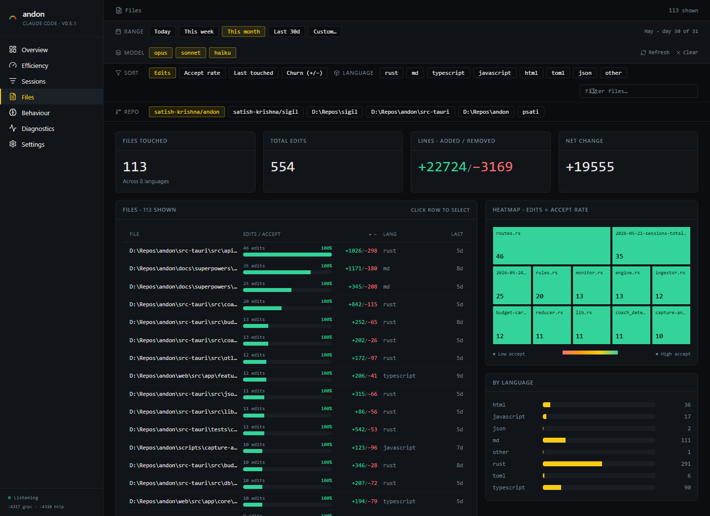
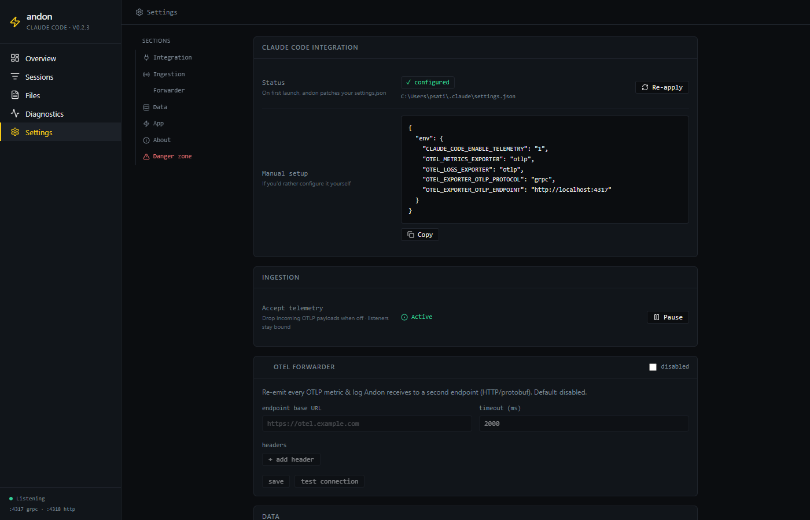

# Features

A walkthrough of every page in the andon dashboard. All screenshots are full-page captures of the actual app against a working SQLite database.

## Overview

The default landing page. Designed to be the one place you check each morning.

- **Range selector** — Today / This week / This month / Last 30 days / Custom. Every other chart on the page respects it.
- **Model filter** — toggle Opus / Sonnet / Haiku to isolate spend per model family.
- **Top KPIs** — month-to-date cost (with last-month-same-day comparison and end-of-month projection at current pace), session count, and a split token breakdown (input / output / cache). When a monthly budget is set (Settings → Monthly budget), the cost tile also shows projected spend as a percentage of that budget, with a progress bar that turns amber at 80% and red at 100%.
- **The Tape** — a calendar-as-row visualisation of daily cost across the month. Today is marked, the y-axis is a money scale, future days are blanked.
- **Cost by model** — period total broken down by model so you can see the Opus-vs-Sonnet mix.
- **Accept rate by language** — horizontal bars sorted descending, with raw edit counts.
- **Top repos · period** *(new in v0.4.0)* — horizontal list of the top 5 repos by cost in the active range, each with a sparkline. Click a row to jump to Sessions filtered to that repo.
- **Active time** — wall-clock minutes you spent vs. minutes Claude Code spent computing.
- **Recent sessions** — last 6 sessions, click-through to detail.

## Efficiency

A filterable page answering "am I spending tokens well?".

- **Cache hit ratio** — the share of prompt tokens (`input + cacheCreation +
  cacheRead`) served from cache, with a percentage-point delta vs. the previous
  period.
- **Net cache savings** — gross read savings minus the cache-creation premium,
  computed per model from the built-in price table. The gross figure and the
  premium are shown so the mechanic is visible. Tokens on models not in the
  price table are excluded and footnoted.
- **Model cost-efficiency** — per model family (`opus` / `sonnet` / `haiku`),
  the cost per session and cost per 1k output tokens. Each session is
  attributed wholly to the family that spent the most in it.

All figures respect the global filter bar (window + model chips).

## Sessions

Every Claude Code session andon has seen, filterable and sortable.

- Same range + model filters as Overview, plus free-text search across session ID and file paths.
- **REPO chip filter** *(new in v0.4.0)* — multi-select chips for every repo Andon has attributed in the active range. `— (not git)` is the bucket for sessions Andon couldn't attribute. Toggling chips filters the table and persists across navigation (the same selection applies on Files).
- **REPO column** — each row shows `org/name` (from the git remote) or the folder basename when the repo has no remote. Hover for the full path.
- **Missing-repo banner** — when more than 20% of sessions in view have no repo info, a banner offers a one-click "Backfill from file paths" (runs the inference fallback) and a link to re-apply the Claude Code hook.
- Sort by time, cost, duration, or decision count.
- Rows expand inline to show files touched and decisions made in that session, or you can click into a full detail view.
- Accept rate per row is computed as `accepts / (accepts + rejects)`.
- **LINES column** *(new)* — per-session lines added / removed. Shows `—` when no file-change data is available (line counts are captured by the PostToolUse hook).
- **Totals row** *(new)* — a grand-total row pinned at the bottom of the table sums cost, tokens, lines, decisions, duration, and accept rate across every session in view. Below it, a segmented bar splits the summed line changes into **Code / Docs / Other** (config files count as code; unclassifiable files as other).

## Session detail

Click any session ID to drill in. Captures everything that happened in that one CLI session.

- **Repo subtitle** *(new in v0.4.0)* — `org/name · branch` directly under the session ID, linking out to the remote (for any normalized `host/path` URL, including GitHub Enterprise vanity hosts and self-hosted GitLab/Gitea). Full `repo_root` shows underneath for context.
- Cost, token, and decision totals for the session.
- Timeline of tool decisions (accept / reject / abort) with the file and language they touched.
- Files modified with lines added / removed.
- Resource attributes captured at the start of the session (host, OS, terminal, Claude Code version).

The same view powers the standalone HTML reports you can export from the **Open report** button.

## Files

A repo-wide view of what Claude Code has been changing.

With one repo chip selected, paths render relative to the repo root:

- KPIs: files touched, total edits, lines added / removed, net change.
- Sortable file table with edits, accept rate, churn, language, last-touched-relative time.
- Filterable by language (rust / typescript / toml / ...) and by free-text path match.
- **REPO chip filter** *(new in v0.4.0)* — the same chip group as the Sessions page; selection is shared. When exactly one repo is selected, file paths render relative to that repo's root (e.g. `src-tauri/src/lib.rs` instead of the full `E:\Repos\andon\src-tauri\src\lib.rs`). With zero or multiple repos selected, paths stay absolute.
- **Heatmap** at the bottom: every file sized by edit count and coloured by accept rate (red = low accept, green = high). Lets you spot files Claude Code keeps suggesting changes to that you keep rejecting.

## Diagnostics

A live OTLP debugger built into the app. Indispensable when you're not sure whether telemetry is flowing.

- **Health** — overall status with seconds-since-last-event.
- **Counters** — records received this session, uptime, last session ID.
- **Listener binds** — confirms `:4317`, `:4318`, `:8765` are bound and serving.
- **Transports** — gRPC vs HTTP request counts split by `metrics` / `logs`.
- **Event counters** — every event name andon has seen this session with a count and a "View" button that filters the feed below.
- **Event feed** — live tail of every OTLP record received, with timestamp, name, session ID, and transport. Filterable, pausable.
- **Download report** — exports a self-contained HTML report of the current diagnostic state for sharing.

## Settings

Configuration, integration status, and danger zone. Sections are anchor-linked from the left rail.

- **Integration** — shows whether andon has successfully patched `~/.claude/settings.json` and exposes a "Re-apply" button. Includes a copy-paste manual config snippet for users who prefer to hand-edit. As of v0.4.0 the patcher also installs a `SessionStart` hook that POSTs to `/api/session/context` so andon can attribute every new session to its repo.
- **Ingestion** — global pause toggle. When paused, OTLP listeners stay bound but drop incoming payloads (so Claude Code never sees an error).
- **OTel forwarder** — opt-in re-emitter. Configure a downstream HTTP/protobuf endpoint, timeout, and custom headers. Test the connection before saving.
- **Data** — DB file path, "Open folder" button, and live row counts per table. *New in v0.4.0:* a **Backfill repo info** button that runs inference (LCA of file paths → walk up for `.git`) over up to 50 sessions per call with NULL `repo_root`. Useful for sessions that predate the SessionStart hook.
- **Monthly budget** — a monthly cost budget in USD. When the projected end-of-month spend crosses 80% / 100% of it, Andon shifts the tray icon to amber / red and fires one desktop notification per threshold per month. Set to 0 to disable. Alerts are suppressed for the first two days of each month, when the projection is too volatile to trust.
- **App** — launch-at-logon toggle (writes to `HKCU\Run`, no admin needed).
- **About** — version, stack, repo link.
- **Danger zone** — unpatch `settings.json` (revert the env vars and all three andon hooks) or restore from the `.andon-backup` snapshot andon took at first patch.
