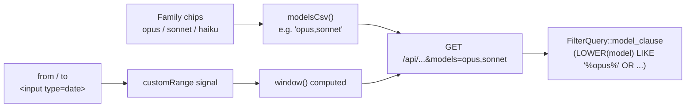

# Filter Fixes — Design

**Date:** 2026-05-18
**Branch:** `fix/filters`
**Scope:** Bug fixes only. Test harness deferred to a separate session (see `2026-05-18-test-harness-plan.md`).

---

## Problem

Two reported defects in the dashboard's filter bar:

1. **Model filter is all-or-none.** Selecting any subset of model chips returns zero rows; only "all selected" shows data.
2. **Custom date range has no UI.** Clicking "Custom…" flips the preset but exposes no date pickers, so the effective range becomes "all of history through today."

A third item — "no tests for web or Tauri" — is acknowledged here and addressed in the separate test-harness plan.

## Root causes

| Bug | Cause |
|---|---|
| Model all-or-none | Frontend `ALL_MODELS = ['opus','sonnet','haiku']` (family names) is sent as exact tokens to the backend, but stored `model` values are full IDs like `claude-opus-4-5-20251001`. Backend SQL is `WHERE model IN ('opus','sonnet','haiku')` → matches nothing. Selecting all → `modelsCsv` returns `''` → no filter applied → all rows. Hence the all-or-none symptom. |
| Custom range no UI | `setRange('custom')` sets the preset but `filter-bar.component` never renders date inputs. `customRange` signal stays `null`. `window()` falls through its `default` branch returning `{ fromMs: 0, toMs: endOfToday }`. |

## Architecture

No architectural change. Two surgical fixes scoped to:

- `web/src/app/core/filter.service.ts`
- `web/src/app/shared/filter-bar.component.ts`
- `src-tauri/src/api/routes.rs` (`FilterQuery::model_clause` and one inline call site)

API endpoints, DTOs, and the wire shape of the `models=` query param are unchanged.



### Wire contract (documented, not changed)

The `models` query param is a CSV of **family substrings**. Backend builds:

```sql
AND (LOWER(model) LIKE '%token1%' OR LOWER(model) LIKE '%token2%' ...)
```

Empty or omitted = no model filter (all models).

This survives new model versions (`claude-opus-4-7-…` matches `%opus%`) without UI or backend changes.

## Components & changes

### Web — `core/filter.service.ts`

- Keep `ALL_MODELS = ['opus','sonnet','haiku']` (families).
- Add `enterCustomMode()`: switches `range` to `'custom'` AND seeds `customRange` from the current `window()` so date pickers aren't blank.
- Add `setCustomFrom(ms: number)` and `setCustomTo(ms: number)`. Each clamps so `from <= to` (swap on inversion).
- `window()`: when `range === 'custom'`, return `customRange()` (now guaranteed non-null). Remove the `{ fromMs: 0, ... }` default fallback.
- `hasActiveFilters()`: include `range() !== 'month'` so the Clear button surfaces when the user is off the default range.
- `clearFilters()`: also reset `range` to `'month'` and `customRange` to `null`.

### Web — `shared/filter-bar.component.ts`

- "Custom…" chip handler: call `filter.enterCustomMode()` instead of `setRange('custom')`.
- When `filter.range() === 'custom'`, render two `<input type="date">` controls inline after the range chips, bound via `setCustomFrom`/`setCustomTo`.
- Add minimal dark-mode CSS for the native picker indicator: `::-webkit-calendar-picker-indicator { filter: invert(1); }`.

### Rust — `src-tauri/src/api/routes.rs`

- Rewrite `FilterQuery::model_clause` to substring matching:
  - Lowercase each token, wrap with `%...%`.
  - Build `AND (LOWER({col}) LIKE ? OR LOWER({col}) LIKE ? ...)`.
  - Empty list → return `(String::new(), vec![])` (unchanged).
- Replace the inline `model_filter_sql` at `routes.rs:1635` with a call through `model_clause` for consistency.
- No schema change. No DTO change. No new endpoints.

## Edge cases

| Case | Behavior |
|---|---|
| All chips deselected | `modelsCsv` = `""` → no filter (matches existing "all = no filter" semantics). |
| Model in DB lacks any family token (e.g. legacy `unknown`) | Excluded whenever any family chip is deselected. Matches user intent. |
| Custom range `from > to` | `setCustomFrom`/`setCustomTo` swap before storing. UI never sends inverted range. |
| Custom range partially set | Picker seeded from current `window()` on entry; both sides always have values. |
| Custom `from` in future | Allowed; returns empty results via existing empty states. Not an error. |
| `custom → month → custom` | Re-entering custom re-seeds from the new `window()`. |
| API `models=foo` (junk token) | Backend builds `LIKE '%foo%'`, returns 0 rows. Not an error. |

## Error handling

None of these warrant new error UI. Existing empty-state components cover "no data" cases. No new try/catch, no toasts.

## Verification (manual)

1. `cargo build` and `npm run build` both succeed.
2. With existing data and only "opus" chip selected → overview shows non-zero numbers (was 0 before).
3. Deselect all chips → behaves identically to "all selected".
4. Click "Custom…" → two date inputs appear, pre-filled with current month bounds.
5. Set custom range to a single past day with known data → all overview cards update to that day's numbers.
6. Switch back to "This month" → date inputs disappear, data restores.
7. `git grep "ALL_MODELS"` shows only the one definition.

## Commit plan

Single branch `fix/filters`, four commits:

1. `fix(api): substring-match model filter so chip selections actually filter`
2. `fix(web): repair custom date range and seed picker from current window`
3. `fix(web): treat non-default range as active filter; reset on clear`
4. `docs: add test-harness plan for upcoming session`

Each is independently revertable.

## Out of scope

- Tests (deferred — see `2026-05-18-test-harness-plan.md`).
- Adding `family/version/exact` toggle modes for the model filter.
- Popover / calendar widget for the date picker (native input is sufficient).
- Quick-preset dropdown inside custom mode.
- Refactoring the 1700-line `routes.rs`.
