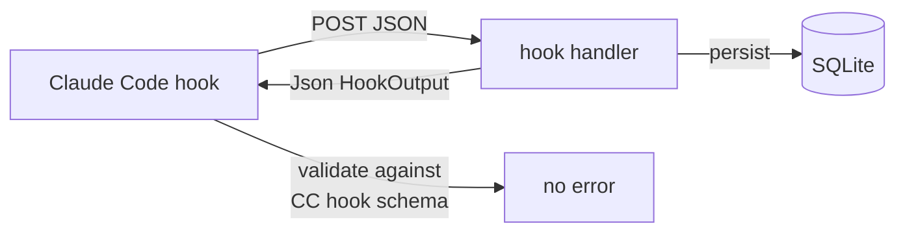

# Hook response envelope — design

**Date:** 2026-05-18
**Status:** Approved (design phase)

## Problem

Andon's three Claude Code hook receiver endpoints return JSON shaped like
`{"ok": true, ...}`. Claude Code's hook runtime pipes the response body back as
stdout from the hook command and validates it against its **hook output
schema** (fields: `continue`, `decision`, `suppressOutput`, `systemMessage`,
`hookSpecificOutput`, ...). `{"ok": true}` is not a valid hook output, so users
see:

> PostToolUse:Write hook error — Hook JSON output validation failed — (root): Invalid input

This fires on every Write/Edit/MultiEdit, every SessionEnd, and every
SessionStart. The hooks still do their job (the POST reaches Andon and rows are
written), but the user sees a spurious error after each tool call.

## Goal

Hook handlers in Andon return a body that conforms to Claude Code's hook output
schema, so no validation error surfaces. Leave room for Andon to use hook
output fields (e.g., `systemMessage`) in the future.

## Non-goals

- Adding new hook capabilities (blocking tools, surfacing messages). Just fix
  the envelope; future features can populate fields later.
- Building an API test harness. That work is tracked separately in
  `2026-05-18-test-harness-phase-{1,2,3}.md`.
- Changing the wire contract of any non-hook endpoint.

## Design

### Architecture



A small `HookOutput` type models Claude Code's hook output envelope. The three
hook receiver handlers return it. No other endpoints are touched.

### Components

#### `src-tauri/src/api/hook_response.rs` (new)

Single responsibility: model Claude Code's hook output envelope.

```rust
#[derive(Debug, Serialize, Default)]
#[serde(rename_all = "camelCase")]
pub struct HookOutput {
    #[serde(skip_serializing_if = "Option::is_none")]
    pub r#continue: Option<bool>,
    #[serde(skip_serializing_if = "Option::is_none")]
    pub suppress_output: Option<bool>,
    #[serde(skip_serializing_if = "Option::is_none")]
    pub system_message: Option<String>,
}

impl HookOutput {
    /// Empty, valid hook output. Serializes to `{}`.
    pub fn ok() -> Self { Self::default() }
}
```

`{}` is a valid Claude Code hook output (every field is optional). The struct
exists so future code can populate `system_message` or `r#continue` without
restructuring callers.

#### `src-tauri/src/api/routes.rs` — handler changes

| Handler                 | Before                                                                         | After                                |
|-------------------------|--------------------------------------------------------------------------------|--------------------------------------|
| `hook_tool_use`         | `Json<Value>` returning `{"ok": true, ...}`                                    | `Json<HookOutput>` → `HookOutput::ok()` |
| `hook_session_end`      | `Result<Json<Value>, ApiError>` returning `{"ok": true, "reason": …}`          | `Json<HookOutput>` → `HookOutput::ok()` |
| `hook_session_context`  | `Result<Json<Value>, ApiError>` returning `{"ok": true, ...}` or `400`         | `Json<HookOutput>` → `HookOutput::ok()` |

The diagnostic fields (`ok`, `reason`) are dropped from the wire. Existing
`tracing` log lines already cover diagnostic needs.

### Error handling

Currently `hook_session_context` returns `400 BAD_REQUEST` with
`{"error": "session_id required"}` on invalid input. That body would also fail
Claude Code's hook validation.

The project rule (in CLAUDE.md) is:

> Always return `Ok` to the client — never propagate ingestion errors to Claude Code.

The new contract makes this explicit for hook handlers: **they always return
`200 OK` with a valid `HookOutput`, even on bad input.** Invalid payloads are
logged via `tracing::warn!` and the handler returns early with
`HookOutput::ok()`. The DB write is skipped for that request.

This matches how `hook_tool_use` already behaves (silently skips missing
fields, returns ok).

### Data flow

Unchanged from today, except the response body is now `{}` instead of
`{"ok": true, ...}`. Persistence paths, repo inference, and forwarder hooks
are untouched.

## Testing

A dedicated API test harness is being built under
`2026-05-18-test-harness-phase-{1,2,3}.md`. This change ships unit tests for
the new type only; handler-level tests will land as part of the harness
rollout.

`#[cfg(test)] mod tests` in `hook_response.rs`:

- `ok_serializes_to_empty_object` — `serde_json::to_string(&HookOutput::ok())` == `"{}"`.
- `none_fields_are_omitted` — populating one field omits the others.
- `field_names_are_camel_case` — `suppress_output` serializes as `suppressOutput`, `system_message` as `systemMessage`.

TDD discipline: write the three failing tests first, then the struct, then
green.

## Migration / rollout

- One squash-merged PR on a short-lived feature branch
  (`fix/hook-response-envelope`).
- Conventional commit: `fix(api): return valid Claude Code hook output envelope`.
- Version bump to `0.4.2` on main after merge, per release process memory.
- No DB migration. No settings.json migration (the global hook commands stay
  identical).

## Acceptance criteria

- [ ] `HookOutput` exists in `src-tauri/src/api/hook_response.rs` with the three serialization tests passing.
- [ ] `hook_tool_use`, `hook_session_end`, `hook_session_context` return `Json<HookOutput>`.
- [ ] `hook_session_context` no longer returns `400` on bad input; it logs and returns `HookOutput::ok()`.
- [ ] Running a Claude Code session with Andon installed produces no "Hook JSON output validation failed" errors for Write/Edit/MultiEdit, SessionStart, or SessionEnd.
- [ ] `cargo test -p andon` passes.

## Out of scope

- Populating `system_message` when ingestion is paused. (Tracked separately if
  we want it.)
- Adding `PreToolUse` blocking behavior.
- API-level integration tests for the hook handlers (covered by the test-harness
  phase plans).
