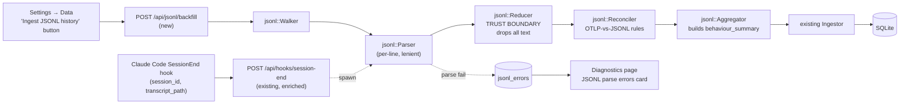

# JSONL behavioural ingest — design

**Status:** draft · awaiting user review
**Branch:** `feature/jsonl-ingest`
**Date:** 2026-05-19

## Problem

Andon today only sees a Claude Code session if OpenTelemetry was already wired up before the session ran. Sessions that pre-date install are invisible. Worse, OTLP omits several signals that would be most valuable for engineers reasoning about *how they work with Claude Code*, not just what they spend — tool invocation sequences, slash command usage, `Task` sub-agent calls, and "stuck" patterns where the assistant thrashes on the same file or retries the same command.

These signals are all sitting on disk in `~/.claude/projects/<slug>/*.jsonl` — Claude Code's per-session transcripts. JSONL is far richer than OTLP but is also undocumented, contains raw prompts and responses, and is owned by an upstream that can change it without notice.

## Goal

Ingest the relevant slice of JSONL data into Andon's SQLite store, in a way that:

1. **Backfills history.** Sessions that ran before OTel was configured populate the existing `sessions` / `token_usage` / `cost_entries` / `tool_decisions` tables so the dashboard shows months of past data on first run.
2. **Adds behavioural views going forward.** When a session ends, the new `SessionEnd` hook trigger parses its transcript and writes JSONL-derived signals: tool sequences, read-to-edit ratio, slash commands, sub-agent calls, stuck detection, and model frequency mix (model mix also uses OTLP data when available).
3. **Preserves the privacy promise.** No prompt or response text enters `data.db` — the existing rule #2 in `CLAUDE.md` remains true. Only numeric features, enums, file paths, and tool names.

## Non-goals (v1)

- A live filesystem watcher tailing JSONL during a session.
- Prompt-content search or transcript browsing.
- Prompt-text classification (topic taxonomy, sentiment, correction detection).
- Embeddings or any ML dependency.
- Reading anything outside `~/.claude/projects/<slug>/*.jsonl` (no `todos/`, no `statsig/`, no `~/.claude/projects.jsonl`).
- Cross-machine aggregation. JSONL stays local, like everything else in Andon.

## Approach

**Backfill button + SessionEnd hook**, sharing a single parser → reducer → reconciler → ingestor pipeline.

- **Backfill** runs once on user demand (Settings → Data → "Ingest JSONL history"). Walks every transcript under `~/.claude/projects/<slug>/`, processes each, writes to SQLite. Idempotent on `session_id`.
- **Live SessionEnd** extends the existing `/api/hooks/session-end` handler (`src-tauri/src/api/routes.rs:831`). Claude Code's `SessionEnd` hook payload already includes `transcript_path` — we spawn a background task that ingests exactly that one file. Hook still returns `200 {continue: true}` immediately.

The **reducer** is the privacy trust boundary: its input has access to raw text, its output type (`DerivedEvent` enum) carries only numeric fields, enums, file paths, and tool names. Anything downstream is text-free by type.

A bundled **pricing table** (`pricing.rs`) computes retroactive cost from token counts when no OTLP cost is available. UI badges those numbers as "(retroactive)" so they're distinguishable.

## Architecture



## Privacy model

**Strict-derived.** The reducer is the only module that reads JSONL fields containing user-authored text. Its output type forbids text by construction. Specifically:

- User and assistant `message.content[]` text blocks: **dropped**.
- Thinking blocks: token counts kept (`thinking_tokens`), content **dropped**.
- Tool-use `input` parameters: only `file_path` (for file-touching tools) and `bash.verb` + `bash.arg_count` (for Bash) extracted; rest **dropped**.
- Tool-result content: `is_error` flag and `duration_ms` kept; output text **dropped**.
- Slash command tags: `command_name` and `arg_count` extracted; raw arg text **dropped**.

The pitch's existing privacy claim — *"No secrets, code contents, or prompts are ever read or stored. Nothing leaves the engineer's machine"* — needs one word changed for accuracy: the parser **reads** prompt text in memory but does not **store** it. We will update the pitch wording to *"never persisted"* rather than *"never read"*.

## Reconciliation: OTLP vs. JSONL

The hook fires on every session close regardless of OTel configuration, so OTLP and JSONL can both produce data for the same `session_id`. JSONL is the **historical backstop**, OTLP is **authoritative for live sessions**:

| Tables | OTLP-covered session | JSONL-only session (retroactive) |
|---|---|---|
| `sessions`, `token_usage`, `cost_entries`, `tool_decisions`, `file_changes` | OTLP-authoritative. JSONL skips. | JSONL populates (`source='jsonl'`). |
| `tool_sequences`, `slash_commands`, `subagent_calls`, `behaviour_summary` | JSONL populates (OTLP cannot). | JSONL populates. |

**OTLP-covered detection**: `EXISTS (SELECT 1 FROM token_usage WHERE session_id = ?)`. If at least one OTLP token row exists for the session, treat it as OTLP-covered. Single boolean check, evaluated once per session at the start of reconciliation.

## Data model

### Schema changes to existing tables

```sql
-- Distinguishes OTLP-derived from JSONL-derived sessions.
ALTER TABLE sessions ADD COLUMN data_source TEXT;
-- Existing rows backfilled to 'otlp' in the same migration.

-- Distinguishes OTLP-emitted decisions from JSONL-derived tool calls.
ALTER TABLE tool_decisions ADD COLUMN source TEXT NOT NULL DEFAULT 'otlp';
ALTER TABLE tool_decisions ADD COLUMN model TEXT;
ALTER TABLE tool_decisions ADD COLUMN bash_verb TEXT;
ALTER TABLE tool_decisions ADD COLUMN arg_count INTEGER NOT NULL DEFAULT 0;
ALTER TABLE tool_decisions ADD COLUMN is_error INTEGER NOT NULL DEFAULT 0;
ALTER TABLE tool_decisions ADD COLUMN duration_ms INTEGER;
ALTER TABLE tool_decisions ADD COLUMN turn_idx INTEGER;
-- `decision` column stays — populated by OTLP rows, NULL for most JSONL rows
-- (JSONL captures every tool_use, not just prompting ones).
-- `model` is populated by JSONL (from the assistant turn's message.model);
-- OTLP rows have it NULL today, can be backfilled from token_usage if needed.
```

### New tables

```sql
-- Tool transition edges, aggregated per session.
-- Powers the Behaviour page's tool-sequence chart.
CREATE TABLE tool_sequences (
  session_id  TEXT NOT NULL,
  from_tool   TEXT NOT NULL,
  to_tool     TEXT NOT NULL,
  count       INTEGER NOT NULL,
  PRIMARY KEY (session_id, from_tool, to_tool)
);

CREATE TABLE slash_commands (
  id            INTEGER PRIMARY KEY AUTOINCREMENT,
  session_id    TEXT NOT NULL,
  timestamp     INTEGER NOT NULL,
  command_name  TEXT NOT NULL,
  arg_count     INTEGER NOT NULL DEFAULT 0
);
CREATE INDEX idx_slash_session ON slash_commands(session_id);
CREATE INDEX idx_slash_name    ON slash_commands(command_name);

-- One row per Task-tool invocation. The child runs in its own
-- transcript file; its SessionEnd hook ingests it separately.
CREATE TABLE subagent_calls (
  id                 INTEGER PRIMARY KEY AUTOINCREMENT,
  parent_session_id  TEXT NOT NULL,
  child_session_id   TEXT,
  subagent_type      TEXT,
  started_at         INTEGER NOT NULL,
  ended_at           INTEGER,
  tool_call_count    INTEGER NOT NULL DEFAULT 0
);
CREATE INDEX idx_subagent_parent ON subagent_calls(parent_session_id);

-- One row per session. Raw aggregates only; threshold checks happen
-- in queries so heuristics can be tuned without a data migration.
CREATE TABLE behaviour_summary (
  session_id           TEXT PRIMARY KEY,
  file_thrashed_max    INTEGER NOT NULL DEFAULT 0,
  file_thrashed_path   TEXT,
  command_retried_max  INTEGER NOT NULL DEFAULT 0,
  command_retried_verb TEXT,
  read_storm_max       INTEGER NOT NULL DEFAULT 0,
  read_count           INTEGER NOT NULL DEFAULT 0,
  edit_count           INTEGER NOT NULL DEFAULT 0,
  total_tool_calls     INTEGER NOT NULL DEFAULT 0,
  thinking_tokens      INTEGER NOT NULL DEFAULT 0,
  subagent_count       INTEGER NOT NULL DEFAULT 0
);

-- Parser failures. Surfaced on Diagnostics so schema drift is observable.
CREATE TABLE jsonl_errors (
  id             INTEGER PRIMARY KEY AUTOINCREMENT,
  jsonl_path     TEXT NOT NULL,
  line_no        INTEGER NOT NULL,
  error_kind     TEXT NOT NULL,
  error_msg      TEXT NOT NULL,
  cc_version     TEXT,
  ingested_at    INTEGER NOT NULL
);
CREATE INDEX idx_jsonl_errors_ts ON jsonl_errors(ingested_at);

-- Backfill / hook ingest run history.
CREATE TABLE jsonl_ingest_runs (
  id                  INTEGER PRIMARY KEY AUTOINCREMENT,
  kind                TEXT NOT NULL,
  started_at          INTEGER NOT NULL,
  ended_at            INTEGER,
  files_processed     INTEGER NOT NULL DEFAULT 0,
  records_processed   INTEGER NOT NULL DEFAULT 0,
  records_errored     INTEGER NOT NULL DEFAULT 0
);
```

`error_kind` values: `'json_parse' | 'unknown_type' | 'missing_field' | 'reducer_panic'`.
`kind` in `jsonl_ingest_runs`: `'backfill' | 'session_end'`.

### Stuck-detection heuristics

All thresholds are query-side constants, not schema constants. Tuning happens via a query change, not a data migration.

| Flag | Aggregate stored | Threshold |
|---|---|---|
| `file_thrashed` | `file_thrashed_max` — max edits to a single file in the session | `>= 5` |
| `command_retried` | `command_retried_max` — max repeats of the same `bash_verb` with the same `arg_count` | `>= 3` |
| `read_storm` | `read_storm_max` — longest run of consecutive `Read` calls with no `Edit`/`Write` between | `>= 10` |

## Reducer output type — the trust boundary in code

```rust
pub enum DerivedEvent {
    SessionLifecycle {
        session_id: String, started_at: i64, ended_at: Option<i64>,
        cc_version: Option<String>, cwd: Option<String>, git_branch: Option<String>,
    },
    TokenUsage {
        session_id: String, ts: i64, model: String,
        input: i64, output: i64, cache_create: i64, cache_read: i64,
    },
    CostEntry {
        session_id: String, ts: i64, model: String, cost_usd: f64,
    },
    ToolCall {
        session_id: String, ts: i64, turn_idx: i64,
        tool_name: String, file_path: Option<String>,
        bash_verb: Option<String>, arg_count: i64,
        is_error: bool, duration_ms: Option<i64>,
        model: Option<String>,
    },
    SlashCommand {
        session_id: String, ts: i64, name: String, arg_count: i64,
    },
    SubAgentCall {
        parent_id: String, child_id: Option<String>,
        subagent_type: Option<String>, started_at: i64,
    },
}
```

No variant carries text content. Privacy invariant is statically enforceable: a single grep for any new variant addition confirms it.

## Module layout

```
src-tauri/src/jsonl/
├── mod.rs          public API: backfill(), ingest_one()
├── record.rs       JsonlRecord serde struct (all-Option fields, lenient)
├── walker.rs       enumerate ~/.claude/projects/<slug>/*.jsonl
├── parser.rs       streaming line reader, BufReader::lines()
├── reducer.rs      TRUST BOUNDARY: JsonlRecord → Vec<DerivedEvent>
├── reconciler.rs   per-session OTLP-vs-JSONL routing
├── aggregator.rs   builds behaviour_summary deltas per session
└── pricing.rs      model → cost-per-token constants for retroactive cost
```

Public API:

```rust
pub async fn backfill(pool: &Pool, claude_home: &Path) -> Result<IngestStats>;
pub async fn ingest_one(pool: &Pool, transcript_path: &Path) -> Result<IngestStats>;
```

`tracing::instrument` on both. No `unwrap()` / `expect()` per CLAUDE.md.

## API surface

### `POST /api/jsonl/backfill` (new)

Request: empty body (the walker uses the user's `~/.claude` location).
Response: `IngestStats { files_processed, records_processed, records_errored, sessions_added, duration_ms }`.

Synchronous from the UI's perspective. Backfill is bounded by transcript volume — for a heavy user, a few seconds.

### `POST /api/hooks/session-end` (existing, enriched)

`SessionEndPayload` gains an optional `transcript_path: Option<String>` field. When present, after the existing session-end handling, an additional `tokio::spawn` task calls `jsonl::ingest_one(pool, transcript_path)`. Existing behaviour is preserved — hook still returns `200 {continue: true}` immediately, errors stay in tracing.

## UI surfaces

### New Behaviour page

Top-level nav slot between *Files* and *Diagnostics*. Sections:

1. **Model mix (by frequency)** — three small charts:
   - Invocations per model (`COUNT(*) FROM token_usage GROUP BY model`).
   - Sessions per model (`COUNT(DISTINCT session_id) FROM token_usage GROUP BY model`).
   - Tools per model heatmap (`COUNT(*) FROM tool_decisions GROUP BY model, tool_name`).
2. **Tool-sequence diagram** — directed graph of top `(from_tool, to_tool)` edges from `tool_sequences`.
3. **Read-to-edit ratio distribution** — histogram of `read_count / edit_count` per session.
4. **Slash command leaderboard** — bar chart from `slash_commands GROUP BY command_name`.
5. **Sub-agent usage** — `subagent_type` × invocation count × median `tool_call_count`.
6. **Stuck sessions** — sessions where any threshold tripped, with the offending file or verb.

All sections respect the same range + model filters as Overview / Sessions (signal-driven).

### Sessions page — Stuck chip

New column on the table. Query joins `behaviour_summary`; chip renders when:
```sql
file_thrashed_max >= 5
  OR command_retried_max >= 3
  OR read_storm_max >= 10
```
Tooltip shows the specific flag and the offending path/verb.

### Overview — "Invocations by model" companion

Adjacent to the existing "Cost by model" chart. Same data, different axis. Reveals cost-vs-frequency imbalance at a glance (*"70% of spend on Opus but it only handled 30% of turns"*).

### Settings → Data additions

- New button **"Ingest JSONL history"** — fires `POST /api/jsonl/backfill`.
- New status line: `"Last JSONL ingest: <relative time> · N records · K errors"` from the most recent `jsonl_ingest_runs` row. The "K errors" portion links to the Diagnostics card filtered to that run.

### Diagnostics — JSONL parse errors card

New card alongside existing Listener Binds / Counters / Event Feed. Shows last-24h error count, most recent 10 errors with `(file, line, error_kind, cc_version)`, "View all" expansion. Purpose: schema-drift observability — when Anthropic ships a Claude Code release that changes the JSONL shape, this card lights up before users file bugs.

### Session detail — small enrichment

Three new stats below the existing KPI row, from `behaviour_summary`:
- `R:E ratio`
- `Slash commands used (N)`
- `Sub-agents (N)`

No new panel — single row of three numbers.

## Error handling

| Error class | Lands in | User-visible |
|---|---|---|
| `serde_json::Error` on a line | `jsonl_errors` (`json_parse`) | Diagnostics count |
| Unknown record `type` | `jsonl_errors` (`unknown_type`) | Diagnostics count |
| Missing required field in known type | `jsonl_errors` (`missing_field`) | Diagnostics count |
| Reducer panic (caught) | `jsonl_errors` (`reducer_panic`) + `tracing::error!` | Diagnostics, highlighted |
| Per-session ingest DB error | `tracing::error!`, counted in `records_errored` | Settings status line |
| Whole-backfill FS error | API returns 500 | Toast: descriptive error |
| SessionEnd hook ingest failure | `tracing::error!`, hook still returns 200 | Diagnostics |

Per-line and per-session processing is wrapped in `std::panic::catch_unwind`. One bad record cannot abort a backfill of thousands of sessions.

## Pricing data

A small bundled `pricing.rs` module:

```rust
pub struct ModelPricing {
    pub input_per_mtok: f64,
    pub output_per_mtok: f64,
    pub cache_read_per_mtok: f64,
    pub cache_create_per_mtok: f64,
}

pub fn lookup(model: &str) -> Option<ModelPricing> { ... }
```

Used only for retroactive cost (`source='jsonl'` rows with no OTLP equivalent). UI tags those `cost_entries` rows so the dashboard can show a "(retroactive)" badge.

Maintenance commitment: update the table when Anthropic changes prices. Quarterly cadence is reasonable; a CI check that compares against `ccusage`'s pricing JSON would catch drift cheaply.

## Testing strategy

Builds on the Phase 1 test harness (commit `8846a33`).

1. **Reducer golden tests** — fixture JSONL records (`user`, `assistant` with `tool_use`, `assistant` with thinking, `summary`, `system`) → assert exact `Vec<DerivedEvent>` output.
2. **Privacy property test** — `proptest`-generated JSONL records containing random prompt-shaped text → reducer → assert no `DerivedEvent` field contains any substring of the input prompt. *Formal verification of the trust boundary.* This is the test that earns the privacy claim its keep in CI.
3. **Reconciliation integration tests** — pre-populate OTLP rows for session A, only JSONL for session B. Run ingest. Assert A's `token_usage` unchanged, B's populated with `source='jsonl'`. Both have rows in the new behavioural tables.
4. **Schema-fragility tests** — fixtures with missing `type`, unknown `type`, missing `message.usage`, extra nested fields. Assert parser logs to `jsonl_errors`, never panics, completes the batch.
5. **Backfill idempotency** — run `backfill()` twice over identical fixtures. Assert row counts equal.
6. **Stuck-detection unit tests** — synthetic sessions matching each threshold → assert `behaviour_summary` aggregates match.
7. **End-to-end smoke** — `scripts/smoke_jsonl.py` writes a synthetic JSONL into a temp `~/.claude/projects/` slug, calls the backfill API, asserts data lands. Mirrors `smoke_otlp.py` / `smoke_grpc.js`.

New dev dependency: `proptest` (or `quickcheck`) for test #2.

## Migration plan

Single migration file, applied on first run after upgrade:

1. `ALTER TABLE sessions ADD COLUMN data_source TEXT`.
2. `UPDATE sessions SET data_source = 'otlp' WHERE data_source IS NULL` — every pre-migration row came from OTLP.
3. Seven `ALTER TABLE tool_decisions ADD COLUMN` statements for `source`, `model`, `bash_verb`, `arg_count`, `is_error`, `duration_ms`, `turn_idx`.
4. `UPDATE tool_decisions SET source = 'otlp' WHERE source IS NULL`.
5. `CREATE TABLE` for each new table.
6. Indexes.

Migration is forward-only. WAL stays. No downtime — Andon does single-process startup, migration completes before listeners bind.

## Rollout

1. Ship the migration + JSONL module + backfill button. Existing users see new behaviour tables empty until they click the button.
2. The SessionEnd hook enhancement is live the moment Andon restarts post-install; new sessions start populating behavioural tables immediately.
3. Update README's "Compared to ccusage" section: remove the "No — only sees post-install sessions" cell under *Retroactive* since backfill now solves that.
4. Update pitch privacy wording from *"never read"* to *"never persisted"* — accurate to the strict-derived model.

## Open questions for future versions

- Live filesystem watcher (deferred — backfill + hook covers v1 needs).
- Prompt-text classification using a keyword classifier with the label persisted but the text dropped at parse time — stretches the strict-derived line, considered for v2.
- Embeddings-based topic-drift detection — v3 at earliest, would require an embedding model dependency.
- Forwarding JSONL-derived events to the OTel forwarder so downstream collectors also see them — currently the forwarder only re-emits OTLP-received events.
