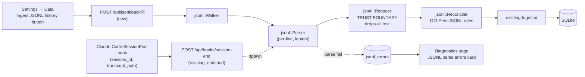

# JSONL behavioural ingest — design

**Status:** draft · awaiting user review · **scope cut to Plan C (2026-05-19)**
**Branch:** `feature/jsonl-ingest`
**Date:** 2026-05-19

## Plan C scope note

This spec was originally written with a broader scope ("Plan A") that included tool-sequence diagrams, read-to-edit ratios, stuck-session detection, and thinking-token tracking. After a scope-honesty pass we cut it down to **Plan C**: keep the value-adds OTLP genuinely cannot deliver (retroactive backfill, slash command tracking, sub-agent tracking, model frequency mix), drop the speculative behavioural views (stuck detection, tool sequences, R:E ratio, thinking tokens) until we have user data to tune them.

The deferred views remain documented in *Open questions for future versions* at the bottom.

## Problem

Andon today only sees a Claude Code session if OpenTelemetry was already wired up before the session ran. Sessions that pre-date install are invisible. Three additional signals are also missing from OTLP no matter when Andon was installed:

- **Slash command usage** — which custom slash commands the user actually invokes.
- **Sub-agent (`Task` tool) usage** — how often the user delegates to Explore-style agents.
- **Model frequency mix for retroactive sessions** — OTLP gives turn counts per model only from install date forward.

All three are sitting on disk in `~/.claude/projects/<slug>/*.jsonl` — Claude Code's per-session transcripts. JSONL is far richer than OTLP but is also undocumented, contains raw prompts and responses, and is owned by an upstream that can change it without notice.

## Goal

Ingest the relevant slice of JSONL data into Andon's SQLite store, in a way that:

1. **Backfills history.** Sessions that ran before OTel was configured populate the existing `sessions` / `token_usage` / `cost_entries` / `tool_decisions` tables so the dashboard shows months of past data on first run.
2. **Adds three new behavioural views.** A Behaviour page surfaces (i) model frequency mix (invocations + sessions + tools-per-model), (ii) slash command leaderboard, (iii) sub-agent usage. The SessionEnd hook ingests these signals live as well as via the one-shot backfill.
3. **Preserves the privacy promise.** No prompt or response text enters `data.db`. File paths, tool names, command names, numeric features only.

## Non-goals (v1)

- **Stuck-session detection** (file_thrashed / command_retried / read_storm). Deferred until we have validated thresholds against real sessions.
- **Tool-sequence diagram.** "Edit→Edit" alone is uninteresting; the full diagram is dashboard candy until we know what users actually look at.
- **Read-to-edit ratio histogram.** Speculative — defer until usage data shows the distribution is informative.
- **Thinking-token consumption tracking.** Niche; defer to v0.6+.
- **Live filesystem watcher** tailing JSONL during a session (backfill + hook covers v1 needs).
- **Prompt-content search** or transcript browsing.
- **Prompt-text classification** (topic taxonomy, sentiment, correction detection).
- **Embeddings** or any ML dependency.
- **Reading anything outside `~/.claude/projects/<slug>/*.jsonl`** (no `todos/`, no `statsig/`).
- **Cross-machine aggregation.** JSONL stays local.

## Approach

**Backfill button + SessionEnd hook**, sharing a single parser → reducer → reconciler → ingestor pipeline.

- **Backfill** runs once on user demand (Settings → Data → "Ingest JSONL history"). Walks every transcript under `~/.claude/projects/<slug>/`, processes each, writes to SQLite. Idempotent on `session_id`.
- **Live SessionEnd** extends the existing `/api/hooks/session-end` handler (`src-tauri/src/api/routes.rs:831`). Claude Code's `SessionEnd` hook payload already includes `transcript_path` — we spawn a background task that ingests exactly that one file. Hook still returns `200 {continue: true}` immediately.

The **reducer** is the privacy trust boundary: its input has access to raw text, its output type (`DerivedEvent` enum) carries only numeric fields, enums, file paths, and tool/command names. Anything downstream is text-free by type.

A bundled **pricing table** (`pricing.rs`) computes retroactive cost from token counts when no OTLP cost is available. UI badges those numbers as "(retroactive)" so they're distinguishable.

## Architecture



There is **no aggregator module** in Plan C. The reducer emits per-event rows; aggregation happens query-side at read time (cheap because the queries are simple `GROUP BY` over small tables).

## Privacy model

**Strict-derived.** The reducer is the only module that reads JSONL fields containing user-authored text. Its output type forbids text by construction.

- User and assistant `message.content[]` text blocks: **dropped**.
- Thinking blocks: ignored entirely in v1.
- Tool-use `input` parameters: only `file_path` extracted for file-touching tools; rest **dropped**.
- Tool-result content: **dropped** entirely (`is_error` not tracked in v1 since we don't surface it).
- Slash command tags: `command_name` and `arg_count` extracted; raw arg text **dropped**.
- Task tool inputs: `subagent_type` and `session_id` extracted; prompt/description text **dropped**.

The pitch's privacy claim needs one word changed: the parser **reads** prompt text in memory but does not **persist** it. We will update the pitch wording to *"never persisted"* rather than *"never read"*.

## Reconciliation: OTLP vs. JSONL

The hook fires on every session close regardless of OTel configuration, so OTLP and JSONL can both produce data for the same `session_id`. JSONL is the **historical backstop**, OTLP is **authoritative for live sessions**:

| Tables | OTLP-covered session | JSONL-only session (retroactive) |
|---|---|---|
| `sessions`, `token_usage`, `cost_entries`, `tool_decisions`, `file_changes` | OTLP-authoritative. JSONL skips. | JSONL populates (`source='jsonl'`). |
| `slash_commands`, `subagent_calls` | JSONL populates (OTLP cannot). | JSONL populates. |

**OTLP-covered detection**: `EXISTS (SELECT 1 FROM token_usage WHERE session_id = ?)`. If at least one OTLP token row exists for the session, treat it as OTLP-covered.

## Data model

### Schema changes to existing tables

```sql
-- Distinguishes OTLP-derived from JSONL-derived sessions.
ALTER TABLE sessions ADD COLUMN data_source TEXT;
-- Existing rows backfilled to 'otlp' in the same migration.

-- Distinguishes OTLP-emitted decisions from JSONL-derived tool calls,
-- and lets the model-mix view break tools down by model.
ALTER TABLE tool_decisions ADD COLUMN source TEXT NOT NULL DEFAULT 'otlp';
ALTER TABLE tool_decisions ADD COLUMN model TEXT;
```

That's it. The bash_verb / arg_count / is_error / duration_ms / turn_idx columns were dropped from Plan C — they only fed stuck detection and tool-sequence work.

### New tables

```sql
CREATE TABLE slash_commands (
    id            INTEGER PRIMARY KEY AUTOINCREMENT,
    session_id    TEXT NOT NULL,
    timestamp     INTEGER NOT NULL,
    command_name  TEXT NOT NULL,
    arg_count     INTEGER NOT NULL DEFAULT 0
);
CREATE INDEX idx_slash_session ON slash_commands(session_id);
CREATE INDEX idx_slash_name    ON slash_commands(command_name);

-- One row per Task-tool invocation. The child runs in its own
-- transcript file; its SessionEnd hook ingests it separately.
CREATE TABLE subagent_calls (
    id                 INTEGER PRIMARY KEY AUTOINCREMENT,
    parent_session_id  TEXT NOT NULL,
    child_session_id   TEXT,
    subagent_type      TEXT,
    started_at         INTEGER NOT NULL,
    ended_at           INTEGER,
    tool_call_count    INTEGER NOT NULL DEFAULT 0
);
CREATE INDEX idx_subagent_parent ON subagent_calls(parent_session_id);

-- Parser failures. Surfaced on Diagnostics so schema drift is observable.
CREATE TABLE jsonl_errors (
    id             INTEGER PRIMARY KEY AUTOINCREMENT,
    jsonl_path     TEXT NOT NULL,
    line_no        INTEGER NOT NULL,
    error_kind     TEXT NOT NULL,
    error_msg      TEXT NOT NULL,
    cc_version     TEXT,
    ingested_at    INTEGER NOT NULL
);
CREATE INDEX idx_jsonl_errors_ts ON jsonl_errors(ingested_at);

-- Backfill / hook ingest run history.
CREATE TABLE jsonl_ingest_runs (
    id                  INTEGER PRIMARY KEY AUTOINCREMENT,
    kind                TEXT NOT NULL,
    started_at          INTEGER NOT NULL,
    ended_at            INTEGER,
    files_processed     INTEGER NOT NULL DEFAULT 0,
    records_processed   INTEGER NOT NULL DEFAULT 0,
    records_errored     INTEGER NOT NULL DEFAULT 0
);
```

`error_kind` values: `'json_parse' | 'unknown_type' | 'missing_field' | 'reducer_panic'`.
`kind` in `jsonl_ingest_runs`: `'backfill' | 'session_end'`.

## Reducer output type — the trust boundary in code

```rust
pub enum DerivedEvent {
    SessionLifecycle {
        session_id: String, started_at: i64, ended_at: Option<i64>,
        cc_version: Option<String>, cwd: Option<String>, git_branch: Option<String>,
    },
    TokenUsage {
        session_id: String, ts: i64, model: String,
        input: i64, output: i64, cache_create: i64, cache_read: i64,
    },
    CostEntry {
        session_id: String, ts: i64, model: String, cost_usd: f64,
    },
    ToolCall {
        session_id: String, ts: i64,
        tool_name: String, file_path: Option<String>,
        model: Option<String>,
    },
    SlashCommand {
        session_id: String, ts: i64, name: String, arg_count: i64,
    },
    SubAgentCall {
        parent_id: String, child_id: Option<String>,
        subagent_type: Option<String>, started_at: i64,
    },
}
```

No variant carries text. The slimmed `ToolCall` keeps only `tool_name`, `file_path`, and `model` — enough to feed `tool_decisions` for retroactive sessions and the tools-per-model heatmap, nothing more.

## Module layout

```
src-tauri/src/jsonl/
├── mod.rs          public API: backfill(), ingest_one()
├── record.rs       JsonlRecord serde struct (all-Option fields, lenient)
├── walker.rs       enumerate ~/.claude/projects/<slug>/*.jsonl
├── parser.rs       streaming line reader, BufReader::lines()
├── reducer.rs      TRUST BOUNDARY: JsonlRecord → Vec<DerivedEvent>
├── reconciler.rs   per-session OTLP-vs-JSONL routing
└── pricing.rs      model → cost-per-token constants for retroactive cost
```

No aggregator module. `tracing::instrument` on the public functions. No `unwrap()` / `expect()` per CLAUDE.md.

## API surface

### New routes
- `POST /api/jsonl/backfill` — runs the full walker. Response: `IngestStats { files_processed, records_processed, records_errored, sessions_added, duration_ms }`.
- `GET /api/jsonl/errors` — last 100 `jsonl_errors` rows, newest first. Powers the Diagnostics card.
- `GET /api/jsonl/ingest-runs` — last 20 `jsonl_ingest_runs`. Powers the Settings "last ingest" line.
- `GET /api/behaviour/model-mix` — invocations + sessions per model, plus a tools-per-model breakdown.
- `GET /api/behaviour/slash-commands` — leaderboard.
- `GET /api/behaviour/subagents` — by `subagent_type` with invocation count.

### Existing route enriched
- `POST /api/hooks/session-end` — `SessionEndPayload` gains `transcript_path: Option<String>`. When present, after the existing handler work, an additional `tokio::spawn` calls `jsonl::ingest_one`. Hook still returns 200 immediately.

## UI surfaces

### New Behaviour page

Top-level nav slot between *Files* and *Diagnostics*. Three sections:

1. **Model mix (by frequency)** — three small displays:
   - Invocations per model (from `token_usage`).
   - Sessions per model (from `token_usage`).
   - Tools per model (from `tool_decisions`).
2. **Slash command leaderboard** — bar list from `slash_commands GROUP BY command_name`.
3. **Sub-agent usage** — list of `subagent_type` with invocation count.

All sections respect the same range + model filters as Overview / Sessions (signal-driven).

### Overview — "Invocations by model" companion

Adjacent to the existing "Cost by model" chart. Same data, different axis. Reveals cost-vs-frequency imbalance at a glance.

### Settings → Data additions

- New button **"Ingest JSONL history"** — fires `POST /api/jsonl/backfill`.
- New status line: `"Last JSONL ingest: <relative time> · N records · K errors"` from the most recent `jsonl_ingest_runs` row.

### Diagnostics — JSONL parse errors card

New card alongside existing Listener Binds / Counters / Event Feed. Shows last-24h error count and 10 most recent errors with `(file, line, error_kind, cc_version)`. Purpose: schema-drift observability — when Anthropic ships a Claude Code release that changes the JSONL shape, this card lights up before users file bugs.

## Error handling

| Error class | Lands in | User-visible |
|---|---|---|
| `serde_json::Error` on a line | `jsonl_errors` (`json_parse`) | Diagnostics count |
| Unknown record `type` | `jsonl_errors` (`unknown_type`) | Diagnostics count |
| Missing required field in known type | `jsonl_errors` (`missing_field`) | Diagnostics count |
| Reducer panic (caught) | `jsonl_errors` (`reducer_panic`) + `tracing::error!` | Diagnostics, highlighted |
| Per-session ingest DB error | `tracing::error!`, counted in `records_errored` | Settings status line |
| Whole-backfill FS error | API returns 500 | Toast: descriptive error |
| SessionEnd hook ingest failure | `tracing::error!`, hook still returns 200 | Diagnostics |

Per-line and per-session processing is wrapped in `std::panic::catch_unwind`. One bad record cannot abort a backfill of thousands of sessions.

## Pricing data

A small bundled `pricing.rs` module exposing `lookup(model: &str) -> Option<ModelPricing>` and `cost_for(...)`. Used only for retroactive cost (`source='jsonl'` rows with no OTLP equivalent). UI tags those `cost_entries` rows so the dashboard can show a "(retroactive)" badge.

Maintenance commitment: update the table when Anthropic changes prices. Quarterly cadence is reasonable.

## Testing strategy

Builds on the Phase 1 test harness (commit `8846a33`).

1. **Reducer golden tests** — fixture JSONL records (`user`, `assistant` with `tool_use`, `assistant` with token usage, `summary`, `system`) → assert exact `Vec<DerivedEvent>` output.
2. **Privacy property test** — `proptest`-generated JSONL records containing random prompt-shaped text → reducer → assert no `DerivedEvent` field contains any substring of the input prompt. *Formal verification of the trust boundary.*
3. **Reconciliation integration tests** — pre-populate OTLP rows for session A, only JSONL for session B. Run ingest. Assert A's `token_usage` unchanged, B's populated with `source='jsonl'`. Both have rows in `slash_commands` / `subagent_calls` if applicable.
4. **Schema-fragility tests** — fixtures with missing `type`, unknown `type`, missing `message.usage`, extra nested fields. Assert parser logs to `jsonl_errors`, never panics, completes the batch.
5. **Backfill idempotency** — run `backfill()` twice over identical fixtures. Assert row counts equal.
6. **End-to-end smoke** — `scripts/smoke_jsonl.py` writes a synthetic JSONL into a temp `~/.claude/projects/` slug, calls the backfill API, asserts data lands.

New dev dependency: `proptest`.

## Migration plan

Single migration file, applied on first run after upgrade:

1. `ALTER TABLE sessions ADD COLUMN data_source TEXT`.
2. `UPDATE sessions SET data_source = 'otlp' WHERE data_source IS NULL` — every pre-migration row came from OTLP.
3. `ALTER TABLE tool_decisions ADD COLUMN source TEXT NOT NULL DEFAULT 'otlp'`.
4. `ALTER TABLE tool_decisions ADD COLUMN model TEXT`.
5. `CREATE TABLE` for the four new tables.
6. Indexes.

Migration is forward-only. WAL stays.

## Rollout

1. Ship the migration + JSONL module + backfill button. Existing users see the new tables empty until they click the button.
2. The SessionEnd hook enhancement is live the moment Andon restarts post-install; new sessions populate `slash_commands` and `subagent_calls` immediately.
3. Update README's "Compared to ccusage" section: flip the *Retroactive* cell to yes.
4. Update pitch privacy wording from *"never read"* to *"never persisted"*.

## Open questions for future versions

The behavioural views cut from Plan C remain valid candidates for v0.6+:

- **Stuck-session detection** (file_thrashed / command_retried / read_storm) — re-evaluate once we have one user-quarter of JSONL data to calibrate thresholds against.
- **Tool-sequence diagram** — full sequences including Read/Grep/Bash; defer until we know which transitions users actually care about.
- **Read-to-edit ratio histogram** — defer until distribution shape is known.
- **Thinking-token consumption tracking** — niche; revisit if users tune extended thinking budgets.
- **Live filesystem watcher** for in-flight sessions — defer; backfill + hook is sufficient.
- **Forwarding JSONL-derived events** to the OTel forwarder.

If any of these arrive in v0.6, the reducer extends additively (new `DerivedEvent` variants), the schema gets new tables (`tool_sequences`, `behaviour_summary`), and the Behaviour page grows new sections. No breaking changes to the v1 contract.
