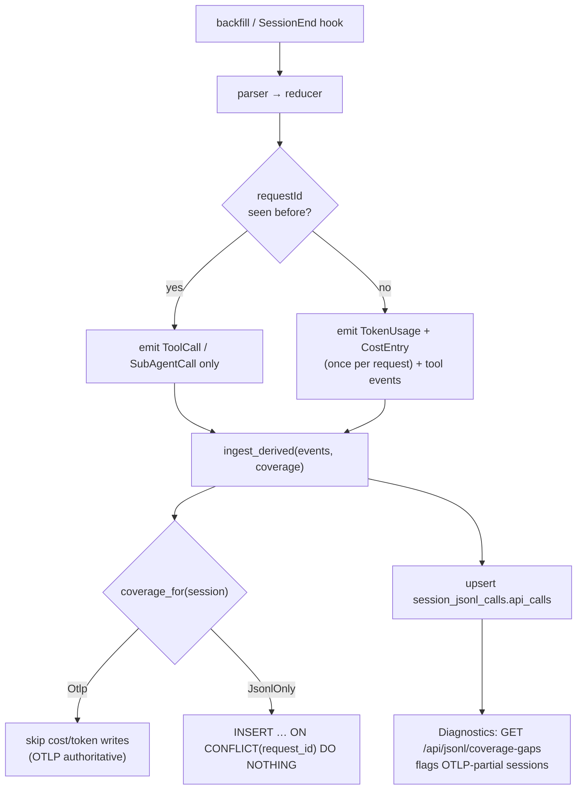

# JSONL cost correctness — Design

> Status: draft 2026-05-19 · author: SatishKrishna Pilla
> Branch: `feature/jsonl-ingest`
> **Supersedes** `docs/superpowers/specs/2026-05-19-jsonl-gap-fill-design.md` and
> `docs/superpowers/plans/2026-05-19-jsonl-gap-fill.md` — both on this same unmerged
> branch. The per-row 5-second-window dedup that spec introduced is removed entirely.

## Motivation

JSONL-ingested sessions overcount cost and tokens by a factor of **1.6×–3×**. This is
not an edge case — it is the structure of every Claude Code transcript.

Claude Code writes **one JSONL `assistant` record per content block** of an API
response: a separate record for the `thinking` block, the `text` block, and *each*
`tool_use` block. Every one of those records carries the **identical, full `usage`
object** plus the same `requestId` and `message.id`.

The reducer (`reducer.rs`) emits a `TokenUsage` *and* a `CostEntry` for every
`assistant` record with non-zero usage. So a single API call split across N records is
ingested as N copies of its tokens and cost.

Real example — one API call, six records, from `~/.claude/projects/D--Repos-andon/`:

```
requestId req_011CbC4JKwPD4LidfZ4V4hds   (message msg_01PSqc8V2pHaVa3b)
  14:07:24.644  blocks=[thinking]   in=1 out=369 cr=36201 cc=802
  14:07:26.173  blocks=[text]       in=1 out=369 cr=36201 cc=802
  14:07:26.737  blocks=[tool_use]   in=1 out=369 cr=36201 cc=802
  14:07:27.768  blocks=[tool_use]   in=1 out=369 cr=36201 cc=802
  14:07:27.771  blocks=[tool_use]   in=1 out=369 cr=36201 cc=802
  14:07:27.954  blocks=[tool_use]   in=1 out=369 cr=36201 cc=802
```

That ~$0.097 call is ingested as six `cost_entries` rows → ~$0.58.

Measured across four real transcripts — `assistant` records vs. distinct `requestId`s:

| Transcript | Records | Real API calls | Overcount |
|---|---|---|---|
| `D--Repos-andon` | 283 | 107 | 2.6× |
| `andon-src-tauri/793e…` | 969 | 611 | 1.6× |
| `andon-src-tauri/3b79…` | 54 | 18 | 3.0× |
| `D--Repos-Siora` | 78 | 48 | 1.6× |

The `2026-05-19-jsonl-gap-fill` spec added a `(session_id, model, timestamp ±5s)`
dedup window. It does **not** catch this: the dedup helpers query a *separate* pooled
connection that cannot see the not-yet-committed inserts of the current
`ingest_derived` transaction, so within one pass every record is written.

OTLP-live sessions are unaffected — OTLP emits one `api_request` event per call. The
bug is purely in the JSONL path.

## Goal

Per-JSONL-ingested-session cost and token totals that equal the sum of each real API
call counted exactly once, with no timestamp heuristics, and a structural guarantee in
the database that a JSONL double-count cannot occur even if the ingest logic regresses.

## Non-goals

- **No OTLP↔JSONL turn-level merge.** A session is either OTLP-covered or JSONL-only;
  routing is binary. The gap-fill use case (OTel stripped mid-session) is handled by
  *detection and flagging*, not by merging the two sources.
- **No OTLP-path retransmit hardening.** The OTLP `api_request` insert
  (`ingestor.rs`) has no dedup; a duplicated OTLP batch double-counts. This is
  pre-existing (present on `main`), not a regression, and out of scope here.
- **No cleanup of already-overcounted rows.** Migration v4 (the whole JSONL feature)
  is unmerged — no shipped database contains JSONL data. A developer who ran the buggy
  backfill wipes their dev `data.db` once.
- **No retroactive-cost UI badge.** Marking JSONL-derived cost as estimated in the UI
  is a separate, pre-existing gap, not part of this fix.

## Architecture

The fix is three layers, each independently sufficient to prevent a double-count and
together giving defense in depth:

1. **Reducer collapses per `requestId`** — one `TokenUsage` + one `CostEntry` per real
   API call, regardless of how many records that call spans.
2. **Binary routing** — an OTLP-covered session gets zero cost/token rows from JSONL;
   a JSONL-only session gets them all. No timestamp windows.
3. **Structural backstop** — every JSONL-written `cost_entries` / `token_usage` row
   carries its `request_id`; a partial unique index makes a duplicate physically
   impossible to insert.

### The dedup key

`requestId` (`req_011Cb…`) is Claude Code's identifier for one Anthropic API call. It
is a hard primary key, not an approximation. In the sampled transcripts it is present
on 969 of 970 `assistant` records (the one exception is a `<synthetic>` api-error
record carrying no real cost), and the `usage` object is byte-identical across every
record sharing a `requestId`. Counting a request's usage once, at its first-seen
record, is therefore exact.

### Reducer changes (`record.rs`, `reducer.rs`)

`JsonlRecord` gains:

```rust
#[serde(rename = "requestId")]
pub request_id: Option<String>,
```

`Reducer` gains a per-transcript `seen_requests: HashSet<String>` (a fresh `Reducer` is
constructed per file in `ingest_one_inner`).

`reduce_assistant`:

- Still walks **every** record's `content` blocks to emit `ToolCall` / `SubAgentCall`.
  This is mandatory — the `tool_use` blocks live on the later records of a request, so
  records cannot be skipped wholesale.
- Emits `TokenUsage` + `CostEntry` **only the first time** a `requestId` is seen.
  Subsequent records of the same request contribute their tool calls and nothing else.
- A record with usage but **no `requestId`** emits no usage event. Without an id it
  cannot be deduped; such records are `<synthetic>` / api-error rows that carry no
  priceable cost. This is documented in the reducer.

`DerivedEvent::TokenUsage` and `DerivedEvent::CostEntry` each gain a
`request_id: String` field so the ingestor can persist it.

### Routing and ingestor changes (`reconciler.rs`, `ingestor.rs`)

`reconciler.rs`:

- **Keep** `coverage_for` (`Coverage::Otlp` iff any `token_usage` row exists for the
  session) and the `Coverage` enum.
- **Delete** `token_row_already_covered` and `cost_row_already_covered` — the
  5-second-window helpers are gone.

`Ingestor::ingest_derived` keeps the `Coverage` parameter and acts on it strictly:

| Event | `Coverage::Otlp` | `Coverage::JsonlOnly` |
|---|---|---|
| `TokenUsage` | skip (OTLP authoritative) | `INSERT … ON CONFLICT(request_id, token_type) DO NOTHING` |
| `CostEntry` | skip (OTLP authoritative) | `INSERT … ON CONFLICT(request_id) DO NOTHING` |
| `ToolCall` | skip (unchanged) | `INSERT` (`source='jsonl'`, unchanged) |
| `SlashCommand` | `INSERT … WHERE NOT EXISTS` (unchanged) | same |
| `SubAgentCall` | `INSERT … WHERE NOT EXISTS` (unchanged) | same |
| `SessionLifecycle` | `INSERT OR IGNORE` | `INSERT OR IGNORE` (`data_source='jsonl'`) |

- The `ON CONFLICT` clauses make re-ingest — a repeated backfill, or the `SessionEnd`
  hook re-reading a grown transcript — idempotent with no time logic.
- The `data_source = 'mixed'` updates are **removed**. Cost is never mixed now: a
  JSONL-only session is `'jsonl'`, an OTLP session stays `'otlp'`.
- `ingest_derived` continues to return `(tokens_written, cost_written)` counts.

### Partial-OTLP detection

Binary routing means a session that lost OTel mid-flight reports only its pre-loss
turns. Rather than let that pass silently, every ingest records the transcript's true
API-call count and the Diagnostics page surfaces sessions where OTLP recorded fewer.

`ingest_one_inner` upserts, per session, the count of distinct `requestId`s observed
in the transcript:

```sql
INSERT INTO session_jsonl_calls (session_id, api_calls, updated_at)
VALUES (?1, ?2, ?3)
ON CONFLICT(session_id) DO UPDATE SET api_calls = ?2, updated_at = ?3;
```

A session is flagged when it is OTLP-covered *and* its transcript shows more calls
than OTLP recorded — an exact integer comparison, not a heuristic:

```sql
SELECT sjc.session_id, sjc.api_calls AS jsonl_calls,
       (SELECT COUNT(DISTINCT timestamp) FROM token_usage tu
        WHERE tu.session_id = sjc.session_id AND tu.request_id IS NULL) AS otlp_calls
FROM session_jsonl_calls sjc
WHERE otlp_calls > 0 AND jsonl_calls > otlp_calls
ORDER BY (jsonl_calls - otlp_calls) DESC;
```

`request_id IS NULL` isolates OTLP-written token rows; `otlp_calls > 0` restricts to
OTLP-covered sessions (a JSONL-only session legitimately has no OTLP calls and is not
a gap).

## Schema and migrations

New migration **v5** (purely additive — v4 is unmerged, so no shipped database holds
JSONL data):

```sql
ALTER TABLE cost_entries ADD COLUMN request_id TEXT;   -- NULL for OTLP rows
ALTER TABLE token_usage  ADD COLUMN request_id TEXT;   -- NULL for OTLP rows

-- Uniqueness enforced ONLY on JSONL-written rows; OTLP rows (NULL) are unconstrained.
CREATE UNIQUE INDEX idx_cost_request
    ON cost_entries(request_id)            WHERE request_id IS NOT NULL;
CREATE UNIQUE INDEX idx_token_request
    ON token_usage(request_id, token_type) WHERE request_id IS NOT NULL;

-- Per-session transcript API-call count; powers partial-OTLP detection.
CREATE TABLE session_jsonl_calls (
    session_id  TEXT PRIMARY KEY,
    api_calls   INTEGER NOT NULL,
    updated_at  INTEGER NOT NULL
);
```

`token_usage`'s unique key is `(request_id, token_type)` because one call yields up to
four token rows (`input` / `output` / `cacheRead` / `cacheCreation`). The OTLP ingest
path is untouched and leaves `request_id` NULL; the partial indexes ignore NULLs, so
OTLP rows are never constrained.

Migration is forward-only, registered as `(5, MIGRATION_V5)` in the `MIGRATIONS` slice.

## API surface

One new endpoint:

- `GET /api/jsonl/coverage-gaps` — runs the partial-OTLP query above; returns
  `[{ session_id, jsonl_calls, otlp_calls }]`, ordered by largest gap first. Powers
  the Diagnostics card.

The `POST /api/jsonl/backfill` response keeps its shape; the two integer fields
`tokens_filled` / `cost_filled` are renamed `tokens_written` / `cost_written` (the
"filled" name was gap-fill vocabulary; under binary routing these count primary-import
rows).

## UI changes

- **Diagnostics page** — a new card, "Possible OTLP coverage gaps", alongside the
  existing JSONL parse-errors card. Lists flagged sessions with `jsonl_calls` vs.
  `otlp_calls`. When the list is empty the card shows a clean "no gaps detected" state.
- **Settings toast** — the backfill toast string uses the renamed
  `tokens_written` / `cost_written` fields. Mechanical.
- `web/src/app/core/models.ts` — rename the two `JsonlBackfillResponse` fields; add a
  `CoverageGap` model and the `coverage-gaps` call in `api.service.ts`.

No new routes, no nav changes.

## Data flow



## Error handling

- The structural unique index is the last line of defense: a duplicate JSONL insert
  fails the `ON CONFLICT` no-op rather than corrupting totals.
- `coverage_for` failure falls back to `Coverage::JsonlOnly` (existing behavior in
  `ingest_one_inner`); under binary routing this means a transient failure could write
  JSONL rows for a genuinely OTLP-covered session. The `ON CONFLICT` clause still
  prevents duplication against a later correct pass, and such rows carry a distinct
  `request_id` so they never collide with OTLP NULL-keyed rows.
- The `session_jsonl_calls` upsert and the `coverage-gaps` query are pure SQL; a
  failure logs via `tracing` and is non-fatal — detection is observability, not a
  correctness gate.
- Per-line and per-session `catch_unwind` wrapping in `ingest_one_inner` is unchanged.

## Privacy

`requestId` is an opaque Anthropic API identifier — not prompt or response text. It is
metadata of the same character as a timestamp. Persisting it does not weaken the
privacy guarantee; the reducer's output type remains text-free by construction and the
`tests/jsonl_privacy.rs` property test is unaffected.

## Testing

TDD — failing test first.

1. **Reducer regression test** (`reducer.rs`) — a fixture in the real
   six-records-per-request shape → assert exactly **one** `TokenUsage` and **one**
   `CostEntry`, plus one `ToolCall` per `tool_use` block. This is the test that would
   have caught the bug.
2. **Reducer** — two distinct `requestId`s → two cost events; a usage record with no
   `requestId` → no cost event.
3. **`ingest_derived`** — `JsonlOnly`: rows written carry `request_id`; a second
   identical call leaves row counts unchanged (`ON CONFLICT` idempotency). `Otlp`:
   zero cost/token rows written.
4. **Integration** (`tests/jsonl_pipeline.rs`) — a realistic transcript fixture with
   multi-record requests → backfill → total cost equals the sum over *distinct
   requests* priced once each; a second backfill yields identical totals.
5. **Migration v5** (`migrations.rs`) — `request_id` columns, both partial indexes,
   and `session_jsonl_calls` exist; `MAX(version) == 5`.
6. **Partial-OTLP detection** — an OTLP session with N distinct token timestamps plus a
   transcript of M > N requests appears in `coverage-gaps`; a fully-covered session
   does not.
7. **Rewritten** — `gap_fills_when_otlp_partial`, `gap_fills_cost_when_otlp_partial`,
   and `dedups_token_usage_against_otlp_within_window` (`tests/jsonl_ingest_writes.rs`)
   test the deleted window dedup; they are rewritten for binary routing. The
   `assistant_emits_token_usage_and_cost` reducer test gains a `requestId` in its
   fixture.
8. **Privacy proptest** — unchanged; must still pass.

## Files touched (build order)

| # | File | Change |
|---|---|---|
| 1 | `src-tauri/src/db/migrations.rs` | Add `MIGRATION_V5`; register `(5, …)`; add v5 test; bump the three existing `MAX(version) == 4` assertions to `5`. |
| 2 | `src-tauri/src/jsonl/record.rs` | Add `request_id` to `JsonlRecord`. |
| 3 | `src-tauri/src/jsonl/reducer.rs` | `seen_requests` set; per-request usage emission; `request_id` on `TokenUsage` / `CostEntry`; regression tests. |
| 4 | `src-tauri/src/jsonl/reconciler.rs` | Delete the two window helpers; keep `coverage_for`. |
| 5 | `src-tauri/src/otlp/ingestor.rs` | Binary routing in `ingest_derived`; `ON CONFLICT` inserts with `request_id`; drop `data_source='mixed'` flips. |
| 6 | `src-tauri/src/jsonl/mod.rs` | Upsert `session_jsonl_calls`; rename `IngestStats` fields to `tokens_written` / `cost_written`; remove the now-dead `"JSONL gap-filled rows for OTLP-partial session"` log line (binary routing returns `(0,0)` for OTLP sessions). |
| 7 | `src-tauri/src/api/dto.rs` | Rename the two `JsonlBackfillResponse` fields; add `CoverageGap` DTO. |
| 8 | `src-tauri/src/api/routes.rs` | Add `GET /api/jsonl/coverage-gaps`. |
| 9 | `src-tauri/tests/jsonl_ingest_writes.rs` | Rewrite the three window-dedup tests for binary routing. |
| 10 | `src-tauri/tests/jsonl_pipeline.rs` | Multi-record integration + idempotency test. |
| 11 | `web/src/app/core/models.ts` | Rename fields; add `CoverageGap`. |
| 12 | `web/src/app/core/api.service.ts` | Add `coverage-gaps` call. |
| 13 | `web/src/app/features/settings/settings.component.ts` | Toast uses renamed fields. |
| 14 | `web/src/app/features/diagnostics/diagnostics.component.{ts,html}` | Coverage-gaps card. |
| 15 | `docs/architecture.md` | OTLP-vs-JSONL section → binary routing + `requestId` dedup. |
| 16 | `docs/superpowers/specs/2026-05-19-jsonl-gap-fill-design.md`, `docs/superpowers/plans/2026-05-19-jsonl-gap-fill.md` | Add a "superseded by this spec" header. |

## Risks

- **Claude Code drops or renames `requestId`.** A future transcript format without
  `requestId` would send every usage record through the no-id path → no cost ingested
  for those sessions (under-count, never over-count). The JSONL parse-errors card does
  not catch this since the records still parse; a follow-up could assert
  `requestId` presence and log to `jsonl_errors`. Acceptable for v1: fail safe low.
- **`coverage_for` misclassifies a session.** Discussed under Error handling — the
  `request_id` key and `ON CONFLICT` contain the blast radius to at most a one-time
  write that cannot duplicate.
- **`COUNT(DISTINCT timestamp)` as the OTLP call proxy.** Two OTLP `api_request`
  events sharing a millisecond timestamp would count as one, slightly inflating the
  apparent gap. Harmless — detection is advisory and errs toward surfacing, not hiding.

## Out of scope (deferred)

- OTLP-path retransmit hardening.
- Retroactive-cost "(estimated)" UI badge for JSONL-only sessions.
- Asserting `requestId` presence as a schema-drift signal in `jsonl_errors`.
- Backfilling a `request_id` onto OTLP rows (the OTLP `api_request` event carries no
  Anthropic request id; if a future Claude Code release adds one, exact OTLP↔JSONL
  reconciliation becomes possible and this design extends cleanly).
