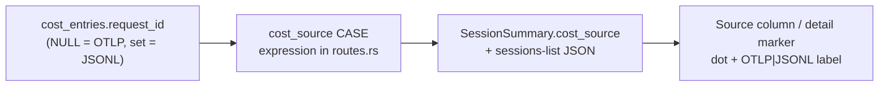

# Per-session cost-source label — Design

> Status: draft 2026-05-20 · author: SatishKrishna Pilla
> Branch: `feature/jsonl-ingest`

## Motivation

A session's cost is either reported by live OpenTelemetry (`api_request` events) or
priced retroactively from a JSONL transcript using Andon's bundled rate table. These
are not equivalent: OTLP cost is Anthropic's own figure; JSONL cost is an estimate.
The dashboard shows both fused into the same `$` figures with no indication of which
is which. A reader cannot tell a measured dollar from an estimated one.

This is a known, deliberately-deferred gap — the `2026-05-19-jsonl-cost-correctness`
spec lists *"Retroactive-cost UI badge for JSONL-only sessions"* under deferred
scope. The walker fix (`fix(jsonl): walker recurses…`) makes it pressing: JSONL is
about to contribute substantially more cost than before, so the provenance of a
session's cost now matters to anyone reading the numbers.

## Goal

Show, per session, whether its cost came from **OTLP** (live telemetry) or **JSONL**
(retroactive transcript ingest), as a neutral provenance label — a "Source" column in
the sessions list and a matching marker on the session detail page.

## Non-goals

- **No Overview indicator.** The Overview's headline cost is an aggregate that can
  blend sources; labelling that blended number is out of scope. The badge is
  per-session, where provenance is concrete and actionable.
- **No trust/quality framing.** The label states provenance (`OTLP` / `JSONL`), not
  a judgement (`measured` / `estimated`).
- **No filtering or sorting by source.** YAGNI — a column, not a facet.
- **No `sessions.data_source` cleanup.** See "The data_source trap" — that column is
  unreliable and this design bypasses it; repairing or removing it is separate work.

## The `data_source` trap

`sessions.data_source` exists (migration v3) and looks like the obvious signal. It is
not trustworthy:

- `upsert_session` (OTLP path, `ingestor.rs`) never sets `data_source` — an
  OTLP-created session row has `data_source = NULL`.
- JSONL ingest creates the row with `data_source = 'jsonl'` via `INSERT OR IGNORE`.
- A session both paths touch keeps whichever value was inserted **first**; neither
  path corrects it afterwards.

So `data_source` reflects insert order, not cost provenance. (Every session in the
current dev database reads `'jsonl'` for exactly this reason, including ones carrying
OTLP token rows.) This design does not read it.

## Architecture

The trustworthy signal is per cost row: a `cost_entries` row written by the OTLP path
has `request_id IS NULL`; one written by JSONL ingest has a non-NULL `request_id`
(see the cost-correctness spec). Binary routing guarantees a session's cost rows are
uniformly one source.

The label is **derived per session from `cost_entries.request_id`**, with the same
OTLP-wins precedence as `reconciler::coverage_for`, so the badge can never contradict
ingest routing:

| Session's `cost_entries` rows | `cost_source` |
|---|---|
| at least one with `request_id IS NULL` | `otlp` |
| rows exist, all `request_id` non-NULL | `jsonl` |
| no cost rows | `null` (no badge) |

### Backend

A single SQL expression computes the label, added to each query that returns session
cost:

```sql
(CASE
   WHEN EXISTS(SELECT 1 FROM cost_entries
               WHERE session_id = s.session_id AND request_id IS NULL) THEN 'otlp'
   WHEN EXISTS(SELECT 1 FROM cost_entries
               WHERE session_id = s.session_id) THEN 'jsonl'
   ELSE NULL
 END) AS cost_source
```

Two correlated `EXISTS` subqueries — consistent with the dozen already in the
sessions-list query, and with `coverage_for`'s own `EXISTS`-based check.

Three call sites in `routes.rs` return per-session cost and need the expression:

1. The **sessions-list** query — result assembled as inline `json!`; add `cost_source`
   to the `SELECT` and the JSON object.
2. The two **`SessionSummary`** construction sites (one of which is `session_detail`).
   Adding the field to the DTO struct forces both — the Rust compiler will not let a
   construction omit it.

`dto.rs` — `SessionSummary` gains `cost_source: Option<String>` (serializes to
`"otlp"` / `"jsonl"` / `null`).

### Frontend

`models.ts` — the `SessionSummary` interface gains
`cost_source: 'otlp' | 'jsonl' | null`.

`sessions.component` — a new **Source** column between Model and Cost. The cell is a
coloured dot plus a label, mirroring the existing Model column's dot+label pattern.
Two small helpers in the component, echoing `modelLabel()` / `modelColor()`:

- `sourceLabel(s)` → `'OTLP'` | `'JSONL'` | `'—'`
- `sourceClass(s)` → the dot's Tailwind background class

| `cost_source` | dot | label | tooltip |
|---|---|---|---|
| `otlp` | `bg-ok` (green) | OTLP | "Cost from live OpenTelemetry" |
| `jsonl` | `bg-warn` (amber) | JSONL | "Cost priced retroactively from JSONL transcripts" |
| `null` | none | `—` (muted) | — |

The two group-label / expanded-row `colspan="10"` cells in the table become
`colspan="11"`. The expanded row's existing Cost card needs no change — it already
reads the list row `s`, which now carries `cost_source`.

`session-detail.component` — the standalone `/sessions/:id` page shows the same dot +
label beside its cost figure.

Colours are two Tailwind classes; green/amber is the starting choice and is trivial
to retune if amber reads too much like a warning.

## Data flow



## Error handling

- A session with no `cost_entries` rows yields `cost_source = null`; the UI renders a
  muted `—`, never an empty or broken cell.
- A session whose cost rows are somehow mixed (NULL and non-NULL — outside binary
  routing's guarantees) resolves to `otlp` by the OTLP-wins precedence above. This
  matches `coverage_for`, so badge and routing stay consistent.
- The label is read-only derived data — no new write path, no migration, nothing that
  can fail ingestion.

## Privacy

`request_id` is opaque Anthropic API metadata — no prompt or response text. The label
exposes only `"otlp"` / `"jsonl"`. No privacy guarantee is affected.

## Testing

TDD — failing test first.

1. **Backend** — a session with an OTLP-written cost row (`request_id` NULL) returns
   `cost_source: "otlp"`; a session with a JSONL-written cost row (non-NULL
   `request_id`) returns `"jsonl"`; a session with no cost rows returns `null`.
   Asserted against both the sessions-list and the session-detail endpoints.
2. **Frontend** — the sessions component renders the Source cell with the correct
   label and dot class for each `cost_source` value, including the `—` no-cost case.

## Files touched (build order)

| # | File | Change |
|---|---|---|
| 1 | `src-tauri/src/api/dto.rs` | `SessionSummary`: add `cost_source: Option<String>`. |
| 2 | `src-tauri/src/api/routes.rs` | Add the `cost_source` CASE expression to the sessions-list query and both `SessionSummary` constructions; populate the field. |
| 3 | `src-tauri/tests/api_sessions.rs` | Assert `cost_source` for OTLP / JSONL / no-cost sessions, against the list and detail endpoints. |
| 4 | `web/src/app/core/models.ts` | `SessionSummary`: add `cost_source`. |
| 5 | `web/src/app/features/sessions/sessions.component.ts` | `sourceLabel()` / `sourceClass()` helpers. |
| 6 | `web/src/app/features/sessions/sessions.component.html` | Source column header + cell; bump `colspan="10"` → `"11"`. |
| 7 | `web/src/app/features/sessions/session-detail.component.ts` | Source dot + label beside the cost figure. |

## Risks

- **Per-row correlated subqueries.** Two `EXISTS` per session row. The sessions-list
  query already runs ~12 correlated subqueries per row over the same `LIMIT`-bounded
  set; two more is negligible and needs no index change (`cost_entries.session_id` is
  already the access path for the existing `SUM(cost_usd)` subquery).
- **`data_source` left vestigial.** The column stays in the schema, now provably
  unused for provenance. Acceptable — noted as deferred cleanup, not silently ignored.

## Out of scope (deferred)

- Overview-level "mixed sources" indicator.
- Filtering or sorting the sessions list by source.
- Removing or correctly populating the `sessions.data_source` column.
