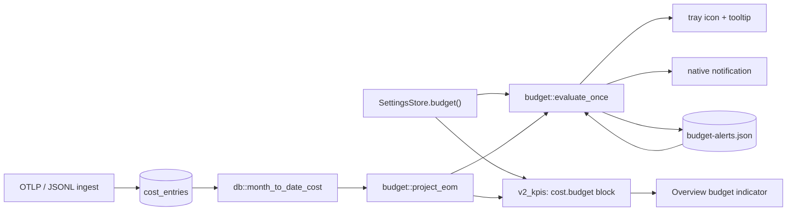
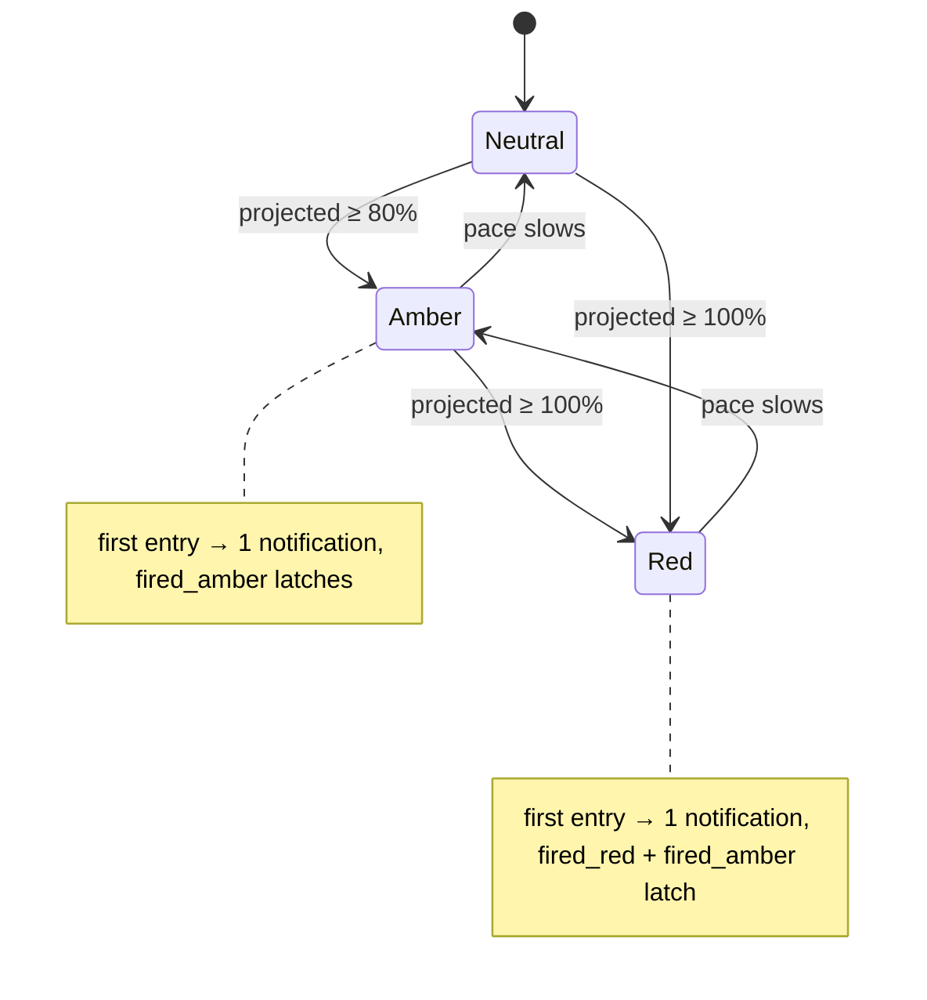

# Budget alerts — Design

> Status: draft 2026-05-21 · author: SatishKrishna Pilla
> Branch: `feature/budget-alerts`
> Issue: [#16](https://github.com/satish-krishna/andon/issues/16)

## Motivation

Andon is named after the manufacturing andon board — a system whose entire job is to
flag a threshold breach for immediate attention. Today Andon *computes* an
end-of-month cost projection (`v2_kpis` → `cost.projected_eom`) and then does nothing
with it. The user has to remember to open the dashboard and read the number. A
passive figure is not a signal.

This feature turns the projection into an active signal: the user sets a monthly cost
budget, and as the projected end-of-month spend crosses 80% and 100% of it, Andon
*tells* the user — without the dashboard being open.

## Goal

Let the user set a monthly USD budget in Settings. A background monitor evaluates the
projected end-of-month cost against that budget and signals threshold crossings two
ways:

- the **tray icon** shifts colour — neutral → amber (≥80%) → red (≥100%);
- a **native desktop notification** fires once per threshold per month on the first
  upward crossing.

The Overview dashboard mirrors the same status on its cost tile, so the tray and the
dashboard never tell different stories.

## Non-goals

- **No configurable threshold percentages.** 80% and 100% are hardcoded. The user
  configures one number — the budget — and nothing else. (Issue says "configurable
  thresholds"; the resolved decision is the *budget* is what's configurable.)
- **No per-repo, per-model, weekly, or daily budgets.** One monthly USD figure.
- **No notification click action.** v1 notifications are informational; clicking does
  not open the dashboard. Deferred, not designed-out.
- **No new dashboard panel.** The budget surfaces on the *existing* Overview cost
  tile, not as a standalone "Signals" panel — that is a sibling issue.
- **No outbound network.** Notifications and the tray are local OS facilities.

## Key decisions

These were resolved during brainstorming and the rest of the design depends on them:

| Decision | Resolution | Rationale |
|---|---|---|
| Where the monitor runs | **Backend** (a Rust task) | The app starts hidden; the Overview page has no polling timer. A frontend monitor cannot signal with the window closed. The signal must outlive the UI. |
| What the thresholds compare | **Projected EOM cost**, both amber and red | Matches the issue: red = "on pace to blow the budget", an early loud warning. |
| Early-month volatility | **Warm-up guard** — no alerts before day 3 | On day 1, `projected = day1_cost × 30`; one big session could slam the tray red on the 2nd. Days 1–2 always evaluate to Neutral. |
| Threshold values | **Fixed** 80% / 100% | YAGNI — one input field, no `amber < red` validation. |
| De-dup state location | **Dedicated `budget-alerts.json`** | Keeps `settings.json` pure user-config; runtime state does not churn the hand-editable file. |
| Tray colour variants | **3 committed PNGs**, recoloured brand bolt | The OS tray takes a bitmap only — no SVG/lucide. Recolouring the existing brand mark keeps Andon's identity in the tray and needs no hand-drawn art. |

## Architecture

A backend **budget monitor** task owns the signal. The dashboard is a passive mirror.

The pure decision logic (`budget/mod.rs`) is separated from the I/O shell
(`budget/monitor.rs`) so the logic is fully unit-testable with no clock, no database,
and no filesystem.

### Backend — `budget` module

A new `src-tauri/src/budget/` directory, mirroring the `otlp/` layout:

**`budget/mod.rs`** — pure, no I/O, exhaustively unit-tested:

- `BudgetStatus` — enum `Neutral | Amber | Red`, `#[serde(rename_all = "lowercase")]`.
- `days_in_month(date: NaiveDate) -> u32` — extracted from the private
  `days_in_current_month()` in `routes.rs`.
- `project_eom(mtd_cost: f64, day_of_month: u32, days_in_month: u32) -> f64` —
  extracted from the inline math in `v2_kpis`:
  `(mtd_cost / day_of_month) × days_in_month`, guarding `day_of_month == 0`.
- `evaluate(projected_eom, monthly_usd, day_of_month) -> BudgetStatus` — the rules,
  in order:
  1. `monthly_usd <= 0.0` → `Neutral` (feature off);
  2. `day_of_month < WARMUP_DAYS` (3) → `Neutral` (warm-up guard);
  3. `projected_eom >= monthly_usd` → `Red`;
  4. `projected_eom >= monthly_usd × 0.80` → `Amber`;
  5. else → `Neutral`.
- `AlertState` — the de-dup record: `{ month: String, monthly_usd: f64,
  fired_amber: bool, fired_red: bool }`. `Default` is the empty state
  (`month: ""`), which forces a reset on first evaluation.
- `evaluate_once(mtd_cost, monthly_usd, now: DateTime<Local>, prior: AlertState)
  -> EvalOutcome` — the testable seam. `EvalOutcome { status: BudgetStatus,
  next_state: AlertState, notify: Option<BudgetStatus> }`. It:
  1. derives `day_of_month` / `days_in_month` from `now`, projects, and `evaluate`s;
  2. resets `prior`'s `fired_*` flags if the month string changed **or** the budget
     changed (abs difference > `$0.001`) — so editing the budget mid-month gives a
     fresh alert slate;
  3. decides `notify`: `Red` with `!fired_red` → `Some(Red)` and sets *both* flags
     (crossing red subsumes amber — no late amber notification); `Amber` with
     `!fired_amber` → `Some(Amber)`; otherwise `None`.

`projected_eom` can rise *and* fall as pace changes. The tray follows `status` freely
in both directions — it is a live gauge. `notify` only ever fires on an *upward*
first crossing, and `fired_*` flags are monotonic within a month — notifications are
a one-shot ratchet. This asymmetry is intentional: a glanceable gauge plus a
non-nagging alert.

Constants in `budget/mod.rs`: `WARMUP_DAYS = 3`, `AMBER_FRACTION = 0.80`.

**`budget/monitor.rs`** — the I/O shell, deliberately thin:

- `run_monitor(app: AppHandle, settings: Arc<SettingsStore>, pool: Arc<DbPool>,
  data_dir: PathBuf)` — evaluates once immediately, then every `MONITOR_INTERVAL`
  (30 minutes) via `tokio::time::interval`.
- Each tick: read `settings.budget()`; query `db::month_to_date_cost`; load
  `AlertState` from `budget-alerts.json`; call `evaluate_once`; then apply side
  effects — set the tray icon + tooltip for `status` (only when `status` changed
  since the last tick), show a notification if `notify` is `Some`, and persist
  `next_state`.
- The 3 tray PNGs are `include_bytes!`'d and decoded once via
  `tauri::image::Image::from_bytes`. The tray is resolved each tick with
  `app.tray_by_id(TRAY_ID)`.
- Tooltip reflects status, e.g. `"andon — 84% of monthly budget (projected)"`;
  Neutral keeps the existing `"andon — Claude Code dashboard"`.
- Notification copy: Amber → title *"Andon — budget warning"*, body *"Projected
  spend $X is NN% of your $Y monthly budget."*; Red → title *"Andon — budget
  exceeded"*, body *"Projected spend $X will exceed your $Y monthly budget."*

### Backend — supporting changes

- **`settings.rs`** — `BudgetSettings { monthly_usd: f64 }` (`0.0` = off, the
  default). `AppSettings` gains `#[serde(default)] pub budget: BudgetSettings`. New
  `budget()` accessor and `save_budget()` mirror the forwarder pair exactly.
- **`db/queries.rs`** — `month_to_date_cost(conn, month_start_ms, now_ms) -> f64`:
  `SELECT COALESCE(SUM(cost_usd), 0) FROM cost_entries WHERE timestamp >= ? AND
  timestamp < ?`, all models. Same shape as the private `sum_cost` in `routes.rs`,
  with no model filter.
- **`lib.rs`** — declare the `budget` module; register
  `tauri_plugin_notification::init()`; promote the tray id to
  `const TRAY_ID: &str = "andon-tray"`; spawn `budget::run_monitor` alongside the
  existing API and OTLP tasks in `setup()`.
- **`Cargo.toml`** — add `tauri-plugin-notification = "2"`.
- **`capabilities/default.json`** — add `"notification:default"`.
- **`api/routes.rs`**:
  - `v2_kpis` swaps its inline projection for `budget::project_eom` and adds, under
    `cost`, a `"budget": { "monthly_usd": <f64>, "status": "<neutral|amber|red>" }`
    block — `status` from `budget::evaluate`, so the dashboard inherits the warm-up
    guard and never disagrees with the tray. Budget unset → `monthly_usd: 0.0`,
    `status: "neutral"`.
  - New route `PUT /api/settings/budget` → `put_budget` handler, mirroring
    `put_forwarder`: a `BudgetPayload { monthly_usd: f64 }`, validated
    (`monthly_usd >= 0.0`, and `<= 1_000_000.0` as a sanity bound), saved via
    `save_budget`. `GET /api/settings` already serialises the whole `AppSettings`
    snapshot, so `budget` rides along with no handler change.

### Frontend

- **`core/api.service.ts`** — add `BudgetSettings { monthly_usd: number }`;
  `AppSettings` gains `budget: BudgetSettings`; `V2Kpis.cost` gains
  `budget: { monthly_usd: number; status: 'neutral' | 'amber' | 'red' }`; add
  `saveBudget(b)` → `PUT /api/settings/budget`.
- **`features/settings/budget-card.component.ts`** — a new standalone card cloned
  from `ForwarderCardComponent`: one number input (monthly budget USD) bound via a
  signal-backed `ngModel` proxy, a dirty flag, and a save button with a flash
  message. Loads the current value from `getSettings()`.
- **`features/settings/settings.component.{ts,html}`** — import and place
  `BudgetCardComponent` near the forwarder card.
- **`features/overview/overview.component.ts`** — a `budgetClass(status)` helper
  returning the Tailwind tint class.
- **`features/overview/overview.component.html`** — below the existing
  "Projected EOM" line, a budget indicator shown only when
  `k.cost.budget.monthly_usd > 0`: a line `Budget · $<projected> / $<limit>
  (<NN>%)` plus a thin progress bar, both tinted by `k.cost.budget.status`
  (neutral → muted, amber → `warn`, red → `err`). The bar fills to
  `min(100, pct)%`; an overflow marker indicates >100%.

### Tray icon assets

Three PNGs in `src-tauri/icons/`, each a recolour of the existing lightning-bolt
brand mark, sized for the tray (64×64):

- `tray-neutral.png` — the current brand colouring;
- `tray-amber.png` — amber treatment (bolt and/or background);
- `tray-red.png` — red treatment.

They must be unambiguously distinct at tray size. Producing them is a one-time asset
task, listed in the build order.

## State model

Per calendar month, the alert state is a tiny monotonic machine. `status` (the tray)
is free to move; the `fired_*` flags (notifications) only ever latch on.

Month rollover or a budget change clears both `fired_*` flags (`evaluate_once`),
re-arming notifications for the new month / new budget.

## Error handling

- **Monitor ticks never panic.** A DB-connection failure logs a warning and skips the
  tick, leaving the tray as-is. A missing or unparseable `budget-alerts.json` is
  treated as the empty `AlertState` (logged), echoing how `SettingsStore::load`
  tolerates a bad `settings.json`. A notification `show()` error is logged and
  swallowed. `tray_by_id` returning `None` logs and skips the tray update. No
  `unwrap()` / `expect()` outside `main.rs` setup, per `CONTRIBUTING.md`.
- **`save_budget` write failure** → `put_budget` returns `500`, mirroring
  `put_forwarder`.
- **Invalid budget payload** (negative, or absurdly large) → `put_budget` returns
  `400` with a message, before any write.
- A panic inside the spawned monitor task would silently kill the signal; the per-tick
  work is structured so a single tick's failure is contained and the loop continues.

## Privacy

No privacy guarantee in `CLAUDE.md` is affected:

1. No new listeners — the monitor binds nothing.
2. No prompt data — the feature handles a dollar figure and two boolean flags.
3. No outbound network — desktop notifications and the tray icon are local OS
   facilities; `budget-alerts.json` and `settings.json` are local files. The OTel
   forwarder remains the only outbound path and is untouched.
4. No telemetry-of-telemetry — nothing phones home.

## Testing

TDD — failing test first.

**`budget/mod.rs` unit tests (pure):**

1. `project_eom` — day 10 of a 30-day month with $40 MTD → $120; `day_of_month == 0`
   guard returns the MTD figure unchanged.
2. `evaluate` — `monthly_usd = 0` → `Neutral` regardless of projection; days 1 and 2
   → `Neutral` even when projected at 300%; day 3 at 79% → `Neutral`, 80% → `Amber`,
   99.9% → `Amber`, 100% → `Red`, 150% → `Red`.
3. `evaluate_once` — fresh state on day 5 at amber → `notify == Some(Amber)`,
   `next_state.fired_amber == true`; the next call still at amber →
   `notify == None`; a jump straight to red with `fired_amber == false` →
   `notify == Some(Red)` and *both* flags latch; a prior state from the previous
   month → flags reset and the alert re-fires; a prior state with a different
   `monthly_usd` → flags reset; a status drop red → amber → neutral → `notify`
   stays `None` while `status` tracks the drop.

**`settings.rs` tests:**

4. `save_budget` persists and a fresh `load()` reads the saved value.
5. **Critical regression** — write a `settings.json` containing only `version` and
   `forwarder` (no `budget` key); `load()` succeeds, `budget()` equals the default,
   and **no** `*.json.corrupt-*` backup file is created. This guards the
   `#[serde(default)]` annotation: without it, every existing install's
   `settings.json` would fail to parse and the corrupt-file path would overwrite the
   user's forwarder configuration.

**API tests (`src-tauri/tests/`):**

6. `PUT /api/settings/budget` with a valid payload → `200` and the value persists; a
   negative `monthly_usd` → `400`.
7. `v2_kpis` response carries `cost.budget` with `monthly_usd` and a `status` string.

**Angular tests (Vitest):**

8. `BudgetCardComponent` loads the existing budget and `save()` calls
   `api.saveBudget` with the entered value.
9. The Overview cost tile renders the budget indicator with the correct tint class
   per `status`, and hides it when `monthly_usd == 0`.

The monitor loop, tray repaint, and OS notification dispatch are not unit-tested
(timers and OS facilities); their logic lives entirely in the pure `evaluate_once`,
and `monitor.rs` is kept thin enough to verify by inspection and manual smoke test.

## Files touched (build order)

| # | File | Change |
|---|---|---|
| 1 | `src-tauri/Cargo.toml` | Add `tauri-plugin-notification = "2"`. |
| 2 | `src-tauri/capabilities/default.json` | Add `"notification:default"`. |
| 3 | `src-tauri/src/settings.rs` | `BudgetSettings`; `AppSettings.budget` with `#[serde(default)]`; `budget()` + `save_budget()`; tests 4–5. |
| 4 | `src-tauri/src/budget/mod.rs` | `BudgetStatus`, `days_in_month`, `project_eom`, `evaluate`, `AlertState`, `evaluate_once`; unit tests 1–3. |
| 5 | `src-tauri/src/db/queries.rs` | `month_to_date_cost`. |
| 6 | `src-tauri/src/budget/monitor.rs` | `run_monitor` loop, tray repaint, notification dispatch, `budget-alerts.json` load/save. |
| 7 | `src-tauri/src/lib.rs` | Declare `budget` module; register notification plugin; `TRAY_ID` const; spawn `run_monitor`. |
| 8 | `src-tauri/src/api/routes.rs` | `PUT /api/settings/budget` + `put_budget`; `v2_kpis` `cost.budget` block; swap inline projection for `budget::project_eom`. |
| 9 | `src-tauri/tests/` | API tests 6–7. |
| 10 | `src-tauri/icons/tray-{neutral,amber,red}.png` | Recoloured brand-bolt tray variants. |
| 11 | `web/src/app/core/api.service.ts` | `BudgetSettings`, `AppSettings.budget`, `V2Kpis.cost.budget`, `saveBudget()`. |
| 12 | `web/src/app/features/settings/budget-card.component.ts` | New budget card. |
| 13 | `web/src/app/features/settings/settings.component.{ts,html}` | Import + place `BudgetCardComponent`. |
| 14 | `web/src/app/features/overview/overview.component.ts` | `budgetClass()` helper. |
| 15 | `web/src/app/features/overview/overview.component.html` | Budget indicator block. |
| 16 | `web/src/app/features/{settings,overview}/*.spec.ts` | Angular tests 8–9. |

## Risks

- **`#[serde(default)]` omission is silent data loss.** Without it on
  `AppSettings.budget`, every existing install's `settings.json` fails to parse on
  first run of the new version, triggering the corrupt-file backup-and-overwrite path
  and wiping the user's forwarder configuration. Test 5 exists specifically to catch
  a regression here; it is non-negotiable.
- **Windows notification delivery.** `tauri-plugin-notification` on Windows relies on
  a registered application identity. `tauri.conf.json` already sets an `identifier`;
  delivery should be verified against an *installed* build (not only `cargo tauri
  dev`) during testing — dev builds can be inconsistent for native notifications.
- **Tray handle lifetime.** `app.tray_by_id(TRAY_ID)` may return `None` if the OS tray
  was torn down. The monitor logs and skips rather than failing — degraded, not
  broken.
- **Projection volatility.** Inherent to linear extrapolation; the day-3 warm-up guard
  contains the worst of it. A mid-month spike can still flash red and later settle —
  accepted, and the reason the tray is a live gauge while notifications latch.

## Out of scope (deferred)

- Configurable threshold percentages; per-repo, per-model, weekly, or daily budgets.
- A notification click action that opens the dashboard.
- A standalone "Signals" panel and cost-spike detection (sibling work toward making
  Andon an active signal board).
- Budget history or spend-tracking over time.
