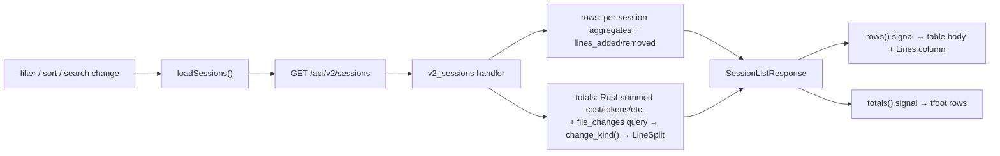

# Sessions totals row + line-change split — Design

> Status: draft 2026-05-21 · author: SatishKrishna Pilla
> Branch: `feature/sessions-totals-line-split`

## Motivation

The Sessions page lists every Claude Code session as a row, grouped under day
headers, with per-session Cost / Tokens / Decisions / Duration / Accept columns.
There is no way to read the *aggregate* of what is currently in view — the user
must eyeball or mentally add the column.

Three related gaps:

1. **No totals.** A filtered list of 80 sessions gives no single "what did all
   this cost / how long did it take" line.
2. **Line churn is invisible at the list level.** `file_changes` already stores
   `lines_added` / `lines_removed` per file, and the row-expand panel shows it
   per file — but the session row itself never surfaces the changeset size.
3. **No sense of *what kind* of change.** A 400-line session could be all
   production code or all generated docs; the list cannot tell them apart.

## Goal

On the Sessions page:

- A **grand totals row** pinned at the bottom of the table, summing every
  session currently shown.
- A new per-session **Lines** column showing `+added −removed` for that session.
- In the totals row only, a **Code / Docs / Other** split of the summed line
  changes — a segmented bar with a legend.

## Non-goals

- **No per-day subtotals.** One grand total, not a subtotal per day group.
- **No sticky totals strip.** The totals are a plain `<tfoot>` at the bottom of
  the table, not an always-visible strip near the filter bar.
- **No per-row split.** The Code / Docs / Other breakdown appears only in the
  totals row; per-session Lines cells stay a plain `+added −removed`.
- **No new endpoint.** Totals are intrinsic to the same filtered query — they
  ride on the existing `/api/v2/sessions` response, not a separate call.
- The legacy `/api/sessions` endpoint and the standalone HTML session report are
  untouched.

## Approach

**Approach A — the server computes everything.** `v2_sessions` already produces
the filtered, sorted, limited row set; it is the one place that knows exactly
which sessions are "in view". So it also computes the totals, including the
Code / Docs / Other split, and returns them alongside the rows. The Angular side
only renders — no client-side aggregation, no second request.

*(Rejected — B: ship per-row buckets and sum them in an Angular `computed()`.
Classification still happens server-side, so the client would only re-add
already-bucketed numbers, and the totalling logic would straddle two layers.
Rejected — C: a separate `/api/v2/sessions/totals` endpoint. The totals are
welded to the same filter and query; a second endpoint means a second copy of
the filter-param plumbing and an extra round-trip for nothing.)*

## Classification — `change_kind()`

A new pure function in `src-tauri/src/api/routes.rs`, beside the existing
`lang_from_path()`:

```rust
enum ChangeKind { Code, Docs, Other }

fn change_kind(path: &str) -> ChangeKind {
    let ext = path.to_lowercase();
    let ext = ext.rsplit('.').next().unwrap_or("");
    match ext {
        "md" | "markdown" | "mdx" | "txt" | "rst" | "adoc" | "asciidoc"
            => ChangeKind::Docs,
        _ if lang_from_path(path) == "other"
            => ChangeKind::Other,
        _   => ChangeKind::Code,
    }
}
```

- It **reuses `lang_from_path()`** — one extension table to maintain.
- **Docs** = prose extensions (Markdown, plain text, reStructuredText, AsciiDoc).
- **Code** = anything `lang_from_path()` maps to a *named* language. Config files
  (`.toml` / `.json` / `.yaml`) map to named langs and therefore count as Code.
- **Other** = anything `lang_from_path()` calls `"other"` and is not a Docs
  extension. Extension-less files (`LICENSE`, `Makefile`) fall here.
- Classification is **case-insensitive** (`.MD` → Docs).

## Changes — backend

### 1. `src-tauri/src/api/routes.rs` — `v2_sessions`

**Per-row lines.** Two correlated subqueries are added to the main `SELECT`,
matching the style of the existing per-session aggregates:

```sql
COALESCE((SELECT SUM(lines_added)   FROM file_changes WHERE session_id = s.session_id), 0) AS lines_added,
COALESCE((SELECT SUM(lines_removed) FROM file_changes WHERE session_id = s.session_id), 0) AS lines_removed,
```

Each row's JSON gains `lines_added` and `lines_removed`.

**Totals.** After the `sessions` vector is built:

- Cost / tokens / decisions / duration / accepts / rejects / aborts are summed
  **in Rust** over the rows already in hand — no extra query.
- For the split, **one** extra query over exactly the session ids just
  returned:

  ```sql
  SELECT file_path, lines_added, lines_removed
  FROM file_changes
  WHERE session_id IN (<placeholders for the returned ids>)
  ```

  Each `file_path` is bucketed via `change_kind()` and accumulated into a
  `LineSplit`. A NULL `file_path` is bucketed as `Other` (defensive — the hook
  always writes a path). When zero sessions were returned, the query is skipped
  and the split is all-zero.

Marshalling the *returned ids* (rather than re-running the filter predicate as a
subquery) guarantees the totals match exactly the rows on screen — same filter,
same `LIMIT`, same ordering. The id list is at most `limit` (≤ 1000) entries,
well within SQLite's `IN` capacity.

`change_kind` classification reuses `lang_from_path`, so it must be defined in or
visible to `routes.rs`. No `unwrap` / `expect`; the handler is synchronous
`rusqlite` throughout, so no connection is held across `.await`.

### 2. `src-tauri/src/api/dto.rs`

```rust
#[derive(Serialize)]
pub struct LinePair { pub added: i64, pub removed: i64 }

#[derive(Serialize)]
pub struct LineSplit {
    pub code:  LinePair,
    pub docs:  LinePair,
    pub other: LinePair,
}

#[derive(Serialize)]
pub struct SessionTotals {
    pub sessions: i64,
    pub cost_usd: f64,
    pub tokens_input: i64,
    pub tokens_output: i64,
    pub accepts: i64,
    pub rejects: i64,
    pub aborts: i64,
    pub decisions: i64,
    pub duration_seconds: f64,
    pub lines_added: i64,    // = code.added + docs.added + other.added
    pub lines_removed: i64,  // = code.removed + docs.removed + other.removed
    pub lines: LineSplit,
}
```

`SessionListResponse` gains a `totals: SessionTotals` field. `accepts` / `rejects`
/ `aborts` are carried so the client can compute the footer Accept% with the same
formula the per-row cells use.

## Changes — frontend

### 3. `web/src/app/core/api.service.ts`

- `V2Session` gains `lines_added: number` and `lines_removed: number`.
- New interfaces `LinePair`, `LineSplit`, `SessionTotals`.
- `SessionListResponse` gains `totals: SessionTotals`.

### 4. `web/src/app/features/sessions/sessions.component.ts`

- The constructor `effect()`, `onSearch()`, and `runBackfill()` currently each
  repeat the same `sessionsV2().subscribe()` block. All three must now also set
  a new `totals` signal — so they are folded into one private `loadSessions()`
  method. Targeted cleanup, directly in service of the feature.
- `totals = signal<SessionTotals | null>(null)`, set from `resp.totals`.
- `totalsAcceptRate` — a `computed()` mirroring the existing per-row
  `acceptRate()` (`accepts / (accepts + rejects)`), so the footer's Accept% is
  consistent with every row above it.
- A small helper to compute segmented-bar segment widths from the `LineSplit`
  (each segment ∝ its bucket churn, `added + removed`).

### 5. `web/src/app/features/sessions/sessions.component.html`

- A new **Lines** column header, placed **after Tokens** (volume metrics
  grouped). The table goes from 11 to 12 columns.
- Per-row Lines cell: `+{{ s.lines_added }} −{{ s.lines_removed }}` in the
  existing `text-ok` / `text-err` green/red; `—` when the session has no file
  data (`lines_added` and `lines_removed` both 0).
- Every existing `colspan="11"` — the day-header rows and the expanded-row
  `<td>` — is bumped to **`colspan="12"`**.
- A new `<tfoot>` with two rows, rendered only when `totals()` is non-null and
  `totals().sessions > 0`:
  - **Row 1 — grand totals.** A label cell spanning the first 6 columns
    (`colspan="6"`): `TOTAL · {{ totals().sessions }} sessions`. Then aligned
    summed cells under Cost, Tokens, Lines, Decisions, Duration, and Accept
    (`totalsAcceptRate()`), all `tabular-nums`.
  - **Row 2 — the split.** A single full-width cell (`colspan="12"`): a
    horizontal **segmented bar** — Code | Docs | Other, segment widths ∝ each
    bucket's churn — followed by a legend
    `■ code +X −Y · ■ docs +X −Y · ■ other +X −Y`. Three distinct tints, built
    with Tailwind utilities.
- The `<tfoot>` is given a top border and a slightly emphasized background to
  separate it from the body. It is **not** sticky.

## Data flow



## Edge cases

- **No `file_changes` data** — the common case until the PostToolUse hook is
  installed and firing (the "when we have" caveat). Per-row Lines cells show
  `—`; the totals Lines cell shows `+0 −0`; Row 2's segmented bar is replaced by
  a muted hint pointing at Settings → Integration (where the hook is installed).
- **Empty session list** (`totals.sessions === 0`) — the `<tfoot>` is not
  rendered; the existing "No sessions match your filters" message stands alone.
- **NULL `file_path`** in `file_changes` — bucketed as `Other`, defensively.
- **Beyond the 200-row limit** — totals cover only the rows *shown*, consistent
  with the page's existing "{N} shown" label. Deliberate, documented behaviour.
- **Privacy** — read-only path; no receiver, settings, or auth surface is
  touched, and no data is exposed that `/api/v2/files` does not already return.

## Testing

- **Rust unit — `change_kind()`:** `.rs` → Code; `.md` / `.txt` / `.rst` →
  Docs; `.toml` / `.json` → Code; no extension → Other; unknown `.xyz` → Other;
  `.MD` (uppercase) → Docs; `a.b.rs` (dotted path) → Code.
- **Rust integration — `v2_sessions`** (with the `test-support` feature): seed
  sessions plus `file_changes` rows across mixed extensions; assert per-row
  `lines_added` / `lines_removed`; assert `totals.lines.{code,docs,other}`;
  assert `totals.lines_added` equals the sum of the three buckets' `added`.
  Edge: no `file_changes` rows → all-zero totals.
- **Angular (Vitest) — `sessions.component`:** given a `SessionListResponse`
  with `totals`, the `<tfoot>` renders the summed values and the split legend;
  given `totals.sessions === 0`, no `<tfoot>` renders; given zero line churn,
  the muted hint renders instead of the bar.

## Files touched

| File | Change |
|---|---|
| `src-tauri/src/api/routes.rs` | `change_kind()` + `ChangeKind`; `v2_sessions` per-row lines + totals |
| `src-tauri/src/api/dto.rs` | `LinePair`, `LineSplit`, `SessionTotals`; `totals` on `SessionListResponse` |
| `src-tauri/src/api/` tests | `change_kind` unit tests; `v2_sessions` integration test |
| `web/src/app/core/api.service.ts` | `lines_*` on `V2Session`; `LinePair` / `LineSplit` / `SessionTotals`; `totals` on `SessionListResponse` |
| `web/src/app/features/sessions/sessions.component.ts` | `loadSessions()` extraction; `totals` signal; `totalsAcceptRate`; bar-width helper |
| `web/src/app/features/sessions/sessions.component.html` | Lines column; `colspan` 11 → 12; two-row `<tfoot>` |
| `web/src/app/features/sessions/sessions.component.spec.ts` | footer render tests |
| `docs/features.md` | document the totals row, Lines column, and split |

## Out of scope (deferred)

- Per-day subtotal rows.
- A sticky / always-visible totals strip.
- A per-row Code / Docs / Other breakdown.
- The same totals treatment on the Files page (its `totals` block already
  exists; a Code / Docs / Other split there is a separate enhancement).
- `README` / `CHANGELOG` / `LICENSE` basename-matching into Docs — current
  design is extension-only.
