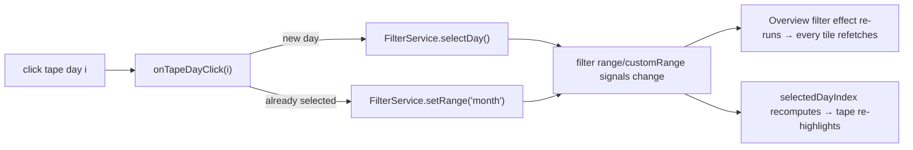

# Tape day-select — Design

> Status: draft 2026-05-21 · author: SatishKrishna Pilla
> Branch: `feature/tape-day-select`

## Motivation

The Overview's **Tape** is a per-day cost bar chart for the current month. Today
it is display-only — its day-bars already carry a `cursor-pointer` class (the
affordance was anticipated) but nothing happens on click. To drill the whole
dashboard into a single day, the user must instead open the filter bar's
Custom-range date inputs and set both ends by hand.

Letting a tape day-bar *be* the day picker is the natural, direct interaction:
the chart you're already looking at becomes the control.

## Goal

Clicking a current-month tape day-bar (today or earlier) narrows the Overview
filter to that single day — every filtered tile updates to show that day. The
tape highlights the selected day. Clicking the selected day again returns to
"This month".

## Non-goals

- **No backend change.** Every Overview tile is already filterable; a selected
  day is just a 1-day window through the existing filter.
- **No new range preset / filter mode.** A selected day reuses the existing
  `custom` range — `custom` already means "an arbitrary window," and a day is a
  1-day window.
- The faint **previous-month comparison strip** stays non-interactive.
- **Future days** are not selectable (no data).

## Approach

A selected day is a 1-day `custom` window. `FilterService` already models custom
windows, and the Overview's filter `effect()` already re-fetches every tile from
`filter.window()` — so narrowing the window *is* "update the overview." Clicking
a tape day calls a new `FilterService.selectDay()`; toggling off calls the
existing `setRange('month')`. The tape derives which day is selected from the
filter state via a small pure helper.

*(Rejected: a new `'day'` `RangePreset` with its own `selectedDay` signal — it
duplicates what `custom` already expresses and adds an enum variant the filter
bar would have to render.)*

## Changes — all frontend

### 1. `web/src/app/core/filter.service.ts`

- **`selectDay(day: Date)`** — new method: sets `customRange` to
  `{ fromMs: startOfDay(day), toMs: endOfDay(day) }` (the file's existing
  day-bound helpers) and `range` to `'custom'`.
- **`rangeLabel`** — add a single-day case: when `range === 'custom'` and the
  window spans exactly one calendar day, render `custom · <Mon D>` instead of
  the redundant `custom · <Mon D> – <Mon D>`.

### 2. `web/src/app/features/overview/tape-selection.ts` — new, pure

Two pure functions — no Angular imports — mirroring `budget-indicator.ts`:

- **`selectedTapeDay(range, window, tapeMonth) → number | null`** — the 0-based
  index of the tape day the filter currently isolates, or `null`. Returns `null`
  unless `range === 'custom'`, the window spans a single calendar day, and that
  day falls within `tapeMonth` (`"YYYY-MM"`). A hand-set multi-day custom range
  therefore highlights no tape day.
- **`tapeDayDate(tapeMonth, index) → Date`** — the local `Date` for day
  `index` (0-based) of `tapeMonth`, used to build the window passed to
  `selectDay`.

### 3. `web/src/app/features/overview/overview.component.ts`

- **`selectedDayIndex`** — `computed(() => selectedTapeDay(filter.range(),
  filter.window(), tape()?.month ?? null))`. Drives the highlight and the toggle.
- **`onTapeDayClick(i)`** — ignores future days (`i + 1 > tape.today_day`); if
  `i === selectedDayIndex()` it calls `filter.setRange('month')` (toggle off),
  otherwise `filter.selectDay(tapeDayDate(tape.month, i))`.

### 4. `web/src/app/features/overview/overview.component.html` — the tape

- The current-month day-bar `
` gains `(click)="onTapeDayClick(i)"`.
- `cursor-pointer` becomes conditional — only on clickable (past-or-today) days;
  future days lose the pointer cursor.
- The bar's `[class]` gains a **selected** branch: when `i === selectedDayIndex()`
  the bar is visually distinct from both the existing `today` highlight and the
  hover state (e.g. a brightened bar with an accent ring). The selected day's
  number label is emphasized too, consistent with how `today_day` already is.

## Data flow

The tape's own data (`api.tape(undefined, models)`) is always the current month
— it is unaffected by the window — so the tape stays month-wide while the rest
of the dashboard shows the selected day.

## Edge cases

- **Future days** — not clickable, no pointer cursor.
- **Clicking today** — selects today as a 1-day custom window; functionally
  identical to the "Today" preset's window. The filter bar shows "Custom".
- **Hand-set multi-day custom range** — `selectedTapeDay` returns `null`; no tape
  day is highlighted (it is not a single-day selection).
- **No tape data yet** (`tape()` is `null`) — no bars render; nothing to click.

## Testing

- **`filter.service.spec.ts`** — `selectDay` sets `range === 'custom'` and a
  1-day window; the `rangeLabel` single-day case renders without the duplicate
  date.
- **`tape-selection.spec.ts`** (new) — `selectedTapeDay`: a single-day custom
  window → its index; a non-`custom` range → `null`; a multi-day custom range →
  `null`; a day outside `tapeMonth` → `null`. `tapeDayDate`: correct local date
  for an index.
- The tape click + highlight wiring is verified by `npm run build` and a manual
  check — the heavy `OverviewComponent` has no unit test, consistent with the
  repo.

## Files touched

| File | Change |
|---|---|
| `web/src/app/core/filter.service.ts` | `selectDay()`; `rangeLabel` single-day case |
| `web/src/app/core/filter.service.spec.ts` | tests for the above |
| `web/src/app/features/overview/tape-selection.ts` | new — `selectedTapeDay`, `tapeDayDate` |
| `web/src/app/features/overview/tape-selection.spec.ts` | new — unit tests |
| `web/src/app/features/overview/overview.component.ts` | `selectedDayIndex`, `onTapeDayClick` |
| `web/src/app/features/overview/overview.component.html` | tape day-bar click + selected highlight |

## Out of scope (deferred)

- Selecting a day from the **previous-month** comparison strip.
- Multi-day drag-select on the tape.
- A day-select affordance on any page other than the Overview.
