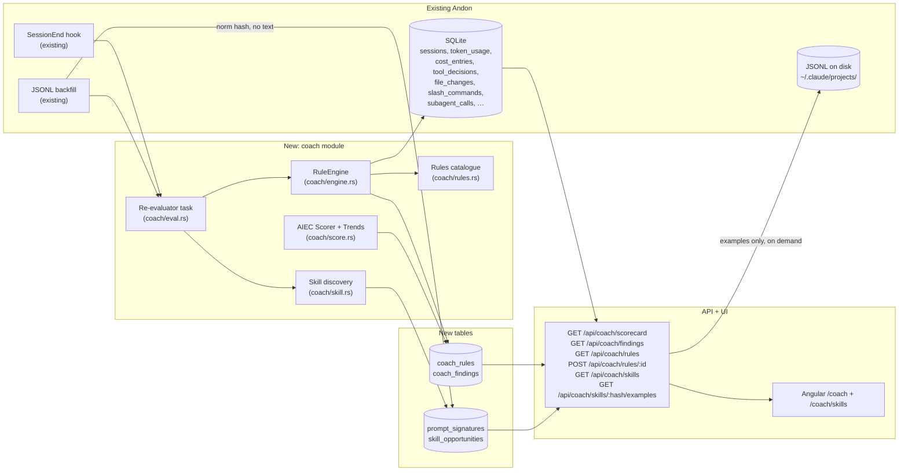
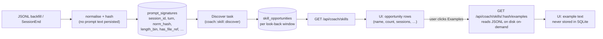

# AI Engineering Coach integration — Design

> Status: draft 2026-05-24 · author: SatishKrishna Pilla
> Branch: `claude/ai-engineering-coach-andon-CKkqZ`
> Upstream: [microsoft/AI-Engineering-Coach](https://github.com/microsoft/AI-Engineering-Coach) (MIT)

## Motivation

[Microsoft AI Engineering Coach](https://github.com/microsoft/AI-Engineering-Coach)
(AIEC) is a VS Code extension that analyses local AI coding-assistant logs and
returns coaching feedback. Its four feature pillars are **Observe**, **Measure**,
**Improve**, and **Level Up**.

Three of those pillars overlap heavily with Andon's existing pages:

| AIEC | Andon equivalent |
|---|---|
| Observe → dashboard, session timeline | Overview, Session detail |
| Measure → code output by lang/model, token budget, activity heatmap | Files, Efficiency, Overview Tape, budget alerts |
| Improve → 45 anti-pattern rules, rule editor / playground, skill discovery, context-health score | **gap** |
| Level Up → personalised quizzes, achievements, SDLC visualisation | n/a (LM-dependent) |

The real gap — and the genuine reason to integrate AIEC at all — is **Improve**.
Andon already collects every fact those rules need (per-session token splits, tool
decisions, file changes, slash commands, sub-agent calls, repo metadata) and shows
none of it as advice. AIEC's rule set is the missing layer on top.

## Goal

A new **Coach** page in Andon that runs AIEC-style anti-pattern rules over the data
already in `~/.andon/data.db` and surfaces:

1. A **scorecard** — five practice-area scores (Prompt quality, Session hygiene,
   Code review discipline, Tool mastery, Context management), mirroring AIEC's
   own breakdown.
2. A ranked **findings list** — every triggered rule for the selected window, with
   the session(s) it triggered on and a one-line suggestion. Clicks drill into the
   relevant Session-detail page.
3. A **rule catalogue** — every rule with current status (enabled / disabled),
   description, severity, and a toggle.
4. A **Skill Finder** sub-page — discovers repeated prompt patterns across the
   selected look-back window and surfaces them as "custom skill opportunities"
   (the AIEC equivalent of *"you have asked Claude to package the extension
   eleven times — make it a slash command"*).

Everything runs locally, deterministically, and respects Andon's filter bar
(window + model chips).

## Non-goals

The following AIEC features are explicitly **out of scope** for this design, and
some are out of scope for Andon period. Each gets a one-line "why" so we don't
re-litigate them.

- **Screenshot / "Coding moments" gallery.** Andon has no IDE process, never sees
  the editor, and explicitly does not. Out of scope permanently.
- **Copilot-language-model-backed features** (quizzes, AI-written rule
  explanations, AI skill summarisation). Andon's privacy contract bans outbound
  network calls except the opt-in OTel forwarder. Out of scope permanently.
- **Achievement / gamification system.** Not Andon's tone. Out of scope.
- **Rule editor / DSL playground UI.** AIEC ships a DSL playground for
  authoring custom detectors. Genuinely useful, but a feature of its own and
  the largest single chunk of AIEC code (`rule-parser`, `rule-compiler`,
  `rule-pipeline`, `dsl/`). Deferred to **Phase 2**; this design ships rules
  as a static Rust catalogue tunable via Settings toggles only.
- **Community skill catalog.** AIEC's Skill Finder also surfaces matches from
  an open-source community catalog hosted online. Andon does not fetch remote
  catalogs (outbound-network rule). If we add this later, it lands behind an
  opt-in toggle modelled on the OTel forwarder. Out of scope here.
- **Importing AIEC's TypeScript code wholesale.** AIEC is a VS Code extension;
  Andon is a Tauri+Rust app with an Angular SPA. We port the *ideas* (the rule
  set, the five practice areas, the scoring approach), not the runtime.
- **A direct AIEC ↔ Andon protocol** (e.g. AIEC consuming `127.0.0.1:8765`).
  Considered below as Option B and rejected — see *Decisions*.

## Decisions (resolved during design)

| # | Decision | Choice |
|---|---|---|
| 1 | Integration shape | **Option A — port the rules into Andon as a native Coach module.** Rationale below. |
| 2 | Rule storage | Hard-coded in Rust (`coach/rules.rs`), one struct per rule. No DSL, no migration. User-tunable in v2. |
| 3 | Findings storage | A new `coach_findings` table written by a background re-evaluator. Cached, not recomputed per request. |
| 4 | Re-evaluation trigger | On session-end (the existing SessionEnd hook touches every session) **and** on every successful JSONL backfill batch. No periodic cron. |
| 5 | Scoring model | **Exact AIEC formula** — severity-weighted detector penalty over the maximum possible penalty for the practice area. See *Scoring* below. |
| 5a | Trend model | **Exact AIEC trends** — WoW (last week vs previous week, % change) and MoM (most-recent 4-week average vs the prior 4-week average, % change). Both rendered on every scorecard tile. |
| 6 | Page placement | New `/coach` route, between **Efficiency** and **Sessions** in the nav (icon: `graduation-cap` from lucide). |
| 7 | License + attribution | AIEC is MIT. Each ported rule carries an `aiec_origin: Option<&'static str>` field with the upstream rule id when applicable; `docs/features.md` and the Coach page footer credit Microsoft AIEC. |

### Why Option A, not B or C

Three shapes were considered:

- **Option A — Port (chosen).** Re-implement AIEC's rule set as a Rust
  `coach` module that reads Andon's tables. One binary, no new runtime, no
  network surface. Matches every Andon principle (single binary, localhost,
  embedded SQLite, no outbound calls). Cost: we maintain a Rust port of
  AIEC's rule logic.
- **Option B — Bridge.** Keep AIEC running as a VS Code extension; have
  AIEC consume Andon's `127.0.0.1:8765` API as its data source. Adds a
  VS Code dependency for Andon users who want coaching, splits the UX
  across two surfaces, and forces Andon to publish a stability contract
  on its API for an external consumer. Rejected.
- **Option C — Sidecar.** Bundle AIEC inside Andon (e.g. as an embedded
  Node runtime). Breaks the single-binary, single-runtime story; adds
  Node+npm to the Rust+Tauri toolchain. Rejected.

If a user separately runs AIEC alongside Andon, nothing here prevents that —
they share no state, they just happen to look at similar things. This design
is about what Andon does itself.

## Architecture



### Module layout (Rust)

```
src-tauri/src/coach/
  mod.rs          public API: `evaluate(pool, window) -> Result<()>`
  rules.rs        the static rule catalogue (enum Rule { Binary, Continuous })
  engine.rs       runs all enabled rules against a window, writes findings
  score.rs        AIEC-formula scorer + WoW/MoM trends + scorecard assembly
  skill.rs        prompt-signature normaliser + discovery pass + examples reader
  eval.rs         re-evaluator task; called from SessionEnd + JSONL ingest
  queries.rs      shared SQL fragments (window predicates, session sets)
```

Same conventions as the rest of the backend: `tracing::instrument` on every
public async fn, `anyhow::Result` at the module boundary, `thiserror` for
domain errors, no `unwrap`/`expect`, no `rusqlite::Connection` held across
`.await`.

## Schema

Two new tables, applied as a new numbered migration. No changes to any
existing table.

### `coach_rules`

```sql
CREATE TABLE coach_rules (
  id           TEXT PRIMARY KEY,        -- e.g. 'long-session-no-commit'
  practice     TEXT NOT NULL,           -- 'prompt' | 'hygiene' | 'review' | 'tool' | 'context'
  severity     TEXT NOT NULL,           -- 'high' | 'medium' | 'low' (AIEC values)
  kind         TEXT NOT NULL,           -- 'binary' | 'continuous'
  enabled      INTEGER NOT NULL DEFAULT 1,
  updated_at   INTEGER NOT NULL         -- unix ms
);
```

A seed migration inserts one row per `Rule` in `coach::rules::RULES`. The
catalogue is hard-coded; this table only persists the user's enable/disable
state across restarts.

### `coach_findings`

```sql
CREATE TABLE coach_findings (
  id          INTEGER PRIMARY KEY AUTOINCREMENT,
  rule_id     TEXT NOT NULL,
  session_id  TEXT NOT NULL,
  detected_at INTEGER NOT NULL,        -- unix ms — the timestamp the rule looked at
  payload     TEXT NOT NULL DEFAULT '{}', -- rule-specific JSON detail (e.g. file path, ratio)
  FOREIGN KEY (rule_id)    REFERENCES coach_rules(id)    ON DELETE CASCADE,
  FOREIGN KEY (session_id) REFERENCES sessions(session_id) ON DELETE CASCADE
);
CREATE UNIQUE INDEX coach_findings_unique
  ON coach_findings(rule_id, session_id, detected_at);
CREATE INDEX coach_findings_session ON coach_findings(session_id);
```

The unique index makes re-evaluation idempotent — re-running a rule over the
same session at the same timestamp is a no-op. `payload` is `serde`-derived
per-rule JSON (the existing `metrics_raw` pattern) so the UI can render
rule-specific detail without the engine knowing about it.

`coach_scorecard` is **not** a table — scorecards are derived on read from
`coach_findings` joined against `sessions`. Caching is unnecessary; the SQL
is a handful of indexed aggregates.

### `prompt_signatures` (skill discovery)

A privacy-safe index of every user prompt seen during JSONL ingest — used
only as the input to the Skill Finder. **No prompt text is stored.**

```sql
CREATE TABLE prompt_signatures (
  session_id   TEXT NOT NULL,
  request_id   TEXT,                      -- nullable; user turns w/o a request
  turn_index   INTEGER NOT NULL,          -- ordinal within the session
  norm_hash    TEXT NOT NULL,             -- BLAKE3 hex of normalised prompt
  length_bin   INTEGER NOT NULL,          -- 0=<20, 1=<100, 2=<500, 3=<2000, 4=≥2000
  has_file_ref INTEGER NOT NULL,          -- 0/1 — contains `@path` or absolute path
  has_code     INTEGER NOT NULL,          -- 0/1 — contains a ``` fence
  command      TEXT,                      -- slash-command name if the prompt was one
  PRIMARY KEY (session_id, turn_index),
  FOREIGN KEY (session_id) REFERENCES sessions(session_id) ON DELETE CASCADE
);
CREATE INDEX prompt_signatures_hash ON prompt_signatures(norm_hash);
```

**Normalisation rule** (the input to `norm_hash`):
1. Lowercase.
2. Strip leading/trailing whitespace; collapse internal whitespace to one space.
3. Replace any absolute path or `@path` reference with the literal `<path>`.
4. Replace any UUID, request id, or commit-sha shape with `<id>`.
5. Replace any contiguous run of digits ≥ 4 long with `<num>`.
6. Replace ``` … ``` code fences with `<code>` (the whole block, including
   contents, drops out of the hash).
7. Truncate to the first 1024 characters of the normalised string before
   hashing — long pasted contexts shouldn't fragment the hash.

The hash uses BLAKE3 with a static 32-byte key built into the binary, so
hashes are stable across runs but not portable across installs. There is
no reverse lookup — by construction, only the JSONL on disk can produce
example text for a given hash.

### `skill_opportunities`

```sql
CREATE TABLE skill_opportunities (
  id             INTEGER PRIMARY KEY AUTOINCREMENT,
  norm_hash      TEXT NOT NULL,           -- groups occurrences
  command        TEXT,                    -- slash-command name if applicable
  occurrences    INTEGER NOT NULL,        -- count of matching prompts in window
  session_count  INTEGER NOT NULL,        -- distinct sessions touched
  first_seen     INTEGER NOT NULL,        -- unix ms — earliest matching prompt
  last_seen      INTEGER NOT NULL,        -- unix ms — most recent matching prompt
  window_start   INTEGER NOT NULL,        -- the look-back window the row was computed for
  window_end     INTEGER NOT NULL,
  computed_at    INTEGER NOT NULL
);
CREATE UNIQUE INDEX skill_opportunities_unique
  ON skill_opportunities(norm_hash, window_start, window_end);
```

The same hash can appear in multiple rows for different look-back windows
(1m / 3m / 6m, matching AIEC). Example text is fetched on demand by the
API at display time — never persisted (see *Skill discovery* below).

## Starter rule set

Ten rules, two per practice area, all derivable from data Andon already has.
Each is implemented as a `Rule { id, practice, severity, aiec_origin,
description, suggestion, query }`. The starter set is deliberately small and
high-signal; expansion follows in later specs.

Twelve rules in Phase 1 — ten binary detectors plus two continuous checks
— each mapped to an AIEC upstream where one exists (the AIEC catalogue at
`src/core/rules/` has 51 rule documents). Andon ports the subset whose
input signals are already in our schema; the rest are deferred or out of
scope for the data we collect.

| Practice | Rule id | Kind | Sev | AIEC origin | Triggers when… |
|---|---|---|---|---|---|
| **Prompt quality** | `repeated-prompts` | binary | medium | `repeated-prompts.md` | Same `norm_hash` (see `prompt_signatures`) appears ≥ 3× in one session |
| Prompt quality | `lazy-prompting` | binary | low | `lazy-prompting.md` | First user turn has `length_bin = 0` *and* the session writes > 5 file edits |
| Prompt quality | `low-constraint-usage` | binary | low | `low-constraint-usage.md` | < 20 % of user turns in a session contain a constraint keyword (`must`, `should`, `limit`, …; matched on the un-hashed prompt at ingest, recorded as a flag) |
| **Session hygiene** | `mega-sessions` | binary | high | `mega-sessions.md` + `metrics/mega-sessions.metric.md` | `sessions.ended_at − started_at > 90 min` *and* `git_activity` for that session is empty |
| Session hygiene | `late-night-coding` | binary | low | `late-night-coding.md` | ≥ 5 sessions in the window started between 23:00 and 05:00 local time |
| Session hygiene | `abandon-sessions` | binary | medium | `abandon-sessions.md` | ≥ 3 sessions in the window with `tool_decisions` but zero accepts |
| **Code review discipline** | `speed-accept` | binary | high | `speed-accept.md` | Median time between consecutive `tool_decisions.decision = 'accept'` in a session < 5 s, over ≥ 10 decisions |
| Code review discipline | `high-cancellation` | binary | medium | `high-cancellation.md` | Session-level `aborts / (accepts + rejects + aborts) > 0.3` over ≥ 10 decisions |
| **Tool mastery** | `no-slash-commands` | binary | low | `no-slash-commands.md` | Session > 30 min with zero `slash_commands` rows |
| Tool mastery | `model-diversity` | **continuous** | — | (AIEC's PatternsAnalyzer "Model Diversity") | Score = `100 if distinct models ≥ 4, 80 if ≥ 3, 50 if ≥ 2, else 20` over the window |
| **Context management** | `cache-hit-starvation` | binary | high | `cache-hit-starvation.md` | Session-level `cacheCreation / (cacheRead + cacheCreation) > 0.7` over ≥ 5 turns |
| Context management | `planning-usage` | **continuous** | — | (AIEC's PatternsAnalyzer "Planning Usage") | Score = `100 if planning-ratio > 0.1, 70 if > 0.05, 40 if > 0, else 10`. Planning ratio = `slash_commands(name='plan') / sessions` over the window |

Each rule's SQL lives in `coach/rules.rs` next to its `Rule` literal — close
to the schema it queries, easy to grep. `aiec_origin` is set to the upstream
AIEC rule id where one exists; the two continuous checks reference the
AIEC analyzer they were ported from.

**Severity values match AIEC exactly** (`high` / `medium` / `low`) because
the scoring formula reads `sevPenalty[severity]` directly. Renaming them
would silently change the math.

### Adding a rule

New rules are pure-data: append a `Rule { … }` to `RULES` and write its
detector closure (a `fn(&Pool, Window) -> Result<Vec<Finding>>`). A unit test
per rule (TDD: failing test first) seeds a curated DB via `test-support` and
asserts the expected `Finding`s come back. No engine change.

## Scoring

The scoring math is a direct port of AIEC's
`PatternsAnalyzer` (`src/core/analyzer-patterns.ts`). The two formulas
below are normative — any change to them is a spec change, not an
implementation detail.

### Per-practice-area score

```
sevPenalty   = { high: 12, medium: 7, low: 3 }            // AIEC constants
detectors    = the set of enabled rules whose practice = P
triggered    = the subset of `detectors` whose detector emitted ≥ 1 finding
               anywhere in the window
penalty      = Σ over r ∈ triggered of sevPenalty[r.severity]
maxPenalty   = |detectors| × sevPenalty.high       // = |detectors| × 12
score(P)     = max(0, round(100 × (1 − penalty / maxPenalty)))
```

Notes that fall out of the formula and matter for implementation:

- **Penalty is per-detector, not per-finding.** A rule that triggers on
  twenty sessions costs the same as a rule that triggers on one. The
  *findings list* is the place to see frequency; the score is "how many
  different bad habits showed up".
- **`maxPenalty` is the worst case for the *enabled* detector set.**
  Disabling a rule shrinks the denominator, which is the correct
  behaviour: a user who turns off five rules can still score 0 if every
  remaining rule trips.
- **Practice areas with zero enabled detectors are reported as
  `score = null`** (not 100). The UI renders these as "—" so we don't
  flatter the user with a free A.

### Status thresholds (AIEC)

```
score >= 70 → "good"             // green
score >= 40 → "needs-improvement" // amber
score <  40 → "critical"         // red
score == null → "n/a"            // muted
```

### Trends (AIEC)

Two indicators per scorecard tile, both computed on **finding count**, not
on score (mirrors AIEC):

```
// Week-over-week — last 7d vs prior 7d
last       = count of findings in [now-7d, now)        for practice P
prev       = count of findings in [now-14d, now-7d)    for practice P
wowPct     = prev > 0 ? round(((last - prev) / prev) * 100) : 0

// Month-over-month — recent 4-week average vs prior 4-week average
recent4w   = [findings in week 1, …, week 4]   weeks counted backward from now
prior4w    = [findings in week 5, …, week 8]
avgRecent  = mean(recent4w)
avgPrev    = mean(prior4w)
momPct     = avgPrev > 0 ? round(((avgRecent - avgPrev) / avgPrev) * 100) : 0
```

For trends, *down is good* (fewer findings is better). The UI inverts the
colour: positive `wowPct`/`momPct` renders red, negative renders green,
zero renders muted. This inversion is the one piece of trend semantics
the formula doesn't encode and is documented in `coach::score`.

A scorecard request returns: `score`, `status`, `wow_pct`, `mom_pct`, and
`triggered_count` per practice — exactly the AIEC shape.

### Per-rule sub-scores (AIEC continuous detectors)

AIEC also has *continuous* checks — detectors that emit a 0-100 score
directly (e.g. Model Diversity: `count ≥ 4 → 100, ≥ 3 → 80, ≥ 2 → 50,
else 20`; Planning Usage: `ratio > 0.1 → 100, > 0.05 → 70, > 0 → 40,
else 10`). These coexist with the binary-trigger rules above.

In this port, continuous checks are modelled as a separate `Rule::Continuous`
variant returning a `score: i64` (0-100) and *no* findings. The Coach page
renders them as additional tiles in their practice section, side-by-side
with the binary-trigger scorecard. Phase 1 ships two continuous checks —
**Model Diversity** and **Planning Usage** — using the exact AIEC tier
thresholds quoted above. Both data sources (`cost_entries.model`,
`slash_commands.name = 'plan'`) are already in the DB.

## Skill discovery

A port of AIEC's **Skill Finder** (`docs/content/improve/skill-finder.md`),
adapted to Andon's stricter privacy contract.

### What it does

For a selected look-back window (1m / 3m / 6m — the AIEC presets), the
Skill Finder surfaces **custom skill opportunities**: prompts the user has
typed in some normalised form `N` times across `S` distinct sessions where
both counts exceed configurable thresholds. The intent: *"you've asked
Claude to package the extension eleven times across seven sessions — make
it a slash command."*



### Privacy posture

Andon's rule (`docs/architecture.md` §"Privacy & safety") is that **raw
user prompts are never persisted**. Skill discovery honours this:

1. JSONL ingest writes `prompt_signatures` — the **hash + structural
   flags only**. The prompt text is processed in memory and dropped.
2. Cluster discovery operates entirely on `prompt_signatures`.
3. When the user clicks "show examples" for a discovered opportunity,
   the API re-reads the original JSONL files from `~/.claude/projects/`
   on disk and returns matching text **without writing it anywhere**.
   The DB never holds raw prompts. The HTTP response is in-memory only
   and crosses no boundary other than localhost.

A property test (`coach_no_prompt_leak.rs`, extended) asserts the
invariant: for randomly generated prompts, no substring of any prompt
appears in any column of `prompt_signatures`, `skill_opportunities`, or
`coach_findings`.

### Discovery algorithm

A straightforward two-pass on `prompt_signatures`:

```
threshold_occurrences = 3        // configurable, AIEC parity default
threshold_sessions    = 2        // configurable

for each look_back ∈ {30d, 90d, 180d}:
    rows = SELECT session_id, norm_hash, command, MIN(ts) AS first, MAX(ts) AS last
           FROM prompt_signatures
           JOIN sessions USING (session_id)
           WHERE sessions.started_at >= now - look_back
           GROUP BY norm_hash, session_id
    buckets = group rows by norm_hash
    for each (hash, group) in buckets:
        occurrences   = sum(group.count_in_session)   // total prompts
        session_count = |distinct session_ids in group|
        if occurrences >= threshold_occurrences AND
           session_count >= threshold_sessions:
            UPSERT skill_opportunities (norm_hash, command, ...)
```

Clustering at Phase 1 is **exact normalised-hash equality** — fast,
deterministic, no fuzzy matching. Future work may add edit-distance or
minhash clustering once we see real-world hash distributions. AIEC's
description ("repeated patterns that waste time" / "the same type of
request") is consistent with exact-after-normalisation matching at this
stage.

### Naming opportunities

The UI needs a short label per opportunity. Three sources, in order of
preference:

1. If `command` is set (the prompt was a slash command), label = `/{command}`.
2. Else, on the Examples fetch, the API returns the **shortest** example
   prompt as the label (truncated at 80 chars). This is human-readable and
   stays current with the most concise phrasing of the pattern.
3. Else, label = `pattern {first-8-chars-of-hash}` as a final fallback.

The shortest-example heuristic mirrors AIEC's behaviour: opportunity rows
in AIEC display a representative prompt, not a hash.

### Re-discovery

The skill-discovery task runs in the same triggers as the coach engine
(SessionEnd, JSONL backfill batch end). It is idempotent — the unique
index on `(norm_hash, window_start, window_end)` makes re-running on the
same window a no-op upsert.

### Thresholds in Settings

Two new Settings inputs (under the Coach → Rules section):

- **Skill Finder: min occurrences** (default 3)
- **Skill Finder: min sessions** (default 2)

Stored as integers in `settings.json` next to `budget`. The Coach skills
endpoint reads these on every request — no caching, no migration on change.

## Re-evaluation

The evaluator runs over a sliding window — by default the last 30 days — and
inserts any new `coach_findings`. The unique index dedupes; finishing a
session twice (re-ingest) does not duplicate findings.

Triggers:

- **SessionEnd hook handler** in `integration.rs` calls
  `coach::eval::evaluate_session(pool, session_id)` after the existing
  session-end writes complete. Scope: the one session's rules, plus an
  incremental skill-discovery refresh.
- **JSONL backfill** calls `coach::eval::evaluate_window(pool, 30d)` and
  `coach::skill::discover_all(pool)` (all three look-back windows) once at
  the end of a backfill batch (not per file). A backfill may surface old
  sessions a rule needs to compare against, and it is the only source of
  `prompt_signatures`.

The evaluator never blocks the OTLP path. It runs on the existing tokio
runtime as a spawned task. Failures are logged via `tracing::warn!` and never
surface to Claude Code (consistent with the receiver-always-`Ok` rule).

## API

Six new endpoints under `/api/coach/`, registered on the existing axum
router, all `serde`-DTO, all `#[tracing::instrument]`, all degrade to safe
empty responses on internal failure.

### `GET /api/coach/scorecard?from&to&models`

Response mirrors AIEC's scorecard shape (`score`, `status`, `wow_pct`,
`mom_pct`, `triggered_count`):

```json
{
  "practices": [
    {
      "practice": "prompt", "score": 88, "status": "good",
      "wow_pct": -25, "mom_pct": -12, "triggered_count": 1,
      "continuous": []
    },
    {
      "practice": "hygiene", "score": 62, "status": "needs-improvement",
      "wow_pct": 14, "mom_pct": 8, "triggered_count": 2,
      "continuous": []
    },
    {
      "practice": "review", "score": 91, "status": "good",
      "wow_pct": 0, "mom_pct": -5, "triggered_count": 0,
      "continuous": []
    },
    {
      "practice": "tool", "score": 74, "status": "good",
      "wow_pct": -10, "mom_pct": -2, "triggered_count": 1,
      "continuous": [
        { "id": "model-diversity", "score": 80 }
      ]
    },
    {
      "practice": "context", "score": 80, "status": "good",
      "wow_pct": 0, "mom_pct": 0, "triggered_count": 0,
      "continuous": [
        { "id": "planning-usage", "score": 70 }
      ]
    }
  ],
  "window": { "from": 1748044800000, "to": 1748131200000 },
  "sessions_in_window": 38
}
```

`status` is one of `"good"` / `"needs-improvement"` / `"critical"` /
`"n/a"`, computed exactly as in AIEC (see *Scoring*). `wow_pct` and
`mom_pct` are **signed integers** — the UI applies the
fewer-findings-is-better inversion when colouring.

### `GET /api/coach/findings?from&to&models&rule_id?&session_id?&limit?`

Response: a paginated list of findings ordered by `detected_at DESC`. Each
finding embeds enough session context (started_at, repo, cost) for the
Coach page to render a row without a second round-trip.

```json
{
  "items": [
    {
      "id": 4711,
      "rule_id": "long-session-no-commit",
      "practice": "hygiene",
      "severity": "warn",
      "session_id": "01HZ...",
      "started_at": 1748044800000,
      "detected_at": 1748053200000,
      "repo": "satish-krishna/andon",
      "cost_usd": 4.21,
      "description": "Session ran 2h17m with no commits.",
      "suggestion": "Commit checkpoints; restart sessions after major milestones.",
      "payload": { "duration_min": 137, "commits": 0 }
    }
  ],
  "next_cursor": null
}
```

### `GET /api/coach/rules`

Static rule catalogue plus the per-row `enabled` flag from `coach_rules`.

### `POST /api/coach/rules/:id`  body: `{ "enabled": bool }`

Updates `coach_rules.enabled`. Disabling a rule does **not** delete its
existing findings — only future evaluations skip it. Disabling a rule
also shrinks the `maxPenalty` denominator for its practice area's score
on subsequent reads (this is the AIEC behaviour and what users intuitively
expect when they turn a rule off).

### `GET /api/coach/skills?lookback=30d|90d|180d`

Returns custom skill opportunities discovered for the requested look-back
window. The endpoint reads pre-computed rows from `skill_opportunities` —
it does not recompute on every request.

```json
{
  "lookback": "90d",
  "opportunities": [
    {
      "norm_hash": "f3a1c2…",
      "label": "/package",
      "command": "package",
      "occurrences": 11,
      "session_count": 7,
      "first_seen": 1742044800000,
      "last_seen": 1748044800000
    },
    {
      "norm_hash": "9b22de…",
      "label": "regenerate the openapi types after the schema change",
      "command": null,
      "occurrences": 6,
      "session_count": 4,
      "first_seen": 1742644800000,
      "last_seen": 1747500000000
    }
  ]
}
```

### `GET /api/coach/skills/:norm_hash/examples?limit=3`

Resolves up to `limit` example prompts for a discovered opportunity by
reading the original JSONL files on disk. The prompt text is returned in
the HTTP response **but never persisted**. If the underlying JSONL has
been deleted or rotated, the endpoint returns `{ "examples": [] }`.

```json
{
  "examples": [
    {
      "session_id": "01HZ…",
      "turn_index": 12,
      "text": "Package the extension and bump the patch version."
    },
    {
      "session_id": "01J0…",
      "turn_index": 4,
      "text": "Can you package the extension please?"
    }
  ]
}
```

## Frontend

`CoachComponent` — standalone, `OnPush`, signals only, `inject()` for
`FilterService` and `ApiService`. Layout reuses `panel` / `panel-title` /
`panel-body` and Tailwind utilities; no new CSS framework.

```
web/src/app/features/coach/
  coach.component.ts          // /coach — scorecard + findings
  coach.component.html
  coach.component.spec.ts
  coach-skills.component.ts   // /coach/skills — Skill Finder sub-route
  coach-skills.component.html
  coach-skills.component.spec.ts
  coach-rules.component.ts    // Settings → Rules sub-page (catalogue + toggles)
  coach-rules.component.html
```

Page structure (top to bottom):

1. **Standard crumb** — `graduation-cap` icon + "Coach".
2. **Experimental banner** — same warn-style banner Behaviour uses
   (`flask-conical` icon, "Coach is experimental — rules are heuristics and
   may not fit your workflow").
3. **`<app-filter-bar />`** — window + model chips, same instance as
   Overview / Efficiency.
4. **Scorecard strip** — five tiles, one per practice area. Each: name,
   big score (0–100, color-graded by AIEC's bands: `≥ 70 good / green`,
   `≥ 40 needs-improvement / amber`, `< 40 critical / red`,
   `null → "—" / muted`), the `triggered_count`, and two trend chips
   (WoW + MoM, inverted-colour: negative = green, positive = red).
   Continuous-check scores render as small inline pills under the tile
   (e.g. *"Model diversity 80"*).
5. **Findings panel** — virtualised list (existing pattern from
   `sessions.component`), filterable by rule-id chips. Each row: severity
   pip, rule name, one-line description, session click-through, repo +
   cost.
6. **Skill Finder link** — prominent CTA "X custom-skill opportunities in
   the last 90 days →" routing to `/coach/skills`.
7. **Rules link** — footer link to Settings → Rules.

### Skill Finder sub-route (`/coach/skills`)

A simpler page sharing the same `CoachComponent` parent layout:

- A 3-button segmented control for **Look-back** (1m / 3m / 6m), mirroring
  AIEC. Default 3m.
- One row per opportunity: severity-neutral pip · label · `N×` count ·
  `S sessions` · last-seen relative time · "Show examples" disclosure.
- Clicking "Show examples" fires `GET /api/coach/skills/:hash/examples`
  and expands the row to show up to three example prompts. A `Copy as
  slash command` button drops a starter `slash-command-name + body`
  snippet into the clipboard for the user to paste into
  `~/.claude/commands/`. We do **not** write to `~/.claude/` from
  Andon — out of scope, and the user must own that step.
- Empty state: a one-liner pointing at Settings → "Ingest JSONL history"
  when no `prompt_signatures` exist for the window.

Settings page gains a new anchor section **Rules** rendering
`CoachRulesComponent`: the catalogue with one toggle per rule, grouped by
practice area, with description and suggestion visible. Toggling calls
`POST /api/coach/rules/:id`.

`ApiService` gains `coachScorecard`, `coachFindings`, `coachRules`,
`updateCoachRule`, `coachSkills`, `coachSkillExamples`. DTOs mirror the
JSON above, declared in `core/`.

## Edge cases

- **Empty window.** Scorecard returns each practice with `triggered_count
  = 0` and `score = 100` *if* the practice has ≥ 1 enabled detector; if
  not, `score = null, status = "n/a"`. Findings list empty. The page
  renders a neutral empty state (no warn colours when there's nothing to
  warn about).
- **All detectors in a practice are disabled.** `score = null`,
  `status = "n/a"`. The tile renders "—". This is *not* the same as
  perfect — the formula is undefined when the denominator is zero.
- **Skill Finder, no JSONL ingest yet.** Empty list with a one-line hint
  pointing at Settings → "Ingest JSONL history" — same pattern the
  Efficiency page uses for subagent rows.
- **JSONL file deleted between discovery and Examples request.** The
  examples endpoint returns `{ "examples": [] }` rather than erroring;
  the `skill_opportunities` row stays as long as the look-back window
  covers it.
- **Sessions without JSONL ingest.** Rules that depend on JSONL-only data
  (`subagent-cost-spike`, `cache-anti-pattern` at session granularity)
  simply skip those sessions — no false positives from missing data. The
  rule catalogue lists each rule's data dependencies so the Coach page
  can surface a "X rules need JSONL backfill" hint when relevant.
- **A rule's SQL is wrong.** Each rule is independent; the engine catches
  per-rule errors, logs, and continues. One broken rule never breaks the
  scorecard.
- **Model filter.** Rules that aggregate over `token_usage` / `cost_entries`
  apply the filter the same way `v2_kpis` does (intersection with the
  selected models). Rules that look at session shape (duration, decision
  counts) ignore the model filter — filtering a session by model doesn't
  shorten it. The rule struct carries a `respects_model_filter: bool` flag
  the engine reads.
- **Tie-breaking on dominant-family rules.** Same fixed order as the
  Efficiency page: `[opus, sonnet, haiku, other]`.

## Privacy & safety

This feature adds **no** new listeners and **no** new outbound calls. The
four privacy guarantees in
[`docs/architecture.md`](../../architecture.md) §"Privacy & safety rules"
are unaffected. Four points worth being explicit about:

1. **No prompt text in any new table.** `prompt_signatures`,
   `skill_opportunities`, and `coach_findings.payload` carry only hashes,
   lengths, counts, and structural flags. The proptest
   `coach_no_prompt_leak.rs` enforces this invariant against random inputs.
2. **JSONL on-demand reads stay in memory.** The
   `/api/coach/skills/:hash/examples` handler reads `~/.claude/projects/`
   at request time and streams matching prompts to the SPA. The text is
   never written to `data.db`, never logged, never forwarded. Tracing
   spans for this handler use `tracing::field::Empty` for the prompt
   field so it cannot accidentally land in `log.txt`.
3. **Forwarder is unaffected.** The forwarder only re-emits OTLP payloads
   from the receivers; Coach data does not flow through it.
4. AIEC's optional Copilot-LM features are not ported. No part of this
   design requires an LM, by design.

## Testing

TDD throughout. Rust tests under `cargo test --features test-support`.

**Rust unit (per rule):** seed a DB through `test-support` with the
minimum data each rule needs; assert the expected `Finding`(s) come back
with the right `payload`. Ten rules → at least ten unit tests, each
covering the trigger and a near-miss.

**Rust integration:** `src-tauri/tests/coach_api.rs` — seeded DB, hit all
four endpoints, snapshot the JSON. Adds one new `.snap`.

**Rust property:** `coach_no_prompt_leak.rs` — generate random prompts,
run JSONL ingest + the full coach pipeline (rules + skill discovery), and
assert no substring of any prompt appears anywhere in
`coach_findings.payload`, `prompt_signatures` (any column), or
`skill_opportunities` (any column). Mirrors `jsonl_privacy.rs`.

**Rust scorer unit tests** — direct AIEC-formula coverage:
- `score_all_clean → 100`, `score_all_high → 0`, `score_disabled → null`.
- Worked AIEC example: 3 detectors enabled in P, one `high` triggers →
  `penalty = 12, maxPenalty = 36, score = round(100×(1−12/36)) = 67`.
- `wow_pct` and `mom_pct`: synthetic counts in 8 consecutive weeks,
  assert exact integer percentages match the AIEC formulas.

**Angular (Vitest):** `coach.component.spec.ts` renders the scorecard and
findings from a mocked `ApiService`; empty-state coverage; toggling a rule
in `coach-rules.component.spec.ts` fires the correct POST.

**Smoke:** the existing OTLP smoke scripts (`scripts/smoke_*.{js,py}`) need
no change — the coach module is read-side only relative to the OTLP path.

## Phased rollout

This design covers Phase 1. Each later phase ships under its own spec.

| Phase | Scope | Spec |
|---|---|---|
| **1 (this design)** | Coach module + 10 binary rules + 2 continuous checks + AIEC scorecard formula (incl. WoW/MoM) + Skill Finder (custom opportunities) + Settings toggles | this doc |
| 2 | **Rule DSL + Playground** — port AIEC's `rule-parser`/`rule-compiler`/`rule-pipeline`/`dsl` so users can author detectors without recompiling Andon; in-app playground to test a rule against historical data | later |
| 3 | **Per-rule trends** — sparklines per rule and per practice area; integrate with the Tape | later |
| 4 | **Community skill catalog** (opt-in, off by default; modelled on the OTel forwarder) — fetch the AIEC community skill index and surface matches alongside custom opportunities | later |

If Phase 1 lands and nobody uses the page, we stop and don't build phases
2–4. The cost of Phase 1 is bounded (one module, one page, two migrations
— `coach_*` plus `prompt_signatures` + `skill_opportunities`); the cost
of premature DSL design is not.

## Files touched

**Rust**

- `src-tauri/migrations/NNN_coach.sql` — `coach_rules` + `coach_findings`
  + indexes + seed inserts.
- `src-tauri/migrations/NNN_skill_finder.sql` — `prompt_signatures` +
  `skill_opportunities` + indexes.
- `src-tauri/src/coach/{mod,rules,engine,score,skill,eval,queries}.rs` — new.
- `src-tauri/src/api/routes.rs` — six handlers + route registration.
- `src-tauri/src/api/dto.rs` — `CoachScorecard`, `CoachFinding`, `CoachRule`,
  `UpdateCoachRule`, `SkillOpportunity`, `SkillExample`.
- `src-tauri/src/jsonl/reducer.rs` — emit a `PromptSignature` derived event
  for every user turn (hash + structural flags only; never the text).
- `src-tauri/src/integration.rs` — call `coach::eval::evaluate_session` on
  SessionEnd, after existing writes.
- `src-tauri/src/jsonl/runner.rs` (or equivalent backfill driver) — call
  `coach::eval::evaluate_window` *and* `coach::skill::discover_all` on
  batch completion.
- `src-tauri/src/settings.rs` — two new keys
  (`skill_min_occurrences`, `skill_min_sessions`).
- `src-tauri/src/lib.rs` — register the `coach` module.
- `src-tauri/tests/coach_api.rs` (+ a new `.snap`) — endpoint coverage.
- `src-tauri/tests/coach_rules.rs` — per-rule unit tests (12 rules).
- `src-tauri/tests/coach_scorer.rs` — AIEC-formula correctness +
  worked-example regression.
- `src-tauri/tests/coach_skill.rs` — normaliser + discovery thresholds
  + examples-on-disk reader.
- `src-tauri/tests/coach_no_prompt_leak.rs` — privacy proptest (now
  covers `prompt_signatures` + `skill_opportunities` columns too).

**Angular**

- `web/src/app/features/coach/coach.component.{ts,html,spec.ts}` — new.
- `web/src/app/features/coach/coach-skills.component.{ts,html,spec.ts}` — new.
- `web/src/app/features/coach/coach-rules.component.{ts,html,spec.ts}` — new.
- `web/src/app/core/api.service.ts` (+ DTO interfaces in `core/`) — six
  new methods.
- `web/src/app/app.routes.ts` — `/coach` + `/coach/skills` routes.
- `web/src/app/app.component.html` — nav item (between Efficiency and
  Sessions).
- `web/src/app/features/settings/settings.component.html` — anchor link
  to the new Rules sub-section, plus two number inputs for the Skill
  Finder thresholds.
- `web/src/app/core/icons.ts` — register `graduation-cap` and
  `lightbulb` (Skill Finder).

**Docs**

- `docs/features.md` — new Coach section, between Efficiency and Sessions.
- `docs/architecture.md` — one paragraph under "SQLite schema" for the two
  new tables; one sentence in "Process model" about the re-evaluator task.
- `README.md` — one bullet in the page list ("**Coach** — anti-pattern
  rules and practice-area scorecards (experimental)") and Microsoft AIEC
  attribution near the License section.

## Risks

- **Rules feel like nagging.** Heuristics that fire on legitimate work
  read as noise. Mitigations: the experimental banner sets expectations,
  every rule is one toggle to disable, and the starter set is deliberately
  small. Severity calibration is iterative.
- **Scoring is easy to game / hard to interpret.** AIEC's formula makes
  the score "how many *different* bad habits showed up" — disabling a
  rule legitimately raises the score (denominator shrinks). The findings
  list — the ground truth — is always one click away from each tile.
- **Skill hashing buckets too coarsely or too finely.** The normaliser
  is the lever. The choice to strip code fences, paths, and ids is
  deliberate ("which kind of question?" not "which exact question?"), but
  if hashes fragment too much in practice, we can extend the normaliser
  in a point release without a migration — the hash key is hard-coded.
- **JSONL files can be large.** On-demand example reads grep through
  `~/.claude/projects/<slug>/*.jsonl`. We bound the search by the session
  ids inside the matching `prompt_signatures` rows, so the read is
  O(matching sessions × file size), not whole-tree.
- **AIEC drifts and our port goes stale.** AIEC's rule set will evolve.
  Each ported rule's `aiec_origin` tag makes the mapping greppable; a
  periodic "AIEC sync" pass can pull new rules in. We are not promising
  parity.
- **JSONL-dependent rules look broken on fresh installs.** Same mitigation
  the Efficiency page uses: a contextual hint pointing at Settings →
  Backfill JSONL when JSONL-dependent rules return no data despite
  qualifying sessions existing.

## Attribution

- AIEC is MIT-licensed by Microsoft.
- `coach::rules::RULES[i].aiec_origin` carries the upstream rule id where
  one applies.
- `README.md` and `docs/features.md` credit Microsoft AIEC as inspiration
  for the Coach feature.
