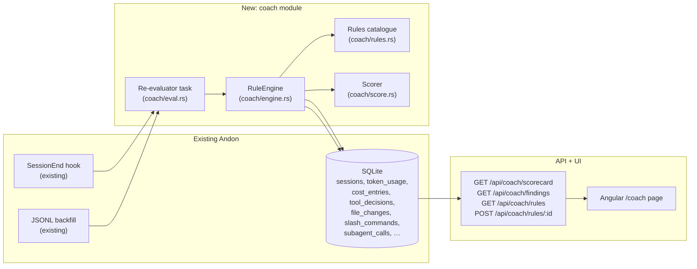

# AI Engineering Coach integration — Design

> Status: draft 2026-05-24 · author: SatishKrishna Pilla
> Branch: `claude/ai-engineering-coach-andon-CKkqZ`
> Upstream: [microsoft/AI-Engineering-Coach](https://github.com/microsoft/AI-Engineering-Coach) (MIT)

## Motivation

[Microsoft AI Engineering Coach](https://github.com/microsoft/AI-Engineering-Coach)
(AIEC) is a VS Code extension that analyses local AI coding-assistant logs and
returns coaching feedback. Its four feature pillars are **Observe**, **Measure**,
**Improve**, and **Level Up**.

Three of those pillars overlap heavily with Andon's existing pages:

| AIEC | Andon equivalent |
|---|---|
| Observe → dashboard, session timeline | Overview, Session detail |
| Measure → code output by lang/model, token budget, activity heatmap | Files, Efficiency, Overview Tape, budget alerts |
| Improve → 45 anti-pattern rules, rule editor / playground, skill discovery, context-health score | **gap** |
| Level Up → personalised quizzes, achievements, SDLC visualisation | n/a (LM-dependent) |

The real gap — and the genuine reason to integrate AIEC at all — is **Improve**.
Andon already collects every fact those rules need (per-session token splits, tool
decisions, file changes, slash commands, sub-agent calls, repo metadata) and shows
none of it as advice. AIEC's rule set is the missing layer on top.

## Goal

A new **Coach** page in Andon that runs AIEC-style anti-pattern rules over the data
already in `~/.andon/data.db` and surfaces:

1. A **scorecard** — five practice-area scores (Prompt quality, Session hygiene,
   Code review discipline, Tool mastery, Context management), mirroring AIEC's
   own breakdown.
2. A ranked **findings list** — every triggered rule for the selected window, with
   the session(s) it triggered on and a one-line suggestion. Clicks drill into the
   relevant Session-detail page.
3. A **rule catalogue** — every rule with current status (enabled / disabled),
   description, severity, and a toggle.

Everything runs locally, deterministically, and respects Andon's filter bar
(window + model chips).

## Non-goals

The following AIEC features are explicitly **out of scope** for this design, and
some are out of scope for Andon period. Each gets a one-line "why" so we don't
re-litigate them.

- **Screenshot / "Coding moments" gallery.** Andon has no IDE process, never sees
  the editor, and explicitly does not. Out of scope permanently.
- **Copilot-language-model-backed features** (quizzes, AI-written rule
  explanations, AI skill summarisation). Andon's privacy contract bans outbound
  network calls except the opt-in OTel forwarder. Out of scope permanently.
- **Achievement / gamification system.** Not Andon's tone. Out of scope.
- **Rule editor + playground UI.** Genuinely useful, but a feature of its own.
  Deferred to a later spec; this design ships rules as a static catalogue tunable
  via Settings toggles only.
- **Skill discovery (mining recurring prompt/tool patterns into suggested slash
  commands or sub-agents).** Deferred to a later spec; the foundation laid here
  — `coach_findings` + the rule-engine plumbing — is what skill discovery would
  build on.
- **Importing AIEC's TypeScript code wholesale.** AIEC is a VS Code extension;
  Andon is a Tauri+Rust app with an Angular SPA. We port the *ideas* (the rule
  set, the five practice areas, the scoring approach), not the runtime.
- **A direct AIEC ↔ Andon protocol** (e.g. AIEC consuming `127.0.0.1:8765`).
  Considered below as Option B and rejected — see *Decisions*.

## Decisions (resolved during design)

| # | Decision | Choice |
|---|---|---|
| 1 | Integration shape | **Option A — port the rules into Andon as a native Coach module.** Rationale below. |
| 2 | Rule storage | Hard-coded in Rust (`coach/rules.rs`), one struct per rule. No DSL, no migration. User-tunable in v2. |
| 3 | Findings storage | A new `coach_findings` table written by a background re-evaluator. Cached, not recomputed per request. |
| 4 | Re-evaluation trigger | On session-end (the existing SessionEnd hook touches every session) **and** on every successful JSONL backfill batch. No periodic cron. |
| 5 | Scoring model | Per practice area, a 0–100 score = `100 × max(0, 1 − weighted_findings / sessions_in_window)`. Capped at 100; deltas vs previous window. |
| 6 | Page placement | New `/coach` route, between **Efficiency** and **Sessions** in the nav (icon: `graduation-cap` from lucide). |
| 7 | License + attribution | AIEC is MIT. Each ported rule carries an `aiec_origin: Option<&'static str>` field with the upstream rule id when applicable; `docs/features.md` and the Coach page footer credit Microsoft AIEC. |

### Why Option A, not B or C

Three shapes were considered:

- **Option A — Port (chosen).** Re-implement AIEC's rule set as a Rust
  `coach` module that reads Andon's tables. One binary, no new runtime, no
  network surface. Matches every Andon principle (single binary, localhost,
  embedded SQLite, no outbound calls). Cost: we maintain a Rust port of
  AIEC's rule logic.
- **Option B — Bridge.** Keep AIEC running as a VS Code extension; have
  AIEC consume Andon's `127.0.0.1:8765` API as its data source. Adds a
  VS Code dependency for Andon users who want coaching, splits the UX
  across two surfaces, and forces Andon to publish a stability contract
  on its API for an external consumer. Rejected.
- **Option C — Sidecar.** Bundle AIEC inside Andon (e.g. as an embedded
  Node runtime). Breaks the single-binary, single-runtime story; adds
  Node+npm to the Rust+Tauri toolchain. Rejected.

If a user separately runs AIEC alongside Andon, nothing here prevents that —
they share no state, they just happen to look at similar things. This design
is about what Andon does itself.

## Architecture



### Module layout (Rust)

```
src-tauri/src/coach/
  mod.rs          public API: `evaluate(pool, window) -> Result<()>`
  rules.rs        the static rule catalogue (struct Rule + RULES: &[Rule])
  engine.rs       runs all enabled rules against a window, writes findings
  score.rs        per-practice-area score + scorecard assembly
  eval.rs         re-evaluator task; called from SessionEnd + JSONL ingest
  queries.rs      shared SQL fragments (window predicates, session sets)
```

Same conventions as the rest of the backend: `tracing::instrument` on every
public async fn, `anyhow::Result` at the module boundary, `thiserror` for
domain errors, no `unwrap`/`expect`, no `rusqlite::Connection` held across
`.await`.

## Schema

Two new tables, applied as a new numbered migration. No changes to any
existing table.

### `coach_rules`

```sql
CREATE TABLE coach_rules (
  id           TEXT PRIMARY KEY,        -- e.g. 'long-session-no-commit'
  practice     TEXT NOT NULL,           -- 'prompt' | 'hygiene' | 'review' | 'tool' | 'context'
  severity     TEXT NOT NULL,           -- 'info' | 'warn' | 'high'
  enabled      INTEGER NOT NULL DEFAULT 1,
  updated_at   INTEGER NOT NULL         -- unix ms
);
```

A seed migration inserts one row per `Rule` in `coach::rules::RULES`. The
catalogue is hard-coded; this table only persists the user's enable/disable
state across restarts.

### `coach_findings`

```sql
CREATE TABLE coach_findings (
  id          INTEGER PRIMARY KEY AUTOINCREMENT,
  rule_id     TEXT NOT NULL,
  session_id  TEXT NOT NULL,
  detected_at INTEGER NOT NULL,        -- unix ms — the timestamp the rule looked at
  payload     TEXT NOT NULL DEFAULT '{}', -- rule-specific JSON detail (e.g. file path, ratio)
  FOREIGN KEY (rule_id)    REFERENCES coach_rules(id)    ON DELETE CASCADE,
  FOREIGN KEY (session_id) REFERENCES sessions(session_id) ON DELETE CASCADE
);
CREATE UNIQUE INDEX coach_findings_unique
  ON coach_findings(rule_id, session_id, detected_at);
CREATE INDEX coach_findings_session ON coach_findings(session_id);
```

The unique index makes re-evaluation idempotent — re-running a rule over the
same session at the same timestamp is a no-op. `payload` is `serde`-derived
per-rule JSON (the existing `metrics_raw` pattern) so the UI can render
rule-specific detail without the engine knowing about it.

`coach_scorecard` is **not** a table — scorecards are derived on read from
`coach_findings` joined against `sessions`. Caching is unnecessary; the SQL
is a handful of indexed aggregates.

## Starter rule set

Ten rules, two per practice area, all derivable from data Andon already has.
Each is implemented as a `Rule { id, practice, severity, aiec_origin,
description, suggestion, query }`. The starter set is deliberately small and
high-signal; expansion follows in later specs.

| Practice | Rule id | Triggers when… | Suggestion |
|---|---|---|---|
| **Prompt quality** | `repeated-identical-prompt` | Same `slash_commands.name`/`prompt_hash` appears ≥ 3× in one session without intervening accepted edits | Save it as a custom slash command |
| Prompt quality | `vague-first-prompt` | First user turn in JSONL is < 20 chars *and* the session writes > 5 file edits | Front-load context: file paths, success criteria |
| **Session hygiene** | `long-session-no-commit` | `sessions.ended_at − started_at > 90 min` *and* `git_activity` for that session is empty | Commit checkpoints; restart sessions after major milestones |
| Session hygiene | `runaway-session-cost` | A single session > 3× the rolling 30-day median session cost | Split the session; check sub-agent strategy |
| **Code review discipline** | `low-accept-rate-file` | Same `tool_decisions.file_path` has ≥ 5 decisions and accept rate < 30 % | Re-prompt with constraints; the model is fighting you |
| Code review discipline | `abort-cluster` | ≥ 3 `tool_decisions` with `decision = 'abort'` within 10 min | Step back and re-plan; aborts are a planning smell |
| **Tool mastery** | `subagent-underuse` | Session > 60 min on Opus with zero `subagent_calls` and ≥ 10 tool decisions | Sub-agents (Haiku/Sonnet) for routine sub-tasks |
| Tool mastery | `subagent-cost-spike` | Sub-agent cost > 40 % of session cost *and* sub-agent family ≥ parent family by tier | Pick a cheaper model for the delegated work |
| **Context management** | `cache-anti-pattern` | Session-level `cacheCreation / (cacheRead + cacheCreation) > 0.7` over ≥ 5 turns | Pin a stable system prompt; reorder volatile content last |
| Context management | `no-cache-warm` | Session has > 20 turns and `cacheRead = 0` throughout | Enable caching upstream; check `OTEL_*` config |

Each rule's SQL lives in `coach/rules.rs` next to its `Rule` literal — close
to the schema it queries, easy to grep. `aiec_origin` is set to the upstream
AIEC rule id where one exists; original rules carry `None`.

### Adding a rule

New rules are pure-data: append a `Rule { … }` to `RULES` and write its
detector closure (a `fn(&Pool, Window) -> Result<Vec<Finding>>`). A unit test
per rule (TDD: failing test first) seeds a curated DB via `test-support` and
asserts the expected `Finding`s come back. No engine change.

## Scoring

For a window `[from, to)` and practice area `P`:

```
sessions  = count of sessions started in window
weight(s) = high → 3, warn → 2, info → 1
findings  = sum of weight(severity) over coach_findings rows in window whose rule.practice = P
score(P)  = round(100 × max(0, 1 − findings / max(1, sessions × 3)))
```

The `× 3` denominator normalises against the worst case (every session
triggers a `high` finding). A practice area with zero findings scores 100;
one `high` finding per session in the window scores 0. Delta vs the previous
period (using the existing `prev_period_window` helper) drives the
↑/↓ arrows on the scorecard tiles.

This is a deliberate simplification of AIEC's own scoring (which factors
trends and learning curves). It is recoverable: the scorer is one file; we
can replace the formula without touching rules or storage.

## Re-evaluation

The evaluator runs over a sliding window — by default the last 30 days — and
inserts any new `coach_findings`. The unique index dedupes; finishing a
session twice (re-ingest) does not duplicate findings.

Triggers:

- **SessionEnd hook handler** in `integration.rs` calls
  `coach::eval::evaluate_session(pool, session_id)` after the existing
  session-end writes complete. Scope: the one session, scoped to its rules.
- **JSONL backfill** calls `coach::eval::evaluate_window(pool, 30d)` once at
  the end of a backfill batch (not per file). Scope: the full window — a
  backfill may surface old sessions a rule needs to compare against.

The evaluator never blocks the OTLP path. It runs on the existing tokio
runtime as a spawned task. Failures are logged via `tracing::warn!` and never
surface to Claude Code (consistent with the receiver-always-`Ok` rule).

## API

Four new endpoints under `/api/coach/`, registered on the existing axum
router, all `serde`-DTO, all `#[tracing::instrument]`, all degrade to safe
empty responses on internal failure.

### `GET /api/coach/scorecard?from&to&models`

Response:

```json
{
  "practices": [
    { "practice": "prompt",  "score": 88, "score_prev": 81, "findings": 4 },
    { "practice": "hygiene", "score": 62, "score_prev": 70, "findings": 12 },
    { "practice": "review",  "score": 91, "score_prev": 89, "findings": 2 },
    { "practice": "tool",    "score": 74, "score_prev": 78, "findings": 7 },
    { "practice": "context", "score": 80, "score_prev": 82, "findings": 5 }
  ],
  "window": { "from": 1748044800000, "to": 1748131200000 },
  "sessions_in_window": 38
}
```

### `GET /api/coach/findings?from&to&models&rule_id?&session_id?&limit?`

Response: a paginated list of findings ordered by `detected_at DESC`. Each
finding embeds enough session context (started_at, repo, cost) for the
Coach page to render a row without a second round-trip.

```json
{
  "items": [
    {
      "id": 4711,
      "rule_id": "long-session-no-commit",
      "practice": "hygiene",
      "severity": "warn",
      "session_id": "01HZ...",
      "started_at": 1748044800000,
      "detected_at": 1748053200000,
      "repo": "satish-krishna/andon",
      "cost_usd": 4.21,
      "description": "Session ran 2h17m with no commits.",
      "suggestion": "Commit checkpoints; restart sessions after major milestones.",
      "payload": { "duration_min": 137, "commits": 0 }
    }
  ],
  "next_cursor": null
}
```

### `GET /api/coach/rules`

Static rule catalogue plus the per-row `enabled` flag from `coach_rules`.

### `POST /api/coach/rules/:id`  body: `{ "enabled": bool }`

Updates `coach_rules.enabled`. Disabling a rule does **not** delete its
existing findings — only future evaluations skip it. A small "Reset findings"
button on the Coach page can be added in v2 if users ask.

## Frontend

`CoachComponent` — standalone, `OnPush`, signals only, `inject()` for
`FilterService` and `ApiService`. Layout reuses `panel` / `panel-title` /
`panel-body` and Tailwind utilities; no new CSS framework.

```
web/src/app/features/coach/
  coach.component.ts
  coach.component.html
  coach.component.spec.ts
  coach-rules.component.ts    // Settings → Rules sub-page (catalogue + toggles)
  coach-rules.component.html
```

Page structure (top to bottom):

1. **Standard crumb** — `graduation-cap` icon + "Coach".
2. **Experimental banner** — same warn-style banner Behaviour uses
   (`flask-conical` icon, "Coach is experimental — rules are heuristics and
   may not fit your workflow").
3. **`<app-filter-bar />`** — window + model chips, same instance as
   Overview / Efficiency.
4. **Scorecard strip** — five tiles, one per practice area. Each: name,
   big score (0–100, color-graded ≥ 80 ok, 60–79 warn, < 60 high), pt-delta
   vs previous period, small finding-count subtitle.
5. **Findings panel** — virtualised list (existing pattern from
   `sessions.component`), filterable by rule-id chips. Each row: severity
   pip, rule name, one-line description, session click-through, repo +
   cost.
6. **Rules link** — footer link to Settings → Rules.

Settings page gains a new anchor section **Rules** rendering
`CoachRulesComponent`: the catalogue with one toggle per rule, grouped by
practice area, with description and suggestion visible. Toggling calls
`POST /api/coach/rules/:id`.

`ApiService` gains `coachScorecard`, `coachFindings`, `coachRules`,
`updateCoachRule`. DTOs mirror the JSON above, declared in `core/`.

## Edge cases

- **Empty window.** Scorecard returns all `score: 100, findings: 0,
  sessions_in_window: 0`; findings list empty. The page renders a neutral
  empty state (no warn colours when there's nothing to warn about).
- **Sessions without JSONL ingest.** Rules that depend on JSONL-only data
  (`subagent-cost-spike`, `cache-anti-pattern` at session granularity)
  simply skip those sessions — no false positives from missing data. The
  rule catalogue lists each rule's data dependencies so the Coach page
  can surface a "X rules need JSONL backfill" hint when relevant.
- **A rule's SQL is wrong.** Each rule is independent; the engine catches
  per-rule errors, logs, and continues. One broken rule never breaks the
  scorecard.
- **Model filter.** Rules that aggregate over `token_usage` / `cost_entries`
  apply the filter the same way `v2_kpis` does (intersection with the
  selected models). Rules that look at session shape (duration, decision
  counts) ignore the model filter — filtering a session by model doesn't
  shorten it. The rule struct carries a `respects_model_filter: bool` flag
  the engine reads.
- **Tie-breaking on dominant-family rules.** Same fixed order as the
  Efficiency page: `[opus, sonnet, haiku, other]`.

## Privacy & safety

This feature adds **no** new listeners, **no** new outbound calls, and reads
no data Andon doesn't already have. The four privacy guarantees in
[`docs/architecture.md`](../../architecture.md) §"Privacy & safety rules"
are unaffected.

Two points worth being explicit about:

1. The `coach_findings.payload` JSON must not embed raw prompt text. Rules
   that look at prompts (`repeated-identical-prompt`, `vague-first-prompt`)
   record only **hashes**, **lengths**, and **counts** — never the prompt
   string. A property test (`coach_no_prompt_leak.rs`) is part of the
   acceptance criteria, modelled on the existing `jsonl_privacy.rs`
   proptests.
2. AIEC's optional Copilot-LM features are not ported. No part of this
   design requires an LM, by design.

## Testing

TDD throughout. Rust tests under `cargo test --features test-support`.

**Rust unit (per rule):** seed a DB through `test-support` with the
minimum data each rule needs; assert the expected `Finding`(s) come back
with the right `payload`. Ten rules → at least ten unit tests, each
covering the trigger and a near-miss.

**Rust integration:** `src-tauri/tests/coach_api.rs` — seeded DB, hit all
four endpoints, snapshot the JSON. Adds one new `.snap`.

**Rust property:** `coach_no_prompt_leak.rs` — generate random prompts,
run the prompt-touching rules, assert no substring of any prompt appears
anywhere in any `coach_findings.payload`. Mirrors `jsonl_privacy.rs`.

**Angular (Vitest):** `coach.component.spec.ts` renders the scorecard and
findings from a mocked `ApiService`; empty-state coverage; toggling a rule
in `coach-rules.component.spec.ts` fires the correct POST.

**Smoke:** the existing OTLP smoke scripts (`scripts/smoke_*.{js,py}`) need
no change — the coach module is read-side only relative to the OTLP path.

## Phased rollout

This design covers Phase 1. Each later phase ships under its own spec.

| Phase | Scope | Spec |
|---|---|---|
| **1 (this design)** | Coach module + 10 rules + scorecard page + Settings toggles | this doc |
| 2 | **Skill discovery** — mine `slash_commands`, `subagent_calls`, and tool sequences for recurring patterns; suggest user-created slash commands or custom sub-agents | later |
| 3 | **Rule playground** — UI to author/test new rules without recompiling; if/when a stable rule DSL is worth it | later |
| 4 | **Per-rule trends** — sparklines per rule, per practice area; integrate with the Tape | later |

If Phase 1 lands and nobody uses the page, we stop and don't build phases
2–4. The cost of Phase 1 is bounded (one module, one page, one migration);
the cost of premature DSL design is not.

## Files touched

**Rust**

- `src-tauri/migrations/NNN_coach.sql` — `coach_rules` + `coach_findings`
  + indexes + seed inserts.
- `src-tauri/src/coach/{mod,rules,engine,score,eval,queries}.rs` — new.
- `src-tauri/src/api/routes.rs` — four handlers + route registration.
- `src-tauri/src/api/dto.rs` — `CoachScorecard`, `CoachFinding`, `CoachRule`,
  `UpdateCoachRule`.
- `src-tauri/src/integration.rs` — call `coach::eval::evaluate_session` on
  SessionEnd, after existing writes.
- `src-tauri/src/jsonl/runner.rs` (or equivalent backfill driver) — call
  `coach::eval::evaluate_window` on batch completion.
- `src-tauri/src/lib.rs` — register the `coach` module.
- `src-tauri/tests/coach_api.rs` (+ a new `.snap`) — endpoint coverage.
- `src-tauri/tests/coach_rules.rs` — per-rule unit tests.
- `src-tauri/tests/coach_no_prompt_leak.rs` — privacy proptest.

**Angular**

- `web/src/app/features/coach/coach.component.{ts,html,spec.ts}` — new.
- `web/src/app/features/coach/coach-rules.component.{ts,html,spec.ts}` — new.
- `web/src/app/core/api.service.ts` (+ DTO interfaces in `core/`) — four
  new methods.
- `web/src/app/app.routes.ts` — `/coach` route.
- `web/src/app/app.component.html` — nav item (between Efficiency and
  Sessions).
- `web/src/app/features/settings/settings.component.html` — anchor link
  to the new Rules sub-section.
- `web/src/app/core/icons.ts` — register `graduation-cap`.

**Docs**

- `docs/features.md` — new Coach section, between Efficiency and Sessions.
- `docs/architecture.md` — one paragraph under "SQLite schema" for the two
  new tables; one sentence in "Process model" about the re-evaluator task.
- `README.md` — one bullet in the page list ("**Coach** — anti-pattern
  rules and practice-area scorecards (experimental)") and Microsoft AIEC
  attribution near the License section.

## Risks

- **Rules feel like nagging.** Heuristics that fire on legitimate work
  read as noise. Mitigations: the experimental banner sets expectations,
  every rule is one toggle to disable, and the starter set is deliberately
  small. Severity calibration is iterative.
- **Scoring is easy to game / hard to interpret.** A 0–100 score per
  practice area is intuitive but lossy. The findings list — the ground
  truth — is always one click away from each tile.
- **AIEC drifts and our port goes stale.** AIEC's rule set will evolve.
  Each ported rule's `aiec_origin` tag makes the mapping greppable; a
  periodic "AIEC sync" pass can pull new rules in. We are not promising
  parity.
- **JSONL-dependent rules look broken on fresh installs.** Same mitigation
  the Efficiency page uses: a contextual hint pointing at Settings →
  Backfill JSONL when JSONL-dependent rules return no data despite
  qualifying sessions existing.

## Attribution

- AIEC is MIT-licensed by Microsoft.
- `coach::rules::RULES[i].aiec_origin` carries the upstream rule id where
  one applies.
- `README.md` and `docs/features.md` credit Microsoft AIEC as inspiration
  for the Coach feature.
