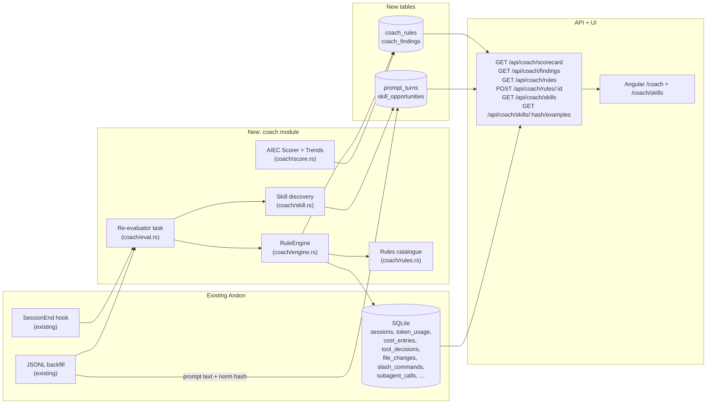
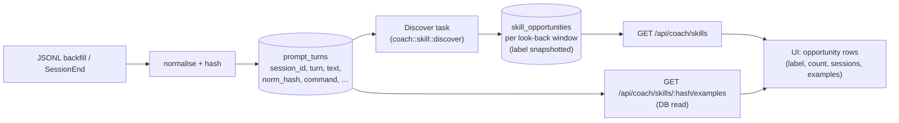

# AI Engineering Coach integration — Design

> Status: draft 2026-05-24 · author: SatishKrishna Pilla
> Branch: `claude/ai-engineering-coach-andon-CKkqZ`
> Upstream: [microsoft/AI-Engineering-Coach](https://github.com/microsoft/AI-Engineering-Coach) (MIT)

## Privacy contract amendment

This design **amends** the privacy guarantee that Andon does not persist raw
user prompts. The amendment is intentional and the rest of the document
assumes it:

- **Before:** "Raw user prompts are never persisted, even if
  `OTEL_LOG_USER_PROMPTS=1` upstream." (`CLAUDE.md` rule 2,
  `docs/architecture.md` §"Privacy & safety rules" item 2)
- **After:** Andon may persist raw user prompts from both JSONL transcripts
  and the OTLP `user_prompt` log event. Everything else about the privacy
  posture is unchanged — local-only listeners (`127.0.0.1`), no outbound
  network except the opt-in OTel forwarder, no telemetry of telemetry,
  user-only file permissions on `data.db`.

The trigger is feature-driven: Skill Finder (and likely later coach
features) need the prompt text. The original guarantee was an
over-restriction premised on "we don't need it" — that premise no longer
holds. Andon is still a local tool: prompts stay on the machine they were
typed on. The thing the original guarantee actually protected against —
exfiltration — is unaffected, because there is no exfil path.

### Reducer trust boundary

The JSONL reducer (`src-tauri/src/jsonl/reducer.rs`) currently enforces
"no prompt or response text" as a **type-level** invariant — its output
enum has no variant that carries text, and `tests/jsonl_privacy.rs`
enforces this empirically. This amendment requires both layers to change
in coordination:

1. **Add a `PromptTurn` variant** to the reducer's output enum, carrying
   `{ session_id, turn_index, ts, text, norm_hash, length, has_file_ref,
   has_code, has_constraint, command }`. The reducer remains the single
   chokepoint for what JSONL data is persisted — implementers must not
   bypass it by writing directly to `prompt_turns` from the parser.
2. **Delete the corresponding assertion** in `tests/jsonl_privacy.rs`
   (the local-DB leak proptest); replace it with the forwarder-side
   leak proptest described under *Privacy & safety*.
3. **Update the reducer's module doc** to state the new structural
   invariant: *prompts persisted to `prompt_turns` flow through the
   reducer's typed output; everything else still cannot carry text.*

Implementation must update `CLAUDE.md`, `docs/architecture.md`,
`docs/features.md`, and `README.md` to reflect the new posture in the
same PR that adds the schema. The forwarder gets one new rule (see
*Privacy & safety* below): prompts must be stripped from anything the
forwarder re-emits, because the forwarder is the only outbound network
path Andon has and it pre-dates this amendment.

## Motivation

[Microsoft AI Engineering Coach](https://github.com/microsoft/AI-Engineering-Coach)
(AIEC) is a VS Code extension that analyses local AI coding-assistant logs and
returns coaching feedback. Its four feature pillars are **Observe**, **Measure**,
**Improve**, and **Level Up**.

Three of those pillars overlap heavily with Andon's existing pages:

| AIEC | Andon equivalent |
|---|---|
| Observe → dashboard, session timeline | Overview, Session detail |
| Measure → code output by lang/model, token budget, activity heatmap | Files, Efficiency, Overview Tape, budget alerts |
| Improve → 45 anti-pattern rules, rule editor / playground, skill discovery, context-health score | **gap** |
| Level Up → personalised quizzes, achievements, SDLC visualisation | n/a (LM-dependent) |

The real gap — and the genuine reason to integrate AIEC at all — is **Improve**.
Andon already collects every fact those rules need (per-session token splits, tool
decisions, file changes, slash commands, sub-agent calls, repo metadata) and shows
none of it as advice. AIEC's rule set is the missing layer on top.

## Goal

A new **Coach** page in Andon that runs AIEC-style anti-pattern rules over the data
already in `~/.andon/data.db` and surfaces:

1. A **scorecard** — five practice-area scores (Prompt quality, Session hygiene,
   Code review discipline, Tool mastery, Context management), mirroring AIEC's
   own breakdown.
2. A ranked **findings list** — every triggered rule for the selected window, with
   the session(s) it triggered on and a one-line suggestion. Clicks drill into the
   relevant Session-detail page.
3. A **rule catalogue** — every rule with current status (enabled / disabled),
   description, severity, and a toggle.
4. A **Skill Finder** sub-page — discovers repeated prompt patterns across the
   selected look-back window and surfaces them as "custom skill opportunities"
   (the AIEC equivalent of *"you have asked Claude to package the extension
   eleven times — make it a slash command"*).

Everything runs locally, deterministically, and respects Andon's filter bar
(window + model chips).

## Non-goals

The following AIEC features are explicitly **out of scope** for this design, and
some are out of scope for Andon period. Each gets a one-line "why" so we don't
re-litigate them.

- **Screenshot / "Coding moments" gallery.** Andon has no IDE process, never sees
  the editor, and explicitly does not. Out of scope permanently.
- **Copilot-language-model-backed features** (quizzes, AI-written rule
  explanations, AI skill summarisation). Andon's privacy contract bans outbound
  network calls except the opt-in OTel forwarder. Out of scope permanently.
- **Achievement / gamification system.** Not Andon's tone. Out of scope.
- **Rule editor / DSL playground UI.** AIEC ships a DSL playground for
  authoring custom detectors. Genuinely useful, but a feature of its own and
  the largest single chunk of AIEC code (`rule-parser`, `rule-compiler`,
  `rule-pipeline`, `dsl/`). Deferred to **Phase 2**; this design ships rules
  as a static Rust catalogue tunable via Settings toggles only.
- **Community skill catalog.** AIEC's Skill Finder also surfaces matches from
  an open-source community catalog hosted online. Andon does not fetch remote
  catalogs (outbound-network rule). If we add this later, it lands behind an
  opt-in toggle modelled on the OTel forwarder. Out of scope here.
- **Importing AIEC's TypeScript code wholesale.** AIEC is a VS Code extension;
  Andon is a Tauri+Rust app with an Angular SPA. We port the *ideas* (the rule
  set, the five practice areas, the scoring approach), not the runtime.
- **A direct AIEC ↔ Andon protocol** (e.g. AIEC consuming `127.0.0.1:8765`).
  Considered below as Option B and rejected — see *Decisions*.

## Decisions (resolved during design)

| # | Decision | Choice |
|---|---|---|
| 1 | Integration shape | **Option A — port AIEC's scoring math exactly and its rule catalogue as adapted detectors mapped to Andon's data.** Rule *names* mirror upstream filenames where applicable; trigger *conditions* are documented per-rule and frequently differ to match Andon's schema. We are not claiming pin-for-pin parity on detection logic. Rationale below. |
| 2 | Rule storage | Hard-coded in Rust (`coach/rules.rs`), one struct per rule. No DSL, no migration. User-tunable in v2; vocabulary lists are settings-tunable in v1 (see *Vocabulary as configuration*). |
| 3 | Findings storage | A new `coach_findings` table written by a background re-evaluator. Cached, not recomputed per request. |
| 4 | Re-evaluation trigger | On session-end (the existing SessionEnd hook touches every session) **and** on every successful JSONL backfill batch. No periodic cron. The session-end task is spawned via `tokio::spawn` after the existing SessionEnd writes commit, takes a fresh pool connection, and never blocks the OTLP receiver. Failures log via `tracing::warn!` and never propagate. |
| 5 | Scoring model | **Exact AIEC formula** — `sevPenalty = {high:12, medium:7, low:3}`, `maxPenalty = maxDetectors × 12`, status bands `≥70 good / ≥40 needs / <40 critical`. Verified against `src/core/analyzer-patterns.ts`. AIEC's hardcoded `|| 8` fallback (when `groupDetectorCount[group]` is unset) does **not** apply in Andon's port — every practice has an explicit detector count from the seeded catalogue. |
| 5a | Trend model | **Exact AIEC trends** — WoW (last week vs previous week, % change) and MoM (most-recent 4-week average vs the prior 4-week average, % change). Both rendered on every scorecard tile. The `n/a` 4th status (zero enabled detectors in a practice) is an Andon-specific addition; AIEC has only three statuses. Documented inline in `coach::score`. |
| 6 | Page placement | New `/coach` route, after **Efficiency** in the nav (icon: `graduation-cap` from lucide). |
| 7 | License + attribution | AIEC is MIT. Each ported rule carries an `aiec_origin: Option<&'static str>` field with the upstream rule id when applicable, or `None` for Andon-original rules inspired by AIEC concepts. `docs/features.md` and the Coach page footer credit Microsoft AIEC. |

### Why Option A, not B or C

Three shapes were considered:

- **Option A — Port (chosen).** Re-implement AIEC's rule set as a Rust
  `coach` module that reads Andon's tables. One binary, no new runtime, no
  network surface. Matches every Andon principle (single binary, localhost,
  embedded SQLite, no outbound calls). Cost: we maintain a Rust port of
  AIEC's rule logic.
- **Option B — Bridge.** Keep AIEC running as a VS Code extension; have
  AIEC consume Andon's `127.0.0.1:8765` API as its data source. Adds a
  VS Code dependency for Andon users who want coaching, splits the UX
  across two surfaces, and forces Andon to publish a stability contract
  on its API for an external consumer. Rejected.
- **Option C — Sidecar.** Bundle AIEC inside Andon (e.g. as an embedded
  Node runtime). Breaks the single-binary, single-runtime story; adds
  Node+npm to the Rust+Tauri toolchain. Rejected.

If a user separately runs AIEC alongside Andon, nothing here prevents that —
they share no state, they just happen to look at similar things. This design
is about what Andon does itself.

## Architecture



### Module layout (Rust)

```
src-tauri/src/coach/
  mod.rs          public API: `evaluate(pool, window) -> Result<()>`
  rules.rs        the static rule catalogue (enum Rule { Binary, Continuous })
  engine.rs       runs all enabled rules against a window, writes findings
  score.rs        AIEC-formula scorer + WoW/MoM trends + scorecard assembly
  skill.rs        prompt-signature normaliser + discovery pass + examples reader
  eval.rs         re-evaluator task; called from SessionEnd + JSONL ingest
  queries.rs      shared SQL fragments (window predicates, session sets)
```

Same conventions as the rest of the backend: `tracing::instrument` on every
public async fn, `anyhow::Result` at the module boundary, `thiserror` for
domain errors, no `unwrap`/`expect`, no `rusqlite::Connection` held across
`.await`.

## Schema

Two new tables, applied as a new numbered migration. No changes to any
existing table.

### `coach_rules`

```sql
CREATE TABLE coach_rules (
  id           TEXT PRIMARY KEY,        -- e.g. 'long-session-no-commit'
  practice     TEXT NOT NULL,           -- 'prompt' | 'hygiene' | 'review' | 'tool' | 'context'
  severity     TEXT NOT NULL,           -- 'high' | 'medium' | 'low' (AIEC values)
  kind         TEXT NOT NULL,           -- 'binary' | 'continuous'
  enabled      INTEGER NOT NULL DEFAULT 1,
  updated_at   INTEGER NOT NULL         -- unix ms
);
```

A seed migration inserts one row per `Rule` in `coach::rules::RULES`. The
catalogue is hard-coded; this table only persists the user's enable/disable
state across restarts.

### `coach_findings`

```sql
CREATE TABLE coach_findings (
  id          INTEGER PRIMARY KEY AUTOINCREMENT,
  rule_id     TEXT NOT NULL,
  session_id  TEXT NOT NULL,
  detected_at INTEGER NOT NULL,        -- unix ms — the timestamp the rule looked at
  payload     TEXT NOT NULL DEFAULT '{}', -- rule-specific JSON detail (e.g. file path, ratio)
  FOREIGN KEY (rule_id)    REFERENCES coach_rules(id)    ON DELETE CASCADE,
  FOREIGN KEY (session_id) REFERENCES sessions(session_id) ON DELETE CASCADE
);
CREATE UNIQUE INDEX coach_findings_unique
  ON coach_findings(rule_id, session_id, detected_at);
CREATE INDEX coach_findings_session ON coach_findings(session_id);
```

The unique index makes re-evaluation idempotent — re-running a rule over the
same session at the same timestamp is a no-op. `payload` is `serde`-derived
per-rule JSON (the existing `metrics_raw` pattern) so the UI can render
rule-specific detail without the engine knowing about it.

`coach_scorecard` is **not** a table — scorecards are derived on read from
`coach_findings` joined against `sessions`. Caching is unnecessary; the SQL
is a handful of indexed aggregates.

### `prompt_turns` (skill discovery input)

One row per user turn seen during JSONL ingest (and, when
`OTEL_LOG_USER_PROMPTS=1` upstream, per OTLP `user_prompt` log event).
The table is the canonical source for prompts inside Andon; Skill
Finder reads from it directly, and future coach features can join
against it without an on-disk JSONL re-read.

```sql
CREATE TABLE prompt_turns (
  session_id     TEXT NOT NULL,
  request_id     TEXT,                      -- nullable; user turns w/o a request
  turn_index     INTEGER NOT NULL,          -- ordinal within the session
  ts             INTEGER NOT NULL,          -- unix ms
  source         TEXT NOT NULL,             -- 'jsonl' | 'otlp'
  text           TEXT NOT NULL,             -- the raw prompt
  norm_hash      TEXT NOT NULL,             -- BLAKE3 hex of normalised text (clustering key)
  command        TEXT,                      -- slash-command name if the prompt was one
  length         INTEGER NOT NULL,          -- char count of `text`
  has_file_ref   INTEGER NOT NULL,          -- 0/1 — contains `@path` or absolute path
  has_code       INTEGER NOT NULL,          -- 0/1 — contains a ``` fence
  has_constraint INTEGER NOT NULL DEFAULT 0,-- 0/1 — matches any keyword in settings.coach.constraint_keywords
  PRIMARY KEY (session_id, turn_index),
  FOREIGN KEY (session_id) REFERENCES sessions(session_id) ON DELETE CASCADE
);
CREATE INDEX prompt_turns_hash    ON prompt_turns(norm_hash);
CREATE INDEX prompt_turns_session ON prompt_turns(session_id, ts);
```

`norm_hash` is the **clustering key** used by Skill Finder. The
normalisation is purely for grouping — it collapses superficially
different prompts into the same bucket so that *"package the
extension"* and *"Package the extension please"* hash to the same
value. We still store the original `text` for display and for future
analyses that need it.

**Normalisation rule** (input to `norm_hash`):
1. Lowercase.
2. Strip leading/trailing whitespace; collapse internal whitespace to one space.
3. Replace any absolute path or `@path` reference with the literal `<path>`.
4. Replace any UUID, request id, or commit-sha shape with `<id>`.
5. Replace any contiguous run of digits ≥ 4 long with `<num>`.
6. Replace ``` … ``` code fences with `<code>` (the whole block, including
   contents, drops out of the hash).
7. Truncate to the first 1024 characters of the normalised string before
   hashing — long pasted contexts shouldn't fragment the hash.

The hash uses BLAKE3 with a static 32-byte key built into the binary, so
hashes are stable across runs but not portable across installs.

The pre-existing `log_events.body` redaction-on-`user_prompt` rule is
also removed in this design: OTLP `user_prompt` log events that carry
prompt text now write the text through to `log_events.body` and also
materialise a `prompt_turns` row, so the two tables stay consistent.

### `skill_opportunities`

```sql
CREATE TABLE skill_opportunities (
  id             INTEGER PRIMARY KEY AUTOINCREMENT,
  norm_hash      TEXT NOT NULL,           -- groups occurrences
  label          TEXT NOT NULL,           -- snapshotted shortest example, or '/{command}'
  command        TEXT,                    -- slash-command name if applicable
  occurrences    INTEGER NOT NULL,        -- count of matching prompts in window
  session_count  INTEGER NOT NULL,        -- distinct sessions touched
  first_seen     INTEGER NOT NULL,        -- unix ms — earliest matching prompt
  last_seen      INTEGER NOT NULL,        -- unix ms — most recent matching prompt
  window_start   INTEGER NOT NULL,        -- the look-back window the row was computed for
  window_end     INTEGER NOT NULL,
  computed_at    INTEGER NOT NULL
);
CREATE UNIQUE INDEX skill_opportunities_unique
  ON skill_opportunities(norm_hash, window_start, window_end);
```

The same hash can appear in multiple rows for different look-back windows
(1m / 3m / 6m, matching AIEC). The `label` column is materialised at
discovery time — the API serves it directly without a join.

## Starter rule set

Ten binary rules plus one continuous check in Phase 1, with one
review-discipline slot intentionally reserved. The starter set is
deliberately small and high-signal; expansion follows in later specs.
Each is implemented as a `Rule { id, practice, severity, aiec_origin,
description, suggestion, query }`. `aiec_origin` is set to the upstream
filename when applicable, or `None` for Andon-original rules.

The AIEC catalogue at `src/core/rules/` has **44** rule documents.
Andon ports the subset whose input signals are already in our schema;
the rest are deferred. Where Andon's trigger differs materially from
upstream (different signal, different threshold), the row carries an
explicit note so the divergence is greppable.

| Practice | Rule id | Kind | Sev | AIEC origin | Triggers when… | Respects model filter |
|---|---|---|---|---|---|---|
| **Prompt quality** | `repeated-prompts` | binary | medium | `repeated-prompts.md` | Same `norm_hash` (see `prompt_turns`) appears ≥ 3× in one session. *AIEC uses `duplicateGroups(matched, similarity=10, minDuplicates=3)` — edit-distance clustering. Andon ships exact-hash equality in Phase 1; revisit if hashes fragment in practice.* | no |
| Prompt quality | `lazy-prompting` | binary | medium | `lazy-prompting.md` | Per-session ratio of user turns where `prompt_turns.length < 30` is `> 0.3`, with `count > 10`. **Matches upstream** (`minChars: 30, maxRatio: 0.3, minSample: 10`). | no |
| Prompt quality | `low-constraint-usage` | binary | low | `low-constraint-usage.md` | < 20 % of user turns in a session have `prompt_turns.has_constraint = 1`. The flag is set at ingest time by matching against `settings.coach.constraint_keywords` (see *Vocabulary as configuration*). | no |
| **Session hygiene** | `long-session-no-commit` | binary | high | *Andon-original; inspired by `mega-sessions.md`* | `sessions.ended_at − started_at > 90 min` AND `git_activity` for the session is empty. **Renamed from `mega-sessions`** so the difference from upstream (`maxMessages: 50`, no git check) is explicit. | no |
| Session hygiene | `late-night-coding` | binary | low | `late-night-coding.md` | ≥ 5 sessions in the window started between 23:00 and 05:00 local time. | no |
| Session hygiene | `abandon-sessions` | binary | medium | `abandon-sessions.md` | ≥ 3 sessions in the window with `tool_decisions` rows but zero `decision = 'accept'`. | no |
| **Code review discipline** | `speed-accept` | binary | high | `speed-accept.md` | Per-session: ≥ 5 occurrences of a user turn following an assistant `accept` decision within 15 s, where the preceding turn touched a file via `file_changes.lines_added ≥ 20`. **Matches upstream** (`maxGapMs: 15000, minAiLoc: 20, minOccurrences: 5`). | no |
| Code review discipline | *(slot reserved)* | — | — | `high-cancellation.md` | **Deferred** — upstream signal (`isCanceled` on requests) is not currently captured by Andon's OTLP ingest. Re-add in a later phase once request-level cancellation is ingested. The Settings → Coach UI shows this row as a visible reservation rather than silently omitting it. | — |
| **Tool mastery** | `no-slash-commands` | binary | low | `no-slash-commands.md` | Session > 30 min with zero `slash_commands` rows. | no |
| Tool mastery | `model-diversity` | **continuous** | — | AIEC `PatternsAnalyzer` "Model Diversity" | Score = `100 if distinct models ≥ 4, 80 if ≥ 3, 50 if ≥ 2, else 20` over the window. **Matches upstream tiers.** | yes |
| **Context management** | `cache-hit-starvation` | binary | high | `cache-hit-starvation.md` | Per-session: `cacheRead / (cacheRead + cacheCreation + non-cached input) < 0.1` over ≥ 20 turns with prompt input ≥ 5000 tokens. **Matches upstream direction** (`minCacheRate: 0.1, minSample: 20, minPromptTokens: 5000`) — alert on *low cache hits*, not high creation. | yes |
| Context management | `low-spec-rate` | binary | medium | `no-spec-driven-development.md` | Over ≥ 5 agent-mode sessions in the window, the fraction that look spec-driven is `< 0.2`. A session is *spec-driven* if its first user turn satisfies **any**: invokes a slash command in `settings.coach.planning_commands`, references a file matching `\.(md\|txt\|spec\|prd\|design\|plan\|rfc\|adoc)$`, matches any keyword in `settings.coach.planning_keywords`, contains ≥ 3 bullet/numbered-list lines, or contains a markdown heading. Replaces the prior `planning-usage` continuous detector — content-aware, vocabulary-configurable. | yes |

Each rule's SQL lives in `coach/rules.rs` next to its `Rule` literal — close
to the schema it queries, easy to grep. `aiec_origin` is set to the upstream
AIEC rule id where one exists. Rows whose AIEC origin column carries the
"Andon-original" marker port the *concept* without claiming behavioural
parity.

**Severity values match AIEC exactly** (`high` / `medium` / `low`) because
the scoring formula reads `sevPenalty[severity]` directly. Renaming them
would silently change the math.

### Adding a rule

New rules are pure-data: append a `Rule { … }` to `RULES` and write its
detector closure (a `fn(&Pool, Window) -> Result<Vec<Finding>>`). A unit test
per rule (TDD: failing test first) seeds a curated DB via `test-support` and
asserts the expected `Finding`s come back. No engine change.

### Vocabulary as configuration

Rules that depend on user-specific vocabulary read their match lists from
`settings.json` under `coach.*`. Defaults ship with the binary; user
overrides persist in the user's settings file. Adding a new
vocabulary-dependent rule means picking a settings key and writing the
detector — no schema change, no migration.

**Day-one keys:**

| Key | Used by | Default |
|---|---|---|
| `coach.planning_commands` | `low-spec-rate` | `["plan", "brainstorm", "design", "spec", "specify", "rfc"]` |
| `coach.planning_keywords` | `low-spec-rate` | `["spec", "specs", "requirement", "requirements", "acceptance criteria", "design doc", "PRD", "RFC", "plan file", "constraint", "must", "should", "ensure"]` |
| `coach.constraint_keywords` | `low-constraint-usage` (via `prompt_turns.has_constraint`) | `["must", "should", "limit", "ensure", "require", "only", "without", "never", "always"]` |
| `coach.skill_min_occurrences` | Skill Finder | `3` |
| `coach.skill_min_sessions` | Skill Finder | `2` |

**Settings semantics.** Lists are read fresh on every coach evaluation —
no caching, no restart required. Changes to `constraint_keywords` do
**not** retroactively recompute `prompt_turns.has_constraint` for
historical rows; the flag reflects the keyword list at ingest time.
This is documented in the Settings UI: *"Constraint keyword changes
apply to future sessions only."* Users wanting full recomputation can
re-run JSONL backfill.

**Deferred (needs data capture first).** `coach.planning_skills` —
matching against the `Skill` tool's `skill` argument requires extending
`tool_decisions` (or a sibling table) to persist tool arguments for
`tool_name = 'Skill'`. The captured value would be the full
`plugin:skill` identifier (e.g. `superpowers:brainstorming`). Tracked
as a separate migration; `low-spec-rate` consumes it when available.
Until then, the rule catalogue UI shows a `<datasource-needed>` marker
for the skills-list dimension rather than silently skipping.

**The general design rule:** never hardcode domain-vocabulary strings
in `rules.rs`. If a rule matches on text the user might phrase
differently than someone else, the vocabulary belongs in settings.

## Scoring

The scoring math is a direct port of AIEC's
`PatternsAnalyzer` (`src/core/analyzer-patterns.ts`). The two formulas
below are normative — any change to them is a spec change, not an
implementation detail.

### Per-practice-area score

```
sevPenalty   = { high: 12, medium: 7, low: 3 }            // AIEC constants
detectors    = the set of enabled rules whose practice = P
triggered    = the subset of `detectors` whose detector emitted ≥ 1 finding
               anywhere in the window
penalty      = Σ over r ∈ triggered of sevPenalty[r.severity]
maxPenalty   = |detectors| × sevPenalty.high       // = |detectors| × 12
score(P)     = max(0, round(100 × (1 − penalty / maxPenalty)))
```

Notes that fall out of the formula and matter for implementation:

- **Penalty is per-detector, not per-finding.** A rule that triggers on
  twenty sessions costs the same as a rule that triggers on one. The
  *findings list* is the place to see frequency; the score is "how many
  different bad habits showed up".
- **`maxPenalty` is the worst case for the *enabled* detector set.**
  Disabling a rule shrinks the denominator, which is the correct
  behaviour: a user who turns off five rules can still score 0 if every
  remaining rule trips.
- **Practice areas with zero enabled detectors are reported as
  `score = null`** (not 100). The UI renders these as "—" so we don't
  flatter the user with a free A.

### Status thresholds (AIEC)

```
score >= 70 → "good"             // green
score >= 40 → "needs-improvement" // amber
score <  40 → "critical"         // red
score == null → "n/a"            // muted
```

### Trends (AIEC)

Two indicators per scorecard tile, both computed on **finding count**, not
on score (mirrors AIEC):

```
// Week-over-week — last 7d vs prior 7d
last       = count of findings in [now-7d, now)        for practice P
prev       = count of findings in [now-14d, now-7d)    for practice P
wowPct     = prev > 0 ? round(((last - prev) / prev) * 100) : 0

// Month-over-month — recent 4-week average vs prior 4-week average
recent4w   = [findings in week 1, …, week 4]   weeks counted backward from now
prior4w    = [findings in week 5, …, week 8]
avgRecent  = mean(recent4w)
avgPrev    = mean(prior4w)
momPct     = avgPrev > 0 ? round(((avgRecent - avgPrev) / avgPrev) * 100) : 0
```

For trends, *down is good* (fewer findings is better). The UI inverts the
colour: positive `wowPct`/`momPct` renders red, negative renders green,
zero renders muted. This inversion is the one piece of trend semantics
the formula doesn't encode and is documented in `coach::score`.

A scorecard request returns: `score`, `status`, `wow_pct`, `mom_pct`, and
`triggered_count` per practice — exactly the AIEC shape.

### Per-rule sub-scores (AIEC continuous detectors)

AIEC also has *continuous* checks — detectors that emit a 0-100 score
directly. These coexist with the binary-trigger rules above.

In this port, continuous checks are modelled as a separate `Rule::Continuous`
variant returning a `score: i64` (0-100) and *no* findings. The Coach page
renders them as additional tiles in their practice section, side-by-side
with the binary-trigger scorecard.

**Phase 1 ships one continuous check:**

- **Model Diversity** — `count ≥ 4 → 100, ≥ 3 → 80, ≥ 2 → 50, else 20`
  over the window. Source: `cost_entries.model`. Tiers match upstream
  exactly.

AIEC's **Planning Usage** continuous detector (`ratio > 0.1 → 100,
> 0.05 → 70, > 0 → 40, else 10`, where ratio counts literal `/plan`
slash commands) is intentionally **not ported**. Its signal —
slash-command match on the string `plan` — is too narrow to be useful
once users have multiple planning skills/commands. The `low-spec-rate`
binary rule (in the rule catalogue above) replaces it with a
content-aware, vocabulary-configurable detector that catches
spec-driven sessions regardless of which command or phrasing the user
prefers.

## Skill discovery

A port of AIEC's **Skill Finder** (`docs/content/improve/skill-finder.md`).

### What it does

For a selected look-back window (1m / 3m / 6m — the AIEC presets), the
Skill Finder surfaces **custom skill opportunities**: prompts the user has
typed in some normalised form `N` times across `S` distinct sessions where
both counts exceed configurable thresholds. The intent: *"you've asked
Claude to package the extension eleven times across seven sessions — make
it a slash command."*



### Discovery algorithm

A straightforward two-pass on `prompt_turns`:

```
threshold_occurrences = settings.coach.skill_min_occurrences  // default 3
threshold_sessions    = settings.coach.skill_min_sessions     // default 2

for each look_back ∈ {30d, 90d, 180d}:
    rows = SELECT norm_hash, session_id, command,
                  MIN(ts) AS first, MAX(ts) AS last, COUNT(*) AS n
           FROM prompt_turns
           JOIN sessions USING (session_id)
           WHERE sessions.started_at >= now - look_back
           GROUP BY norm_hash, session_id
    buckets = group rows by norm_hash
    for each (hash, group) in buckets:
        occurrences   = sum(group.n)
        session_count = |distinct session_ids in group|
        if occurrences >= threshold_occurrences AND
           session_count >= threshold_sessions:
            label = compute_label(hash, group)
            UPSERT skill_opportunities (norm_hash, label, command, ...)
```

Clustering at Phase 1 is **exact normalised-hash equality** — fast,
deterministic, no fuzzy matching. Future work may add edit-distance or
minhash clustering once we see real-world hash distributions. AIEC's
description ("repeated patterns that waste time" / "the same type of
request") is consistent with exact-after-normalisation matching at this
stage.

### Naming opportunities

`compute_label(hash, group)` picks a human-readable label at discovery
time, snapshotted into the `skill_opportunities.label` column so the API
never has to compute it on read:

1. If every row in the group has the same non-null `command`,
   label = `/{command}`.
2. Else, label = the **shortest** matching `prompt_turns.text` in the
   group, trimmed and truncated at 80 chars (mirrors AIEC's representative
   prompt). Ties broken by earliest `ts`.

### Examples endpoint

The UI fetches up to three example prompts when the user expands an
opportunity row. The endpoint reads `prompt_turns` directly:

```
GET /api/coach/skills/:norm_hash/examples?limit=3
→ SELECT session_id, turn_index, ts, text
  FROM prompt_turns
  WHERE norm_hash = ?
  ORDER BY length ASC          -- prefer shorter, more canonical phrasings
  LIMIT ?
```

There is no on-disk JSONL re-read and no in-memory-only path.

### Re-discovery

The skill-discovery task runs in the same triggers as the coach engine
(SessionEnd, JSONL backfill batch end). It is idempotent — the unique
index on `(norm_hash, window_start, window_end)` makes re-running on the
same window a no-op upsert. The `label` is recomputed on every upsert,
so as soon as a shorter example arrives the label updates.

### Thresholds in Settings

Two new Settings inputs (under Coach → Skill Finder):

- **Min occurrences** (default 3) — minimum repetitions of a normalised
  prompt before it surfaces as an opportunity
- **Min sessions** (default 2) — minimum distinct sessions the prompt
  must appear in

Stored as integers in `settings.json` under `coach.skill_min_occurrences`
and `coach.skill_min_sessions`. The Coach skills endpoint reads these on
every request — no caching, no migration on change. Defaults are
Andon's, picked for sensitivity over precision in early data; upstream
AIEC does not publish its production defaults, so this is not a parity
claim.

## Re-evaluation

The evaluator runs over a sliding window — by default the last 30 days — and
inserts any new `coach_findings`. The unique index dedupes; finishing a
session twice (re-ingest) does not duplicate findings.

Triggers:

- **SessionEnd hook handler** in `integration.rs` calls
  `coach::eval::evaluate_session(pool, session_id)` via `tokio::spawn`
  after the existing session-end writes commit — never inline, never
  before. The spawned task takes a fresh pool connection (never
  inherits one across the spawn boundary) and never blocks the OTLP
  receiver. Scope: the one session's rules, plus an incremental
  skill-discovery refresh.
- **JSONL backfill** calls `coach::eval::evaluate_window(pool, 30d)` and
  `coach::skill::discover_all(pool)` (all three look-back windows) once at
  the end of a backfill batch (not per file). A backfill may surface old
  sessions a rule needs to compare against, and it is one of the two
  writers of `prompt_turns` (the other is the OTLP `user_prompt` log
  ingest path).

The evaluator never blocks the OTLP path. Failures are logged via
`tracing::warn!` and never surface to Claude Code (consistent with the
receiver-always-`Ok` rule).

## API

Six new endpoints under `/api/coach/`, registered on the existing axum
router, all `serde`-DTO, all `#[tracing::instrument]`, all degrade to safe
empty responses on internal failure.

### `GET /api/coach/scorecard?from&to&models`

Response mirrors AIEC's scorecard shape (`score`, `status`, `wow_pct`,
`mom_pct`, `triggered_count`):

```json
{
  "practices": [
    {
      "practice": "prompt", "score": 88, "status": "good",
      "wow_pct": -25, "mom_pct": -12, "triggered_count": 1,
      "continuous": []
    },
    {
      "practice": "hygiene", "score": 62, "status": "needs-improvement",
      "wow_pct": 14, "mom_pct": 8, "triggered_count": 2,
      "continuous": []
    },
    {
      "practice": "review", "score": 91, "status": "good",
      "wow_pct": 0, "mom_pct": -5, "triggered_count": 0,
      "continuous": []
    },
    {
      "practice": "tool", "score": 74, "status": "good",
      "wow_pct": -10, "mom_pct": -2, "triggered_count": 1,
      "continuous": [
        { "id": "model-diversity", "score": 80 }
      ]
    },
    {
      "practice": "context", "score": 80, "status": "good",
      "wow_pct": 0, "mom_pct": 0, "triggered_count": 0,
      "continuous": []
    }
  ],
  "window": { "from": 1748044800000, "to": 1748131200000 },
  "sessions_in_window": 38
}
```

`status` is one of `"good"` / `"needs-improvement"` / `"critical"` /
`"n/a"`, computed exactly as in AIEC (see *Scoring*). `wow_pct` and
`mom_pct` are **signed integers** — the UI applies the
fewer-findings-is-better inversion when colouring.

### `GET /api/coach/findings?from&to&models&rule_id?&session_id?&limit?`

Response: a paginated list of findings ordered by `detected_at DESC`. Each
finding embeds enough session context (started_at, repo, cost) for the
Coach page to render a row without a second round-trip.

```json
{
  "items": [
    {
      "id": 4711,
      "rule_id": "long-session-no-commit",
      "practice": "hygiene",
      "severity": "warn",
      "session_id": "01HZ...",
      "started_at": 1748044800000,
      "detected_at": 1748053200000,
      "repo": "satish-krishna/andon",
      "cost_usd": 4.21,
      "description": "Session ran 2h17m with no commits.",
      "suggestion": "Commit checkpoints; restart sessions after major milestones.",
      "payload": { "duration_min": 137, "commits": 0 }
    }
  ],
  "next_cursor": null
}
```

### `GET /api/coach/rules`

Static rule catalogue plus the per-row `enabled` flag from `coach_rules`.

### `POST /api/coach/rules/:id`  body: `{ "enabled": bool }`

Updates `coach_rules.enabled`. Disabling a rule does **not** delete its
existing findings — only future evaluations skip it. Disabling a rule
also shrinks the `maxPenalty` denominator for its practice area's score
on subsequent reads (this is the AIEC behaviour and what users intuitively
expect when they turn a rule off).

### `GET /api/coach/skills?lookback=30d|90d|180d`

Returns custom skill opportunities discovered for the requested look-back
window. The endpoint reads pre-computed rows from `skill_opportunities` —
it does not recompute on every request.

```json
{
  "lookback": "90d",
  "opportunities": [
    {
      "norm_hash": "f3a1c2…",
      "label": "/package",
      "command": "package",
      "occurrences": 11,
      "session_count": 7,
      "first_seen": 1742044800000,
      "last_seen": 1748044800000
    },
    {
      "norm_hash": "9b22de…",
      "label": "regenerate the openapi types after the schema change",
      "command": null,
      "occurrences": 6,
      "session_count": 4,
      "first_seen": 1742644800000,
      "last_seen": 1747500000000
    }
  ]
}
```

### `GET /api/coach/skills/:norm_hash/examples?limit=3`

Returns up to `limit` example prompts for a discovered opportunity, read
directly from `prompt_turns` ordered by `length ASC` (shorter examples
first — more canonical phrasings). Returns `{ "examples": [] }` if the
hash has no matching rows.

```json
{
  "examples": [
    {
      "session_id": "01HZ…",
      "turn_index": 12,
      "text": "Package the extension and bump the patch version."
    },
    {
      "session_id": "01J0…",
      "turn_index": 4,
      "text": "Can you package the extension please?"
    }
  ]
}
```

## Frontend

`CoachComponent` — standalone, `OnPush`, signals only, `inject()` for
`FilterService` and `ApiService`. Layout reuses `panel` / `panel-title` /
`panel-body` and Tailwind utilities; no new CSS framework.

```
web/src/app/features/coach/
  coach.component.{ts,html,spec.ts}          // /coach — scorecard + findings
  coach-skills.component.{ts,html,spec.ts}   // /coach/skills — Skill Finder

web/src/app/features/settings/
  coach-card.component.{ts,html,spec.ts}     // Settings → Coach card
                                             //   (skill-finder thresholds,
                                             //    vocabulary editors,
                                             //    rules catalogue)
```

Page structure (top to bottom):

1. **Standard crumb** — `graduation-cap` icon + "Coach".
2. **Experimental banner** — same warn-style banner Behaviour uses
   (`flask-conical` icon, "Coach is experimental — rules are heuristics and
   may not fit your workflow").
3. **`<app-filter-bar />`** — window + model chips, same instance as
   Overview / Efficiency.
4. **Scorecard strip** — five tiles, one per practice area. Each: name,
   big score (0–100, color-graded by AIEC's bands: `≥ 70 good / green`,
   `≥ 40 needs-improvement / amber`, `< 40 critical / red`,
   `null → "—" / muted`), the `triggered_count`, and two trend chips
   (WoW + MoM, inverted-colour: negative = green, positive = red).
   Continuous-check scores render as small inline pills under the tile
   (e.g. *"Model diversity 80"*).
5. **Findings panel** — virtualised list (existing pattern from
   `sessions.component`), filterable by rule-id chips. Each row: severity
   pip, rule name, one-line description, session click-through, repo +
   cost.
6. **Skill Finder link** — prominent CTA "X custom-skill opportunities in
   the last 90 days →" routing to `/coach/skills`.
7. **Rules link** — footer link to Settings → Coach.

### Skill Finder sub-route (`/coach/skills`)

A simpler page sharing the same `CoachComponent` parent layout:

- A 3-button segmented control for **Look-back** (1m / 3m / 6m), mirroring
  AIEC. Default 3m.
- One row per opportunity: severity-neutral pip · label · `N×` count ·
  `S sessions` · last-seen relative time · "Show examples" disclosure.
- Clicking "Show examples" fires `GET /api/coach/skills/:hash/examples`
  and expands the row to show up to three example prompts. A `Copy as
  slash command` button drops a starter `slash-command-name + body`
  snippet into the clipboard for the user to paste into
  `~/.claude/commands/`. We do **not** write to `~/.claude/` from
  Andon — out of scope, and the user must own that step.
- Empty state: a one-liner pointing at Settings → "Ingest JSONL history"
  when no `prompt_turns` exist for the window.

Settings page gains a new **Coach** card (sibling to the existing
`<app-budget-card>` and `<app-forwarder-card>`) with three sub-sections:

1. **Skill Finder** — `coach.skill_min_occurrences` and
   `coach.skill_min_sessions` number inputs, with a one-line caption
   *"Surfaces prompt patterns that meet both thresholds."*
2. **Vocabulary** — chip-list editors (reusing the `<app-filter-bar />`
   model-chip styling) for `coach.planning_commands`,
   `coach.planning_keywords`, `coach.constraint_keywords`. Caption:
   *"These lists power detection. Tweak them to match your team's
   vocabulary — Andon won't infer them for you. Constraint-keyword
   changes apply to future sessions only; re-run Backfill JSONL for
   full recomputation."*
3. **Rules** — `CoachRulesComponent` rendering the catalogue grouped
   by practice area, with description and suggestion visible. Toggling
   calls `POST /api/coach/rules/:id`. The reserved review-discipline
   slot (`high-cancellation`) renders with a `circle-slash` icon, a
   `data not captured yet` muted caption, and no toggle — making the
   reservation visible rather than silent.

`ApiService` gains `coachScorecard`, `coachFindings`, `coachRules`,
`updateCoachRule`, `coachSkills`, `coachSkillExamples`. DTOs mirror the
JSON above, declared in `core/`.

## Edge cases

- **Empty window.** Scorecard returns each practice with `triggered_count
  = 0` and `score = 100` *if* the practice has ≥ 1 enabled detector; if
  not, `score = null, status = "n/a"`. Findings list empty. The page
  renders a neutral empty state (no warn colours when there's nothing to
  warn about).
- **All detectors in a practice are disabled.** `score = null`,
  `status = "n/a"`. The tile renders "—". This is *not* the same as
  perfect — the formula is undefined when the denominator is zero.
- **Skill Finder, no JSONL ingest yet.** Empty list with a one-line hint
  pointing at Settings → "Ingest JSONL history" — same pattern the
  Efficiency page uses for subagent rows.
- **Examples-endpoint hash with no rows.** Possible if a
  `skill_opportunities` row exists but its underlying `prompt_turns`
  rows have been deleted (cascade from a session delete). The endpoint
  returns `{ "examples": [] }`. A follow-up discovery pass garbage-collects
  the orphaned opportunity.
- **Sessions without JSONL ingest.** Rules that depend on JSONL-only
  data (anything that reads `prompt_turns` — `repeated-prompts`,
  `lazy-prompting`, `low-constraint-usage`, `low-spec-rate`, plus the
  Skill Finder) simply skip those sessions — no false positives from
  missing data. The rule catalogue carries each rule's data
  dependencies so the Coach page can surface a "X rules need JSONL
  backfill" hint when JSONL-derivable sessions exist but
  `prompt_turns` rows for them don't.
- **A rule's SQL is wrong.** Each rule is independent; the engine catches
  per-rule errors, logs, and continues. One broken rule never breaks the
  scorecard.
- **Model filter.** Rules that aggregate over `token_usage` / `cost_entries`
  apply the filter the same way `v2_kpis` does (intersection with the
  selected models). Rules that look at session shape (duration, decision
  counts) ignore the model filter — filtering a session by model doesn't
  shorten it. The rule struct carries a `respects_model_filter: bool` flag
  the engine reads.
- **Tie-breaking on dominant-family rules.** Same fixed order as the
  Efficiency page: `[opus, sonnet, haiku, other]`.

## Privacy & safety

This feature **amends** the long-standing "raw user prompts are never
persisted" guarantee (see *Privacy contract amendment* at the top of this
document). Andon now stores prompts in `prompt_turns`, and the
`log_events.body` redaction-on-`user_prompt` rule is removed. The
remaining guarantees are intact and called out individually:

1. **All listeners stay bound to `127.0.0.1`.** No change.
2. **No outbound network calls** except the opt-in OTel forwarder. No change.
3. **`data.db` is user-only read/write.** No change. Prompts at rest sit
   behind the same file permissions everything else does.
4. **No telemetry of telemetry.** No change.

The amendment adds one new safety rule, tied to the only outbound path
Andon has:

5. **The forwarder must strip prompts before re-emitting.** The forwarder
   re-emits OTLP payloads to a user-configured downstream collector. With
   prompt redaction removed, an OTLP `user_prompt` log event now carries
   the raw prompt — and forwarding that downstream would silently exfil
   text the user typed locally. The forwarder gains a filter pass that
   rewrites `log_events.body` to `"<redacted>"` for any record whose
   `event.name` is `user_prompt` before sending. The Skill Finder data
   path does **not** flow through the forwarder; only the OTLP receivers
   do, and only `user_prompt` records are touched.

A proptest (`forwarder_no_prompt_leak.rs`) generates random
`user_prompt` log records and asserts the forwarder's outgoing payload
contains no substring of any generated prompt. This is the inverse of
the now-obsolete `coach_no_prompt_leak.rs` — the boundary that matters
is the one network egress point, not the local DB.

AIEC's optional Copilot-LM features are still not ported. No part of
this design requires an LM, by design.

## Testing

TDD throughout. Rust tests under `cargo test --features test-support`.

**Rust unit (per rule):** seed a DB through `test-support` with the
minimum data each rule needs; assert the expected `Finding`(s) come back
with the right `payload`. **11 active rules** (10 binary + 1 continuous;
the reserved review-discipline slot has no test) → at least 11 unit
tests, each covering the trigger and a near-miss. Vocabulary-dependent
rules (`low-constraint-usage`, `low-spec-rate`) also cover *"keyword
list change flips the detector output on next eval"* via a second
sub-test.

**Rust integration:** `src-tauri/tests/coach_api.rs` — seeded DB, hit all
four endpoints, snapshot the JSON. Adds one new `.snap`.

**Rust property:** `forwarder_no_prompt_leak.rs` — generate random
`user_prompt` log records, run them through the forwarder's filter pass,
and assert the outgoing OTLP payload contains no substring of any
generated prompt. Replaces the previous local-DB leak proptest, which
became obsolete when the privacy contract was amended.

**Rust normalisation unit tests** — `coach::skill::normalise` against a
curated table: same prompt with/without trailing whitespace, with
different paths, with/without code fences, with embedded UUIDs all
collapse to the same hash; structurally different prompts produce
different hashes.

**Rust scorer unit tests** — direct AIEC-formula coverage:
- `score_all_clean → 100`, `score_all_high → 0`, `score_disabled → null`.
- Worked AIEC example: 3 detectors enabled in P, one `high` triggers →
  `penalty = 12, maxPenalty = 36, score = round(100×(1−12/36)) = 67`.
- `wow_pct` and `mom_pct`: synthetic counts in 8 consecutive weeks,
  assert exact integer percentages match the AIEC formulas.

**Angular (Vitest):** `coach.component.spec.ts` renders the scorecard and
findings from a mocked `ApiService`; empty-state coverage; toggling a rule
in `coach-card.component.spec.ts` fires the correct POST.

**Smoke:** the existing OTLP smoke scripts (`scripts/smoke_*.{js,py}`) need
no change — the coach module is read-side only relative to the OTLP path.

## Phased rollout

This design covers Phase 1. Each later phase ships under its own spec.

| Phase | Scope | Spec |
|---|---|---|
| **1 (this design)** | Coach module · 10 binary rules (1 review-discipline slot reserved) · 1 continuous check · AIEC scoring formula (incl. WoW/MoM) · Skill Finder (custom opportunities) · vocabulary settings · Coach UI page + Skill Finder sub-route + Settings → Coach card | this doc |
| 2 | **Rule DSL + Playground** — port AIEC's `rule-parser`/`rule-compiler`/`rule-pipeline`/`dsl` so users can author detectors without recompiling Andon; in-app playground to test a rule against historical data | later |
| 3 | **Per-rule trends** — sparklines per rule and per practice area; integrate with the Tape | later |
| 4 | **Community skill catalog** (opt-in, off by default; modelled on the OTel forwarder) — fetch the AIEC community skill index and surface matches alongside custom opportunities | later |

If Phase 1 lands and nobody uses the page, we stop and don't build phases
2–4. The cost of Phase 1 is bounded (one module, one page, two migrations
— `coach_*` plus `prompt_turns` + `skill_opportunities`); the cost
of premature DSL design is not.

## Files touched

**Rust**

- `src-tauri/src/db/migrations.rs` — three new entries in the `MIGRATIONS`
  slice:
  - `MIGRATION_V7` — `coach_rules` + `coach_findings` + indexes + seed
    inserts for the static catalogue.
  - `MIGRATION_V8` — `prompt_turns` + `skill_opportunities` + indexes.
  - `MIGRATION_V9` — `has_constraint INTEGER NOT NULL DEFAULT 0` column
    on `prompt_turns`.
  - Update the `assert_eq!(v, 6)` lines in the existing migration tests
    to `9`.
- `src-tauri/src/coach/{mod,rules,engine,score,skill,eval,queries}.rs` — new.
- `src-tauri/src/api/routes.rs` — six handlers + route registration.
- `src-tauri/src/api/dto.rs` — `CoachScorecard`, `CoachFinding`, `CoachRule`,
  `UpdateCoachRule`, `SkillOpportunity`, `SkillExample`.
- `src-tauri/src/jsonl/reducer.rs` — add a `PromptTurn { … }` variant to
  the reducer's output enum (the reducer remains the single chokepoint
  for JSONL data persisted to the DB). Update the module-level trust
  boundary doc-comment per *Privacy contract amendment §Reducer trust
  boundary*. Compute `norm_hash`, `length`, `has_code`, `has_file_ref`,
  and `has_constraint` at emit time.
- `src-tauri/src/otlp/ingestor.rs` — drop the `user_prompt` body
  redaction (currently lines 162-168). On `user_prompt` log events,
  write `body` through to `log_events` *and* write a `prompt_turns` row
  tagged `source = 'otlp'`. Compute the same derived fields the reducer
  computes.
- `src-tauri/src/otlp/forwarder.rs` — new `redact_user_prompt` filter
  pass on outgoing OTLP log records (see *Privacy & safety* rule 5).
- `src-tauri/src/integration.rs` — `tokio::spawn` `coach::eval::evaluate_session`
  on SessionEnd, *after* existing writes commit (never inline).
- `src-tauri/src/jsonl/walker.rs` (the backfill driver) — call
  `coach::eval::evaluate_window` *and* `coach::skill::discover_all` on
  batch completion.
- `src-tauri/src/settings.rs` — five new keys under `coach.*`:
  `planning_commands`, `planning_keywords`, `constraint_keywords`,
  `skill_min_occurrences`, `skill_min_sessions`. Defaults per
  *Vocabulary as configuration*.
- `src-tauri/src/lib.rs` — register the `coach` module.
- `src-tauri/tests/coach_api.rs` (+ a new `.snap`) — endpoint coverage.
- `src-tauri/tests/coach_rules.rs` — per-rule unit tests (10 binary +
  1 continuous = 11 active; the reserved review-discipline slot has
  no test).
- `src-tauri/tests/coach_scorer.rs` — AIEC-formula correctness +
  worked-example regression.
- `src-tauri/tests/coach_skill.rs` — normaliser + discovery thresholds
  + examples endpoint.
- `src-tauri/tests/forwarder_no_prompt_leak.rs` — proptest that the
  forwarder strips `user_prompt` bodies before sending.
- `src-tauri/tests/jsonl_privacy.rs` — **delete** the assertions that
  prompts never appear in `prompt_turns.text` or `log_events.body`;
  rewrite to assert the forwarder redaction instead. The privacy
  invariant has moved from the local DB to the network egress point.

**Angular**

- `web/src/app/features/coach/coach.component.{ts,html,spec.ts}` — new.
- `web/src/app/features/coach/coach-skills.component.{ts,html,spec.ts}` — new.
- `web/src/app/core/api.service.ts` (+ DTO interfaces in `core/`) — six
  new methods.
- `web/src/app/app.routes.ts` — `/coach` + `/coach/skills` routes.
- `web/src/app/app.component.html` — nav item placed after Efficiency
  (order: Overview · Sessions · Behaviour · Files · Efficiency ·
  **Coach** · Diagnostics · Settings).
- `web/src/app/features/settings/coach-card.component.{ts,html,spec.ts}` —
  new sibling to `budget-card` / `forwarder-card`. Houses Skill Finder
  thresholds, Vocabulary chip-list editors, and the Rules catalogue.
- `web/src/app/features/settings/settings.component.html` — include the
  new `<app-coach-card />`.
- `web/src/app/core/icons.ts` — register `graduation-cap`, `lightbulb`
  (Skill Finder), `circle-slash` (reserved-rule indicator),
  `chevron-down` (disclosure for description / examples).

**Docs (canonical privacy-contract edits in the same PR)**

- `CLAUDE.md` — rule 2 under "Privacy guarantees the code must keep" is
  replaced with: *"Prompts persisted to the local DB never leave it. The
  forwarder strips `user_prompt` bodies before re-emitting."* Out-of-scope
  list is unchanged.
- `docs/architecture.md` §"Privacy & safety rules" — item 2 rewritten to
  match (prompts allowed at rest; forwarder strips them on egress).
  §"SQLite schema" — one row each for `prompt_turns` and
  `skill_opportunities`, one row updated for `log_events` (no longer
  redacted). §"Process model" — one sentence on the coach re-evaluator.
- `docs/features.md` — new Coach section, between Efficiency and Sessions,
  including the Skill Finder sub-page.
- `README.md` — one bullet in the page list ("**Coach** — anti-pattern
  rules, practice-area scorecards, and a Skill Finder for repeated
  prompts (experimental)"), the Privacy section's "Raw user prompts are
  never persisted…" bullet replaced with the new posture, and Microsoft
  AIEC attribution near the License section.

## Risks

- **Rules feel like nagging.** Heuristics that fire on legitimate work
  read as noise. Mitigations: the experimental banner sets expectations,
  every rule is one toggle to disable, and the starter set is deliberately
  small. Severity calibration is iterative.
- **Scoring is easy to game / hard to interpret.** AIEC's formula makes
  the score "how many *different* bad habits showed up" — disabling a
  rule legitimately raises the score (denominator shrinks). The findings
  list — the ground truth — is always one click away from each tile.
- **Skill hashing buckets too coarsely or too finely.** The normaliser
  is the lever. The choice to strip code fences, paths, and ids is
  deliberate ("which kind of question?" not "which exact question?"), but
  if hashes fragment too much in practice, we can extend the normaliser
  in a point release without a migration — the hash key is hard-coded.
- **`prompt_turns` will grow large.** Long-running users may accumulate
  hundreds of thousands of rows. The table is indexed on `norm_hash` and
  on `(session_id, ts)` — the two access paths Skill Finder needs. We
  do not paginate prompts in the API; the examples endpoint always
  returns at most `limit` rows (default 3). If the DB grows unwieldy in
  practice, a future migration can prune `prompt_turns` rows whose
  session is older than the longest configured look-back (180d) and
  whose hash has zero open `skill_opportunities`. Out of scope for
  Phase 1 — let's see the real numbers first.
- **AIEC drifts and our port goes stale.** AIEC's rule set will evolve.
  Each ported rule's `aiec_origin` tag makes the mapping greppable; a
  periodic "AIEC sync" pass can pull new rules in. We are not promising
  parity.
- **JSONL-dependent rules look broken on fresh installs.** Same mitigation
  the Efficiency page uses: a contextual hint pointing at Settings →
  Backfill JSONL when JSONL-dependent rules return no data despite
  qualifying sessions existing.
- **Vocabulary defaults won't match every user.** The planning- and
  constraint-keyword lists ship with sensible defaults but are
  inevitably opinionated. Mitigation: every list is one inline-edit
  away in Settings → Coach. The Settings page explicitly explains
  *"these lists power detection; tweak them to match your team's
  vocabulary — Andon won't infer them for you."*
- **`low-spec-rate` may fire on agent-mode-heavy sessions that
  legitimately don't need specs** (e.g. exploratory data analysis,
  pure-Q&A debugging). Mitigation: the rule only counts sessions whose
  first turn precedes `file_changes` rows (a proxy for *"this session
  produced code, so an upfront spec was relevant"*). Pure-Q&A sessions
  don't qualify as denominators.
- **`high-cancellation` is missing from Phase 1 and users may notice.**
  The reserved-slot row in the catalogue and the Settings → Coach UI
  make the absence explicit rather than silent. A spec follow-up tracks
  the OTLP signal we'd need to capture.

## Attribution

- AIEC is MIT-licensed by Microsoft.
- `coach::rules::RULES[i].aiec_origin` carries the upstream rule id where
  one applies.
- `README.md` and `docs/features.md` credit Microsoft AIEC as inspiration
  for the Coach feature.
