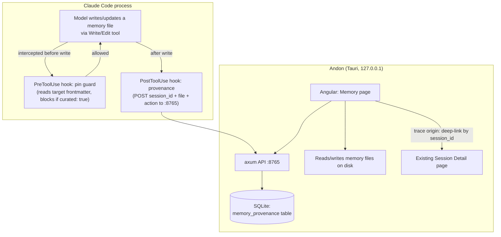

# Memory Browser: design

- **Date:** 2026-07-16
- **Status:** Draft (requirements and design). Originated in a brainstorming session. Read "Honest limits" and "Open questions" before implementation begins.

## Problem

Claude Code keeps a per-project memory: a `MEMORY.md` index plus one Markdown file per fact, under `~/.claude/projects/<project-slug>/memory/`. The model writes and updates these itself. Two things are wrong with that from a user's seat:

1. It is invisible and unmanaged. You cannot see what the model has chosen to remember about a project, and a stale or wrong memory silently reshapes every future session (context poisoning). There is no supported surface to prune it.
2. It is buried. The files sit deep under `~/.claude/`, keyed by a mangled project path, with no browser.

The felt pain that started this: abandoning a rotten session and starting fresh is cheap, but re-establishing context is not. Memory is supposed to carry context across sessions, yet you have no way to curate what it carries.

This feature gives Andon a page to browse and curate what Claude remembers about a project, with each memory traceable to the session that wrote it.

## Goals

- See every memory for a project in one place, rendered readable.
- Curate: delete a memory, edit its text, or pin it so the model cannot overwrite it.
- Trace a memory back to the session that created or last touched it.

## Non-goals (explicitly ruled out during brainstorming)

- **Editing the live context of a running session.** There is no supported way to mutate a running Claude Code session's in-memory context from outside the process. Confirmed by dedicated research. Do not attempt it.
- **Summarize-to-resume.** Generating an editable summary to seed a new session overlaps native features (`/compact [instructions]`, `/rewind` summarize) and is not worth building.
- **Prose session summaries in the default configuration.** Generating them requires a model call (outbound), so they are off by default: the default origin view is the local Session Detail deep-link. Prose summaries exist only as an explicit opt-in, modeled on the OTel forwarder. See Scope and component 5.

## Scope

**In scope**

- Read and render the project's auto-memory (`MEMORY.md` + `memory/*.md`).
- Curation actions: view, delete, edit, pin.
- Provenance: a memory-to-session link, recorded going forward, surfaced by deep-linking to Andon's existing Session Detail.
- Optional prose session summaries: opt-in and off by default, following the OTel forwarder precedent for sanctioned outbound features. Generated by a `SessionEnd` hook, gated on the provenance ledger so only memory-touching sessions are summarized (not every session), via a cheap headless `claude -p` call. See component 5.

**Out of scope**

- Curating `CLAUDE.md` or path-scoped rules (they are hand-authored and already editable).
- Cross-project aggregation into one pile. The view is per-project with a switcher, matching Andon's existing per-repo model.
- Merge/dedupe and tagging of memories. Possible later; not v1.

## How it fits Andon

This feature is a natural extension of patterns Andon already ships. It introduces no new architectural concept.

| Need | Andon already has it |
|---|---|
| Install hooks into `~/.claude/settings.json` | The Settings > Integration patcher installs three hooks today, including a `PostToolUse` hook and a `SessionStart` hook that POST to the axum API. |
| A hook that POSTs events to a local API | The line-count `PostToolUse` hook and the `SessionStart` context hook both do this against `:8765`. |
| Persist per-session metadata to SQLite | The ingestion path already writes session, decision, and file-change data. |
| Render a session's full detail | The Session Detail page already shows files, decisions, cost, duration, and repo for any session ID. |
| A per-repo, filterable feature page | `web/src/app/features/{overview,sessions,files,diagnostics,settings}` is the pattern; add `memory`. |
| An opt-in outbound feature, off by default | The OTel forwarder is exactly this pattern: a Settings toggle, off by default, test-before-save. The optional summarizer follows it. |

The one genuinely new thing is that this feature reads (and writes) files under `~/.claude/projects/<project>/memory/` directly, rather than receiving data over OTLP. That is a deliberate exception to the OTLP-only ingestion path, justified because memory is not telemetry and is never emitted over OTLP.

## Architecture and data flow

**Reading a memory's origin:** the provenance table maps `memory_file -> session_id`. Andon already renders that session at Session Detail, so "where did this come from" is a deep-link, not a generated artifact.

## Components

### 1. Memory page (Angular)

- Lists the project's memories (index + files), each rendered readable with its `type`, description, and body.
- Per-memory actions: delete, edit (inline), pin/unpin.
- Per-memory "origin" affordance: deep-links to Session Detail for the linked session, or shows "origin unknown" for memories that predate the provenance hook.
- Per-project, with a project switcher (memory is project-keyed).
- Live-watches the memory folder so it reflects reality as sessions run. (Alternative: snapshot on open. See open questions.)
- Follows Andon's master-detail overlay convention; standalone components, signals, `OnPush`.

### 2. API endpoints (axum, :8765)

- Read: list/read memory files for a project.
- Write: edit a memory (write to disk), delete a memory, set/clear the pin flag (write `curated: true` to frontmatter).
- Provenance ingest: accept the `PostToolUse` hook's POST and upsert into `memory_provenance`.
- Provenance query: given a memory file, return the linked session(s).

Andon writes memory edits straight to disk. These writes do not pass through Claude Code's tools, so they are never subject to the model's hooks (including the pin guard).

### 3. Provenance hook (`PostToolUse`, matcher `Write|Edit`)

- Fires on every model write to a memory file. Confirmed hookable by test: a `PostToolUse` `Write|Edit` hook fires on writes into the memory folder, and its input carries `transcript_path` (`.../<session-id>.jsonl`), so the session ID falls out of it.
- POSTs `{ session_id, memory_file, action, timestamp }` to the API, which records it. The model's memory files are left untouched; provenance lives in SQLite, not in the memory content.
- Installed by extending the existing `settings.json` patcher.

### 4. Pin guard (`PreToolUse`, matcher `Write|Edit`)

- Fires before a model write to a memory file. Reads the target file's frontmatter; if `curated: true`, blocks the write (`PreToolUse` can block; `PostToolUse` cannot).
- Self-contained: reads the file directly and does not depend on Andon running, so pins are enforced even when the dashboard is closed.
- Installed by extending the `settings.json` patcher.

### 5. Session origin (default) plus optional prose summaries

**Default (off): reuse Session Detail.** The provenance link resolves to a session ID that Andon already renders in full. No outbound call, no generated artifact. This is always available and is the origin view whenever the summarizer is disabled, which is the default.

**Opt-in: prose summaries.** Off by default. When enabled in Settings (modeled on the OTel forwarder: an explicit toggle with disclosure of what leaves the machine), a `SessionEnd` hook fires when a memory-touching session ends (gated on the provenance ledger, so only sessions that actually wrote a memory are summarized). The hook reads the on-disk transcript, trims it to the load-bearing turns (user prompts, assistant text, decisions; verbose tool-output blobs dropped), and shells out to `claude -p --model claude-haiku-4-5 "summarize: <trimmed transcript>"`. This is a **fresh headless call, not `--resume`**, so it does not reload the session's full context (the efficiency point); it uses the user's **existing Claude Code login** (subscription OAuth or key, resolved by Claude Code itself), so Andon needs no API key or OAuth handling of its own; and it runs on the cheap Haiku tier. The generated summary is stored so it is ready when you open the origin. Reliable per session on a clean exit; `SessionEnd` misses hard crashes, so a crashed session is summarized lazily the first time you open it. The toggle must state plainly that this sends session content to Anthropic, the same party that already processed that session live during the run.

## Data model

- **`memory_provenance`** (new SQLite table): `session_id`, `memory_file` (relative path within the project memory folder), `project_slug`, `action` (`create` | `update`), `ts`. One memory file can have many rows (created in one session, updated in others).
- **Pin state** lives in the memory file's own frontmatter (`curated: true`) on disk, which is the single source of truth. The pin guard and Andon both read it from there. No separate pin table.
- **Memory content is never copied into SQLite.** It is read live from disk. Only provenance metadata (IDs, paths, timestamps) is persisted.

## Privacy guarantees this feature must keep

Andon's non-negotiables (`CLAUDE.md`, and `docs/architecture.md` "Privacy & safety rules") apply directly here:

1. **Outbound network is off by default and opt-in only.** The core feature makes no model calls; origin is a local deep-link. The optional prose summarizer is the single outbound path, off by default and explicitly configured, exactly as the OTel forwarder is. When enabled it transmits session content to Anthropic, the same party that processed that session live. No other outbound calls exist.
2. **No conversation content persisted by the core feature.** Memory content is read live from disk and never written into Andon's DB; provenance rows hold IDs, paths, and timestamps only. When the opt-in summarizer is disabled (the default), the DB stays content-free. When it is enabled, the generated prose summaries are conversation-derived and are stored in the DB so they are ready on demand; enabling the toggle is the user's explicit, disclosed consent to persist that derived content.
3. **Localhost only, no phone-home.** Unchanged; the new endpoints bind to `127.0.0.1` like the rest.
4. **`settings.json` patching** is extended, not reinvented: two new hooks always (provenance `PostToolUse`, pin-guard `PreToolUse`), plus a third `SessionEnd` summarizer hook only when the opt-in summarizer is enabled. The Danger Zone "unpatch" must revert whichever of these are installed.

## Honest limits (state these plainly in the UI where relevant)

- **Provenance is forward-only.** It exists only from when Andon's hooks are installed. Memories that predate the hook show "origin unknown" and are labeled as such. No timestamp inference (a labeled guess is still a guess).
- **A pinned memory is frozen.** The model cannot update it even with genuinely better information. That is the deal pinning makes.
- **The provenance hook assumes memory writes go through the `Write`/`Edit` tool.** Tested and confirmed for tool-driven writes. If an undocumented internal auto-persist path exists that bypasses the tool layer, those writes would not be captured. Low risk, not proven impossible.
- **The pin guard depends on the model routing memory writes through the tool layer** for the block to fire. Same assumption as above.

## Open questions (decide before or during planning)

1. **What is "the origin" when a memory has many touches?** A memory created in session A and updated in B and C has several provenance rows. Options: show the creating session, the last-touching session, or the full list. Recommendation: show the creating session as the headline origin and expose the full touch history on demand.
2. **Live-watch vs snapshot** for the memory folder. Recommendation: live-watch, to reflect reality as sessions run.
3. **Deletion safety.** Deleting a memory is destructive and the model may have depended on it. Do we soft-delete (move aside, recoverable) or hard-delete? Recommendation: soft-delete with an undo, given Andon's general "take a backup first" posture (see the `.andon-backup` snapshot pattern).
4. **Does editing a memory in Andon count as a "touch" in provenance?** It has no session ID. Recommendation: record Andon edits as provenance rows with a sentinel origin (`andon-user`) so the history is honest about human edits.
5. **Transcript trimming heuristic (only when the opt-in summarizer is enabled).** How aggressively to trim the transcript before sending it to `claude -p` trades summary quality against token cost and exposure. Recommendation: keep user prompts, assistant text, and decisions; drop large tool-output blobs; cap total input. This is a tuning knob, not a blocker. (Trigger and persistence are settled: `SessionEnd` hook gated on the provenance ledger, summaries stored, per component 5.)

## Follow-up

Once built, this ships as an Andon feature and gets a companion blog post documenting the addition (the "memory browser" post), in the author's blog repo.
