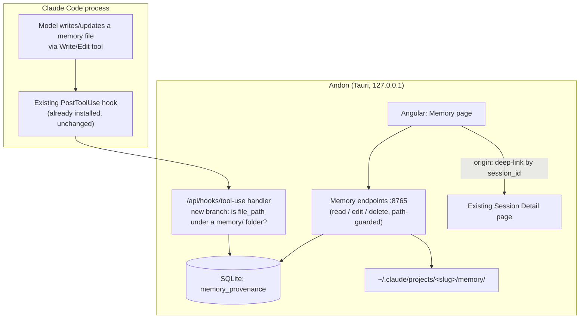

# Memory Browser: design

- **Date:** 2026-07-16 (revised 2026-07-17)
- **Status:** Approved. Requirements and design settled; ready for an implementation plan.

## Problem

Claude Code keeps a per-project memory: a `MEMORY.md` index plus one Markdown file per fact, under `~/.claude/projects/<project-slug>/memory/`. The model writes and updates these itself. Two things are wrong with that from a user's seat:

1. It is invisible and unmanaged. You cannot see what the model has chosen to remember about a project, and a stale or wrong memory silently reshapes every future session (context poisoning). There is no supported surface to prune it.
2. It is buried. The files sit deep under `~/.claude/`, keyed by a mangled project path, with no browser.

The felt pain that started this: abandoning a rotten session and starting fresh is cheap, but re-establishing context is not. Memory is supposed to carry context across sessions, yet you have no way to curate what it carries.

This feature gives Andon a page to browse and curate what Claude remembers about a project, with each memory traceable to the session that last wrote it.

## Goals

- See every memory for a project in one place, rendered readable.
- Curate: edit a memory's text, or delete it.
- Trace a memory back to the session that wrote it.

## Non-goals

- **Editing the live context of a running session.** There is no supported way to mutate a running Claude Code session's in-memory context from outside the process. Confirmed by dedicated research. Do not attempt it.
- **Summarize-to-resume.** Generating an editable summary to seed a new session overlaps native features (`/compact [instructions]`, `/rewind`) and is not worth building.
- **Pinning memories against model overwrite.** Cut during design. Enforcing a pin requires a `PreToolUse` hook, which fires on every `Write`/`Edit` in every session machine-wide and pays a process spawn each time to guard a folder touched roughly once per session. Worse, blocking a write does not stop the model, it reroutes it: a blocked write to `user_role.md` yields `user_role-updated.md` and a new index line. Pinning would produce duplicates rather than stability, and dedupe is itself out of scope. Seeing and fixing a bad memory already addresses the stated pain. Reconsider only after observing real memory churn.
- **Prose session summaries.** Deferred to a separate spec that depends on this one. See "Follow-up work".

## Scope

**In scope**

- Read and render a project's auto-memory (`MEMORY.md` + `memory/*.md`).
- Curation actions: view, edit, delete.
- Provenance: a memory-to-session link recorded going forward, surfaced by deep-linking to Andon's existing Session Detail page.

**Out of scope**

- Curating `CLAUDE.md` or path-scoped rules (they are hand-authored and already editable).
- Cross-project aggregation into one pile. The view is per-project with a switcher, matching Andon's existing per-repo model.
- Merge, dedupe, and tagging of memories. Possible later; not v1.
- Any outbound network call. This feature makes none.

## How it fits Andon

This feature introduces no new architectural concept, installs no new hooks, and does not touch `~/.claude/settings.json`.

| Need | Andon already has it |
|---|---|
| A hook that reports every model write | The `PostToolUse` hook (matcher `Write\|Edit\|MultiEdit`) already POSTs Claude Code's raw hook JSON to `/api/hooks/tool-use`. That payload carries `session_id`, `transcript_path`, `cwd`, `tool_name`, and `tool_input.file_path` — everything provenance needs. |
| Persist per-session metadata to SQLite | The ingestion path already writes session, decision, and file-change data. Migrations are versioned consts in `src-tauri/src/db/migrations.rs`. |
| Render a session's full detail | The Session Detail page already renders files, decisions, cost, duration, and repo for any session ID. |
| A per-repo feature page | `web/src/app/features/{overview,sessions,files,diagnostics,settings}` is the pattern; add `memory`. |
| Safely resolve a caller-supplied path under `~/.claude/` | `validate_transcript_path()` in `src-tauri/src/api/routes.rs` canonicalizes and asserts containment. The same guard shape applies here. |

The one genuinely new thing is that this feature reads and writes files under `~/.claude/projects/<slug>/memory/` directly, rather than receiving data over OTLP. That is a deliberate exception to the OTLP-only ingestion path, justified because memory is not telemetry and is never emitted over OTLP.

## Architecture and data flow

Reading a memory's origin is a lookup in `memory_provenance` followed by a deep-link. Andon already renders that session in full, so origin is a link, not a generated artifact.

## Components

### 1. Memory page (Angular)

- Per-project, with a project switcher (memory is project-keyed). Standalone component, signals, `OnPush`, Tailwind utilities, `@if`/`@for`.
- Lists the project's memories: the `MEMORY.md` index plus each `memory/*.md`, rendered readable with its `type`, description, and body.
- Per-memory actions: edit inline, delete behind a confirm.
- Per-memory origin affordance: deep-links to Session Detail for the last-touching session; the full touch history is expandable; memories predating the ledger show "origin unknown".
- Reads from disk on navigation, with a manual refresh button. No file watching. Andon has no watcher infrastructure today (no `notify` dependency; the only background loop is the budget monitor's 30-minute poll), and memory changes at most once per session, so a page that is seconds stale costs nothing.

### 2. Memory API endpoints (axum, :8765)

- Read: list and read memory files for a project.
- Write: save an edited memory to disk.
- Delete: remove a memory file and its `MEMORY.md` index line.
- Provenance query: given a memory file, return its touch rows, most recent first.

Andon writes memory edits straight to disk. These writes do not pass through Claude Code's tools and so trigger no hooks; the UI records them itself (see the data model).

**Path validation is non-negotiable.** These endpoints accept a path from the client and then write and delete on disk, and any page in a browser can POST to `127.0.0.1:8765`. Unguarded, this is an arbitrary-file-delete primitive. Every read, write, and delete must canonicalize the resolved path and assert containment within the target project's `memory/` folder before touching the filesystem, following `validate_transcript_path()`. This is the first time Andon accepts destructive filesystem instructions from the SPA, and the guard is what makes that acceptable.

### 3. Provenance branch in the existing tool-use handler

- No new hook and no `settings.json` change. The `PostToolUse` hook already installed by the Settings > Integration patcher POSTs raw hook JSON to `/api/hooks/tool-use` on every `Write`/`Edit`/`MultiEdit`.
- The handler gains a branch: if `tool_input.file_path` resolves under a `~/.claude/projects/<slug>/memory/` folder, insert a `memory_provenance` row alongside the line-count work it already performs.
- `session_id` comes from the hook payload directly. Memory files themselves are never modified; provenance lives in SQLite, not in memory content.
- A provenance insert failure logs and never affects the handler's response, consistent with the rule that ingestion failures are never surfaced to the client.

### 4. Session origin

The provenance link resolves to a session ID Andon already renders in full. The headline origin is the **last-touching session**, because you are curating what the memory says now, and what it says now is what the last session wrote; the creating session explains an earlier version of the text on screen. The full touch history is available on demand. No outbound call, no generated artifact.

## Data model

- **`memory_provenance`** (new table, `MIGRATION_V7`: a `const` plus an entry in the `MIGRATIONS` array in `src-tauri/src/db/migrations.rs`): `session_id`, `memory_file` (path relative to the project memory folder), `project_slug`, `action` (`create` | `update` | `edit` | `delete`), `ts`. One memory file has many rows.
- **Human edits are recorded.** Edits and deletes made in Andon's UI have no session, so they are written with the sentinel `session_id = 'andon-user'` and action `edit` or `delete`. Without this, a memory you rewrote yesterday would still name the model's session as its last touch, which is a lie in the most prominent spot on the page.
- **Memory content is never copied into SQLite.** It is read live from disk. Only provenance metadata (IDs, paths, timestamps) is persisted.
- **Provenance rows are append-only and outlive their files.** Deleting a memory never deletes its history; it appends a `delete` row. This is what makes churn observable: an `andon-user` delete followed by a later `create` for the same `memory_file` is the model reinstating a fact you removed. Cleaning up rows alongside the file would erase precisely the evidence this feature exists to collect (see "Measuring churn").

## Privacy

Andon's existing non-negotiables (`CLAUDE.md`, `docs/architecture.md` "Privacy & safety rules") apply unchanged. This feature amends none of them:

1. **No outbound network calls.** The feature makes none at all. Origin is a local deep-link.
2. **No conversation content persisted.** Memory content is read live from disk and never written into Andon's DB. Provenance rows hold IDs, paths, timestamps, and an action verb only. The DB stays content-free.
3. **Localhost only, no phone-home.** The new endpoints bind to `127.0.0.1` like the rest.
4. **`settings.json` patching is untouched.** No new hooks are installed, so the Danger Zone unpatch needs no new logic.

## Error handling

- **Missing memory folder** is the common case, not an error. Render an empty state explaining the model has not written memories for this project yet.
- **Malformed frontmatter** renders the raw file body rather than dropping the file. A memory you cannot parse is still a memory you need to see and delete.
- **Path guard rejection** returns an error without touching disk and is logged.
- **Provenance insert failure** logs and is swallowed; it never breaks the tool-use hook response.

## Testing

TDD throughout: failing test first, then implementation.

**Rust**
- Path guard: containment holds, traversal attempts (`../`) rejected, symlinks resolved before the containment check, paths outside the project's memory folder rejected.
- Memory-path detection predicate in the tool-use handler: memory paths matched, ordinary project files ignored.
- Provenance insert and query, including ordering by recency and the `andon-user` sentinel.
- The `MIGRATION_V7` migration applies cleanly.

**Angular**
- Frontmatter parsing, including the malformed case.
- Empty state when no memory folder exists.
- "Origin unknown" labeling for pre-ledger memories.
- Delete confirm gating the destructive call.

## Honest limits (state these plainly in the UI where relevant)

- **Provenance is forward-only.** It exists only from when this feature ships. Memories that predate it show "origin unknown" and are labeled as such. No timestamp inference — a labeled guess is still a guess.
- **Deletion is permanent.** There is no undo and no trash. This is deliberate: memories are a few lines each and self-regenerating, so if the fact still matters the model writes it again next session. A confirm step is the whole safety net.
- **Provenance assumes memory writes go through the `Write`/`Edit` tool.** Tested and confirmed for tool-driven writes. If an undocumented internal auto-persist path exists that bypasses the tool layer, those writes would not be captured. Low risk, not proven impossible.
- **Nothing stops the model rewriting a memory you fixed.** Without pinning, curation is a correction, not a lock. The provenance history is what tells you it happened.

## Measuring churn

Pinning was cut on a prediction: that blocking a write reroutes the model into writing a near-duplicate file rather than stopping it. That prediction is untested, and this feature is the instrument that tests it. Shipping without pinning is therefore a deliberate experiment, not merely a scope cut.

The question to answer from real use: **how often does the model rewrite or reinstate a memory a human corrected or deleted?** The append-only provenance ledger answers it directly — an `andon-user` `edit` or `delete` row followed by a model-session `create` or `update` row for the same `memory_file` is one churn event.

No churn dashboard, metric, or report is in v1. The ledger holds the data; a SQL query against `memory_provenance` answers the question when there is enough history to be worth asking. Build a surface for it only if the answer turns out to matter.

What the answer changes:

- **Churn is rare.** Pinning was never needed. The viewer is the whole feature; close the question.
- **Churn is common and the rewrites are wrong.** Pinning earns a real design — but one that does not tax every write machine-wide, and that reckons with rerouting. That is a new spec, informed by evidence rather than argument.
- **Churn is common and the rewrites are right.** The model had better information than the human did, and pinning would have frozen a worse memory in place. Cutting it was correct on the merits, not just on cost.

## Follow-up work

**Optional prose session summaries (separate spec, depends on this one).** An opt-in, off-by-default summarizer that generates a prose account of the session behind a memory, modeled on the OTel forwarder's precedent for sanctioned outbound features. It would branch off the existing `SessionEnd` hook (also already installed), gate on the `memory_provenance` ledger this spec lands so only memory-touching sessions are summarized, trim the on-disk transcript to its load-bearing turns, and shell out to a fresh headless `claude -p --model claude-haiku-4-5` call — not `--resume`, so the session's full context is never reloaded — using the user's existing Claude Code login, so Andon needs no API key handling of its own. It is deferred because it is larger than the entire browser, it is off by default, and it replaces an origin view that already works. Ship the browser, use it, and find out whether Session Detail is actually insufficient before building the alternative. Its open question — how aggressively to trim the transcript, trading summary quality against token cost and exposure — belongs to that spec.

**Blog post.** Once built, this ships as an Andon feature and gets a companion "memory browser" post in the author's blog repo.
