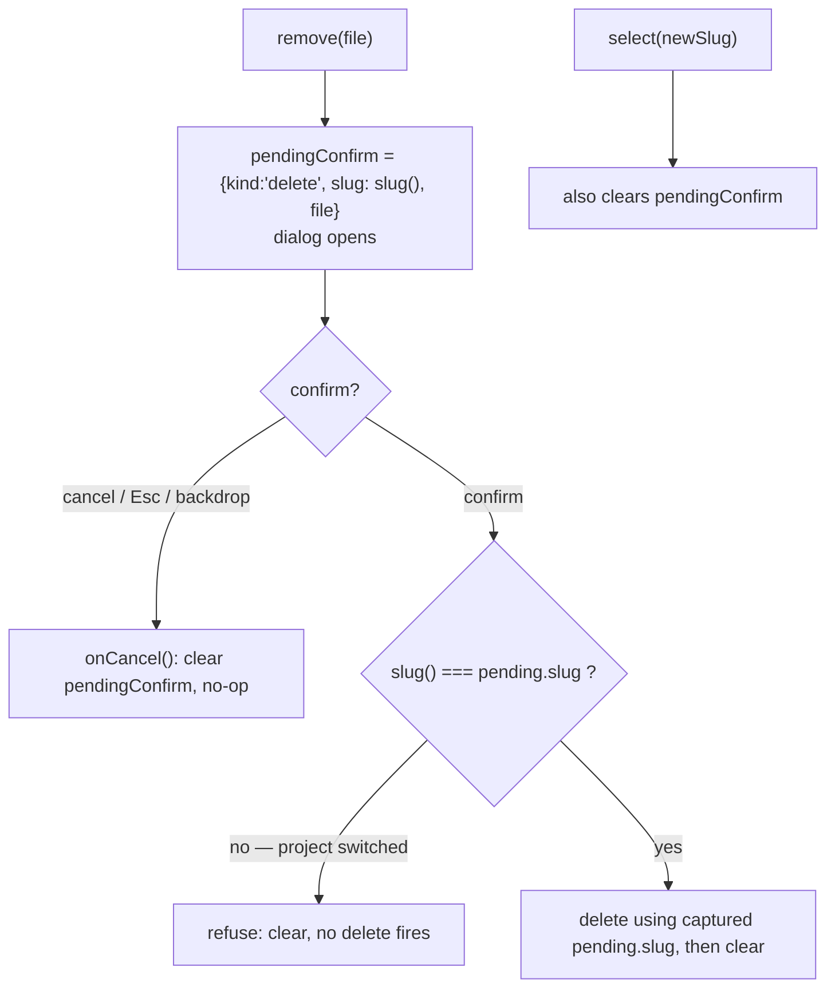

# Styled confirm dialog — design

## Context

Four destructive actions in the Angular SPA gate on the native browser `window.confirm`, which is unstyleable and jarring against Andon's dark theme:

- `memory.component.ts` `remove()` — permanent memory delete.
- `memory.component.ts` `startEdit()` — discard a dirty draft when switching edit targets.
- `settings.component.ts` `unpatch()` — remove andon env vars from `settings.json`.
- `settings.component.ts` `restoreBackup()` — restore the original `settings.json`.

There is no reusable dialog primitive in the app today (verified: no `role="dialog"`, no `inset-0`, no CDK/spartan dialog usage; the shared components are `panel`, `filter-bar`, `empty`, `andon-mark`). This spec adds one and converts all four call sites. Own branch after the markdown-viewer follow-up shipped (PR #35).

## Goal

Replace all four native confirms with a single reusable in-app styled dialog that matches the theme, **without reintroducing the cross-project delete race** that the memory-browser branch fought.

## Non-goals

- The Tauri dialog plugin. It renders native OS chrome, which defeats the theme-matching purpose and still carries the async race. Rejected in favor of an Angular component.
- Any change to what the four actions do, their API calls, or their success/error handling.
- A generic promise-based dialog service or queue. Each host owns one dialog instance driven by a signal. YAGNI.

## The load-bearing hazard

`window.confirm` is synchronous and blocks the JS event loop while open. That block is *why* `remove()` is currently race-safe: `slug()` cannot change under the delete because nothing else runs while the dialog is up. An in-app modal is asynchronous and does not block, so a project switch (or an in-flight `memoryList` response) can land between opening the dialog and confirming. Replacing confirm therefore reintroduces the exact race unless the delete is guarded. This is the entire reason the delete conversion is non-trivial; the other three sites have no such hazard.

## Decisions

- **Reusable presentational component** (`ConfirmDialogComponent`), not inline markup. Four call sites across two features justify it; it is independently testable and gives the app the dialog primitive it lacks.
- **Logic and the race guard live in each host**, never in the dialog. The dialog is dumb: it renders a request and emits confirm/cancel.
- **Default keyboard focus on Cancel** for destructive dialogs, so Enter does not accidentally confirm a permanent action.
- **Double guard for the memory delete:** `select()` clears any pending dialog on a project switch (primary), and `onConfirm()` re-verifies `slug()` against the captured slug and operates on the captured slug (defense in depth, mirroring the `editingSlug` guard in `saveEdit`).

## ConfirmDialogComponent

`web/src/app/shared/confirm-dialog.component.ts` — standalone, `ChangeDetectionStrategy.OnPush`.

- **Type:** `ConfirmRequest = { title: string; message: string; confirmLabel: string; danger?: boolean }`.
- **Input:** `request: ConfirmRequest | null` (null renders nothing / closed).
- **Outputs:** `confirm: void`, `cancel: void`.
- **Markup:** a `fixed inset-0` backdrop over a centered panel with `role="dialog"`, `aria-modal="true"`, `aria-labelledby` (title) and `aria-describedby` (message). Cancel and Confirm buttons; Confirm carries danger styling when `danger` is true. Theme `--color-*` tokens only, no new palette classes.
- **Behavior:** Escape key emits `cancel`; a click on the backdrop (not the panel) emits `cancel`; the Confirm button emits `confirm`. On open, focus the Cancel button.

## Host pattern and the memory race guard

Each host holds a `pendingConfirm` signal describing the pending action, renders `<app-confirm-dialog [request]="..." (confirm)="onConfirm()" (cancel)="onCancel()">`, and derives the `ConfirmRequest` from the pending state.

Memory:

`pendingConfirm` for memory is a discriminated union:

- `{ kind: 'delete'; slug: string; file: string }`
- `{ kind: 'discard'; slug: string; target: MemoryEntry }`

`onConfirm()` switches on `kind`. For `delete`: if `slug() !== pending.slug`, refuse and clear (mirrors `saveEdit`'s guard); otherwise call `api.memoryDelete(pending.slug, pending.file)` with the existing success/error handling (`invalidateHistory`, `refresh`, `refreshProjects`, `actionError`). For `discard`: re-verify `slug() === pending.slug`, then perform the edit switch to `pending.target` that `startEdit` used to do inline.

`onCancel()` clears `pendingConfirm`. `select()` gains one line: clear `pendingConfirm` alongside the other per-project invalidation it already does.

## Discard-draft restructure (memory)

`startEdit(e)` currently calls `confirm()` synchronously when switching away from a dirty draft. New shape: if `editing()` is set, differs from `e.doc.file`, and `isCurrentDraftDirty()`, then set `pendingConfirm = {kind:'discard', slug: slug(), target: e}` and return (do not switch yet). The actual switch (`editing`/`editingSlug`/`draft` assignment) moves into `onConfirm()`'s `discard` branch. With a clean draft, `startEdit` switches immediately as today.

## Settings conversions (no race)

`pendingConfirm = signal<{ kind: 'unpatch' | 'restore' } | null>(null)`. `unpatch()` and `restoreBackup()` set the pending state instead of calling `confirm()`. `onConfirm()` switches on `kind` and runs the existing action body (the `api.*` call plus `flash`/`refresh`). `onCancel()` clears. No slug, no re-verify.

## Accessibility and UX

- `role="dialog"`, `aria-modal="true"`, labelled by the title and described by the message.
- Escape and backdrop click cancel; focus starts on Cancel.
- Copy stays honest and names the target: delete says the file name and that it is permanent with no undo; settings dialogs keep their current wording.

## Testing strategy

TDD, Vitest, at the component boundary.

- **`confirm-dialog.component.spec.ts` (new):** renders nothing when `request` is null; renders title/message/confirm label when set; emits `confirm` on the confirm button; emits `cancel` on the cancel button, on Escape, and on backdrop click; applies danger styling when `danger` is true.
- **`memory.component.spec.ts` (rework + add):** the headline race test — open the delete dialog, `select('other-project')`, then confirm, and assert no delete request fires against the new project. Delete happy path through the dialog. Discard-draft through the dialog. Project switch clears the pending dialog. Existing tests that mock `window.confirm` (`does not delete when the confirm is declined`, `posts a delete when the confirm is accepted`, `renders an error when delete fails`, `confirms before discarding a dirty draft`, `does not confirm when switching edit targets with an untouched draft`, `clears the cached history for a file after a successful delete`) are reworked to drive the dialog instead of `window.confirm`.
- **`settings.component.spec.ts` (new):** `unpatch()` and `restoreBackup()` open the dialog; confirm runs the API call; cancel makes no API call.

## File structure

- Create: `web/src/app/shared/confirm-dialog.component.ts`, `web/src/app/shared/confirm-dialog.component.spec.ts`. The `ConfirmRequest` type is exported from the component file.
- Modify: `web/src/app/features/memory/memory.component.ts`, `memory.component.html`, `memory.component.spec.ts`.
- Modify: `web/src/app/features/settings/settings.component.ts`, `settings.component.html`. Create: `web/src/app/features/settings/settings.component.spec.ts`.

## Success criteria

- No `window.confirm` (or `confirm(`) remains in `memory.component.ts` or `settings.component.ts`.
- The styled dialog renders for all four actions and matches the theme.
- The memory delete race test passes: switching projects with the delete dialog open, then confirming, deletes nothing from the new project.
- Discard-draft and both settings actions work through the dialog.
- All existing and new component tests pass.
- No new NgModule; standalone, signals, OnPush; theme tokens only.

## Out of scope / follow-ups

- Converting any other native `confirm`/`alert` the app may add later (none remain after this branch).
- A focus-trap library or generic modal service — not warranted for four static dialogs.
