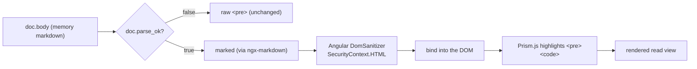

# Memory markdown viewer — design

## Context

The Memory Browser page (`web/src/app/features/memory/`) renders each memory's body in a raw `<pre>` block. Memory files are markdown, so headings, lists, bold, links, and fenced code all show as literal text. This spec covers rendering the read view as sanitized markdown with syntax-highlighted code, on its own branch after the Memory Browser feature shipped (PR #33) and the stale-switcher-count fix merged (PR #34).

The rendering pipeline was de-risked first with a throwaway HTML prototype (`marked` → sanitize → highlight), which confirmed the order and proved a battery of hostile memories render inert. This spec ports that validated shape into Angular.

## Goal

Render a memory's read view as markdown with highlighted code, without ever letting a hostile memory execute script inside the Tauri webview. The editor keeps showing raw text.

## Non-goals

- Rendering the collapsed MEMORY.md index as markdown — it stays raw. It is a machine artifact whose relative links (`alpha.md`) navigate nowhere in-app; rendering it is effort for a worse result.
- Any change to save, delete, provenance, or the project switcher.
- Adding DOMPurify or highlight.js. See "Decisions".

## Decisions

### Rendering stack: ngx-markdown

Wire ngx-markdown via `provideMarkdown()` (standalone, no NgModule). ngx-markdown wraps the same `marked` engine, so the parser matches what the prototype validated.

### Sanitizer: Angular's built-in DomSanitizer

Use ngx-markdown's default sanitization, which routes the `marked` output through Angular's `DomSanitizer` (`SecurityContext.HTML`) before it reaches the DOM. No DOMPurify dependency.

Rationale: the prototype used DOMPurify only because a bare HTML file has no framework sanitizer. Angular's `DomSanitizer` is the sanitizer that already protects every Angular app — it strips `<script>`, inline event handlers, and `javascript:`/dangerous `data:` URIs. For a localhost, single-user tool rendering the user's own memory files, adding DOMPurify would mean disabling ngx-markdown's sanitizer, owning a `bypassSecurityTrustHtml` path, and carrying a runtime dependency, for no material gain. The memory for this feature explicitly blesses either DOMPurify or Angular's sanitizer; we take the lighter, idiomatic one.

`[disableSanitizer]` MUST remain false (the default). A test asserts it.

### Highlighter: Prism.js

Use ngx-markdown's native Prism.js integration. It wires up with one provider and highlights code blocks after sanitization, preserving the `parse → sanitize → highlight` order. Adds `prismjs`. highlight.js (used by the prototype) has no advantage inside ngx-markdown and needs more manual wiring.

### Unparsed files (`parse_ok === false`): plain-text fallback

When `parse_ok` is false, `body` holds the entire raw file including frontmatter. Rendering that as markdown makes the leading `---` render as stray rules and headings. So an unparsed memory keeps the current raw `<pre>` presentation; only `parse_ok === true` memories render as markdown. This is a template branch on `doc.parse_ok`.

### Editor unchanged

The edit toggle continues to show raw text in the `<textarea>`, seeded from `doc.raw`. Only the read view renders markdown. The editor round-trips the whole file verbatim via `doc.raw`, exactly as today.

## Render pipeline

The order is load-bearing: sanitize before the HTML reaches the DOM, highlight only after. Prism decorates already-sanitized, already-inserted code.

## Component changes

All changes live in `web/src/app/features/memory/`.

- `memory.component.ts`: no new state signals. The read view is a template concern. Provide markdown/Prism at app bootstrap (`app.config.ts` via `provideMarkdown()`), not in the component.
- `memory.component.html`: the read-view block becomes `@if (entry.doc.parse_ok) { <markdown [data]="entry.doc.body" /> } @else { <pre>{{ entry.doc.raw }}</pre> }`. Exact bindings settled in the plan.
- Styles: rendered markdown needs scoped styling (headings, code, blockquote, table) using existing Tailwind/theme tokens. No new palette classes.
- `app.config.ts` (or the standalone bootstrap): add `provideMarkdown()` and the Prism wiring.

## Security: the gate

Sanitization is the reason this feature is not trivial. The read view now injects model-authored, user-editable content as HTML into the webview next to the IPC surface.

Requirements:

- ngx-markdown sanitization stays enabled (`[disableSanitizer]` false).
- A test proves a hostile memory cannot execute: feed a body containing ``, a `javascript:` link, a raw `<script>`, and an `onclick=` handler; assert the rendered DOM contains no `<script>`, no `onerror`/`onclick` attributes, and no `javascript:` href. This mirrors the prototype's tripwire — it is the acceptance gate for the feature, not an optional extra.

## Testing strategy

- TDD, Vitest, at the component boundary (the existing `memory.component.spec.ts` pattern).
- Read-view rendering: a `parse_ok: true` body with a heading and a fenced code block renders as `<h*>` and a highlighted `<pre><code>`, not literal text.
- Unparsed fallback: a `parse_ok: false` entry renders as a raw `<pre>` containing `doc.raw`, not markdown.
- Editor still seeds from `doc.raw` (existing tests must stay green).
- XSS gate: the hostile-memory test above.

## Success criteria

- A realistic memory renders with headings, lists, links, and highlighted code in the read view.
- An unparsed memory renders as raw text, not garbled markdown.
- The hostile-memory test passes: nothing executes, dangerous markup is stripped.
- All existing memory-component tests stay green.
- No DOMPurify, no highlight.js, no NgModule added.

## Out of scope / follow-ups

- Styled in-app confirm dialogs (separate memory, separate branch).
- Rendering the MEMORY.md index as markdown (declined above).
