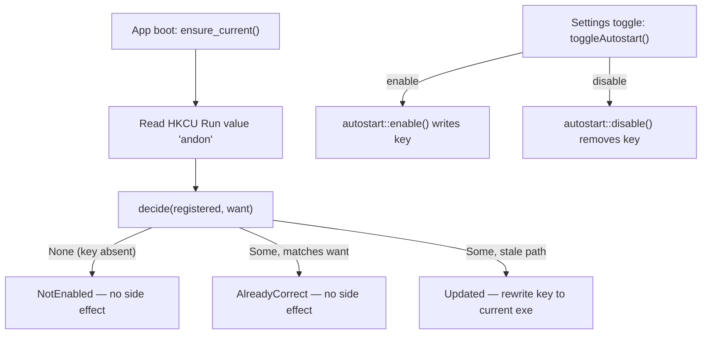

# Autostart opt-in — design

Date: 2026-07-19
Status: Approved, ready for implementation plan

## Problem

Andon force-enables Windows logon autostart. On every launch, `lib.rs` calls `autostart::ensure_current()` unconditionally, which writes the app's path into `HKCU\Software\Microsoft\Windows\CurrentVersion\Run` whether or not the user ever asked for it. This has two consequences.

First, a consent gap: a user installs a telemetry viewer and, on first run, an unsigned binary silently wires itself into their logon sequence. Nobody clicked "yes."

Second, a security-heuristic signal: writing the Run key is the single most-fingerprinted persistence technique on Windows (MITRE ATT&CK T1547.001). Combined with an unsigned binary that also patches another app's config and binds network listeners, this matches the behavioral profile Microsoft Defender's machine-learning heuristics flag as `Program:Win32/...!ml`. The detection is probabilistic per binary hash, so it fires unpredictably across releases even though the behavior has not changed since v0.2.5.

Code signing is the durable fix for the heuristic and is tracked separately. This design addresses the consent gap and removes the loudest behavioral signal for the majority of users, at zero cost.

## Goal

Autostart becomes genuinely opt-in. A fresh install writes nothing to the registry until the user enables autostart in Settings. Existing users who already have autostart are preserved (grandfathered).

## Non-goals

Code signing, EV certificate acquisition, and SmartScreen reputation are out of scope for this change. So is any new Settings UI — the toggle already exists and works.

## Key insight

The opt-in path is already fully built. The Settings page exposes a working `toggleAutostart()` that calls the existing `autostart_enable` / `autostart_disable` API routes, which call `autostart::enable()` / `autostart::disable()`. The only thing force-enabling autostart is the unconditional `ensure_current()` at boot.

Therefore the registry key's presence *is* the opt-in state. No new settings storage and no new UI are required. Enabling writes the key; disabling removes it; `ensure_current()` must stop treating "key absent" as "please create it."

## Design

### Behavioral change

`ensure_current()` changes from create-or-update to update-only-if-present. It self-heals the registered path for users who already opted in, and does nothing for users who have not.

| Registry state at boot | Old outcome | New outcome |
|---|---|---|
| Key present, path matches current exe | `AlreadyCorrect` | `AlreadyCorrect` (unchanged) |
| Key present, path stale (app moved or reinstalled) | `Updated` (rewrite) | `Updated` (rewrite — grandfathers existing users) |
| Key absent | `Enabled` (writes key) | `NotEnabled` (no side effect) |

New installs: no key, boot does nothing, autostart stays off until the user toggles it on in Settings. Existing users: key present, boot self-heals the path, autostart preserved. Nobody loses autostart; nobody new is force-enrolled.

### Testability refactor (SOLID)

Extract the decision from the I/O so the policy can be unit-tested without touching the real registry. The Windows test module today deliberately refuses to call `enable()` / `disable()` because they mutate real OS state, which leaves the core rule untested.

```rust
// Pure. No registry access. Fully unit-testable on every platform.
fn decide(registered: Option<&str>, want: &str) -> EnsureOutcome
```

`ensure_current()` becomes a thin wrapper: read the registered command from the registry, call `decide`, then act on the returned outcome (rewrite the key only for the `Updated` case).

Add a `NotEnabled` variant to `EnsureOutcome` (serializes to `not_enabled` via the existing snake_case tag). The `Enabled` variant becomes unreachable from `ensure_current()` and is removed. `enable()` returns a `String`, not `EnsureOutcome`, so removing the variant does not affect the enable path.

### Flow



## Files affected

`src-tauri/src/autostart.rs` — introduce `decide()`, rewire `ensure_current()`, add `NotEnabled`, remove `Enabled`, add unit tests for `decide()`.

No changes to `lib.rs` (the call site is unchanged — the behavior moves into `ensure_current`), the API routes, the Angular Settings component, or the API service.

## Testing

Unit-test `decide()` directly, since it is pure:

- `decide(None, want)` returns `NotEnabled`.
- `decide(Some(want), want)` returns `AlreadyCorrect`.
- `decide(Some(other), want)` returns `Updated`.

Update the existing `ensure_outcome_serializes_to_snake_case_tag` test: drop the `Enabled` case, add `NotEnabled` -> `{"outcome":"not_enabled"}`. Keep the existing `registry_constants_are_correct` and non-Windows stub tests. Follow TDD: write the failing `decide()` tests first, then implement.

## Release notes

Frame the Defender behavior as a standing condition of unsigned distribution, not a one-time 0.7.0 hiccup. State that autostart is now opt-in (existing users keep their setting), give the Defender unblock steps for anyone affected, and note that code signing is on the roadmap as the durable fix.

## Out of scope follow-ups

- Acquire code signing (individual OV via Certum or Azure Trusted Signing; EV requires a legal entity).
- Submit false-positive reports to Microsoft only after signing, since reports are keyed per hash.
