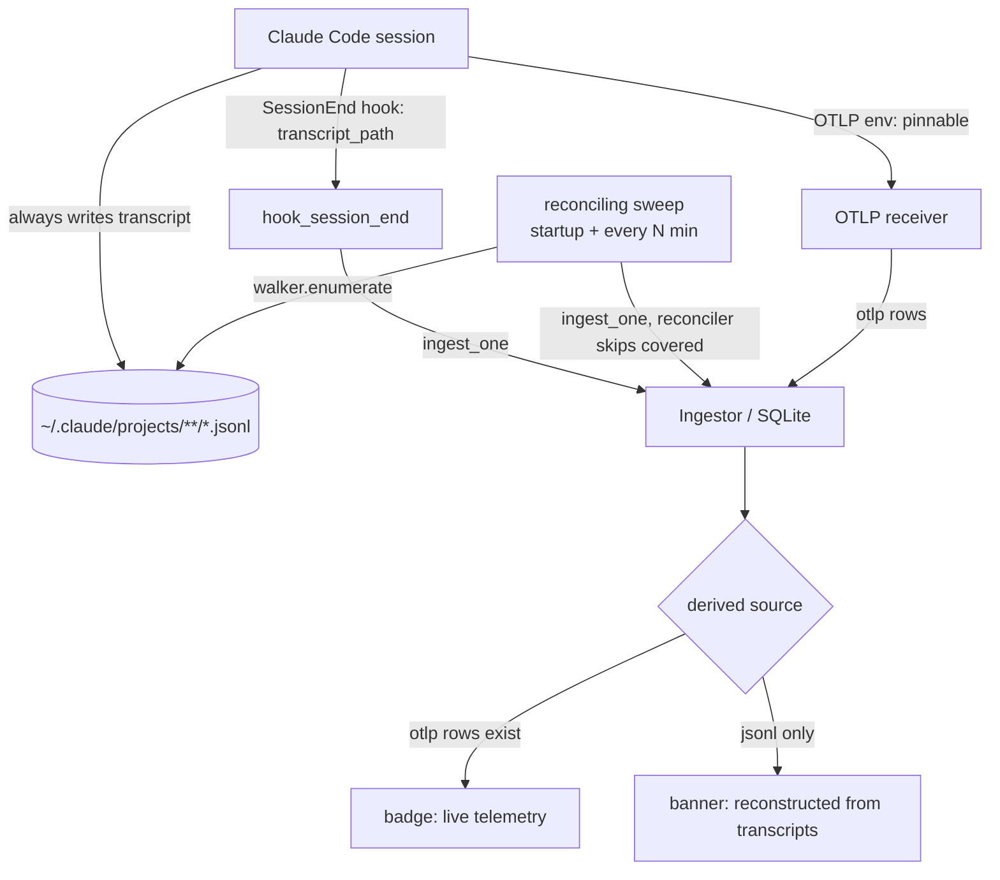

# OTLP-absence fallback: automatic transcript ingestion + provenance banner

Status: approved design, ready for planning. Date: 2026-08-04.

## Problem

Andon's primary ingestion path is OTLP on `127.0.0.1:4317/4318`. That path can go silent for reasons Andon does not control: an enterprise `managed-settings.json` pins `OTEL_EXPORTER_OTLP_ENDPOINT` to a corporate collector (managed settings sit above user settings, so Andon's patch loses), the receiver is down, ingestion is paused, or the user never wired telemetry up at all.

Andon already has a second ingestion path from Claude Code's on-disk transcripts (`~/.claude/projects/**/*.jsonl`), but today it only fires two ways: the manual `/api/jsonl/backfill` endpoint, and the `SessionEnd` hook, which ingests a single transcript per clean session end. There is no automatic, continuous transcript ingestion, and no UI signal that a session's data came from a transcript rather than live telemetry.

The gaps that leaves, when OTLP is absent: sessions whose `SessionEnd` hook never fires (crash, machine shutdown, hooks disabled by policy), the pre-existing transcript backlog, and sessions that happened while Andon was closed. On those, the dashboard is silently empty until someone remembers to click backfill.

## Coverage matrix (why the design has the shape it does)

The `SessionEnd` hook and a disk sweep cover *different* failure quadrants. Neither is redundant.

| Machine state | OTLP | Hooks fire? | What covers it |
|---|---|---|---|
| Normal | yes | yes | OTLP (real-time). Transcript ingest at `SessionEnd` dedupes to a no-op. |
| Endpoint pinned / receiver down | no | yes | `SessionEnd` hook ingests the transcript; banner marks it transcript-sourced. |
| Pinned and hooks disabled | no | no | The sweep only. No hook means no data path except the disk walk. |
| Crash / shutdown mid-session | any | `SessionEnd` lost | The sweep only. Transcript is on disk, never ingested by the hook. |

## What we are building

Two pieces. That is the whole feature.

### 1. Reconciling sweep

A background task, spawned in `lib.rs` setup alongside the existing OTLP / API / budget-monitor tasks. It runs once at startup, then every N minutes (default 5, configurable, with an on/off toggle).

Each tick: `jsonl::walker::enumerate` over `~/.claude/projects/`, the reconciler skips sessions and records already covered, and `ingest_one` handles the rest through the same `Ingestor` the `SessionEnd` hook already uses. Re-ingesting a covered session is a no-op: the reconciler dedupes, and OTLP-sourced rows take precedence over transcript-sourced rows.

The sweep skips files unchanged since the last tick (by mtime/size) so it does not re-parse the whole corpus every interval. Tracking last-seen mtime in memory is sufficient; on restart a cold re-walk is safe because the reconciler still dedupes — it is just more work once.

The sweep respects the existing pause/resume ingestion control: when ingestion is paused, the sweep does nothing. Failures are logged and never fatal, consistent with the walker's existing lenient philosophy; parse failures flow to the existing jsonl error channel (`/api/jsonl/errors`).

### 2. Provenance banner

The session `source` is already derived, not stored (`api/routes.rs`):

```sql
WHEN EXISTS(... cost_entries WHERE session_id = s.session_id AND request_id IS NULL) THEN 'otlp'
WHEN EXISTS(... cost_entries WHERE session_id = s.session_id)                        THEN 'jsonl'
```

Every OTLP-absent quadrant resolves to `source = 'jsonl'`, and the branch ordering guarantees a healthy session can never render a false `jsonl` banner even when both rails ingested. So the banner is gated purely on `source = 'jsonl'` — no new column, no detector, no new state.

Wording must not claim a cause the light model does not verify. `source = 'jsonl'` means the data came from a transcript; it does not say *why* OTLP was silent. The banner reads:

> This session's data was reconstructed from local transcripts — no live telemetry was received.

It drops out for free the moment real OTLP data lands.

## Data flow



## Explicitly out of scope

These were considered and cut. Listing them so no one rebuilds them by reflex.

- **Per-session OTLP-absence detector and grace timer.** Its only unique value over derived `source` was a banner during the live, still-empty window before anything is ingested — which is real-time-ness the light gate deliberately declined. Cutting it keeps the design consistent with that choice.
- **Any schema change / `otlp_absent` column.** Redundant with derived `source`.
- **Mid-session live tailing / real-time parity on pinned machines.** The sweep gives eventually-complete data; real-time is a separate, larger feature (a true file tailer with offset tracking) and is not needed until an OTLP-pinned user complains that end-of-session latency is too slow.
- **Detecting the cause of OTLP silence** (managed policy vs receiver down vs paused vs never configured). The banner states the effect, not an unverified cause.

## Privacy

The sweep reuses `ingest_one`, which extracts usage and metadata and never persists raw prompts. Privacy guarantee #2 (raw prompts never persisted) is preserved *because the sweep adds no new field mappings* — it rides the path the `SessionEnd` hook already exercises. The regression to guard against: any future change that maps a raw message body into SQLite.

## Settings

Add a sweep interval (default 5 minutes) and an enable/disable toggle, following the existing settings module patterns. On by default.

## Testing

- Unit: the sweep's skip-unchanged logic; the reconciler's skip-covered behavior (extend existing coverage rather than duplicate).
- Integration: the pinned-endpoint quadrant end to end — feed a fixture transcript with no OTLP, run the sweep, assert the session appears with `source = 'jsonl'`; then feed OTLP rows for the same session and assert `source` flips to `'otlp'` with no double count.
- Frontend: the banner renders when `source = 'jsonl'` and is absent otherwise.

## Assumptions to verify during planning (not blockers now)

- `reconciler` / `ingest_one` idempotency against repeated and mixed-source ingest. Believed true — it is exercised today on every dual-source session — but confirm before relying on it.
- The derived `source` is available in the session DTO consumed by the Angular views that will host the banner; expose it if not.
- The `request_id IS NULL` discriminator that separates OTLP from transcript cost rows is reliable. Inherited from the existing source badge; if it is ever wrong, badge and banner are wrong together, not independently.
